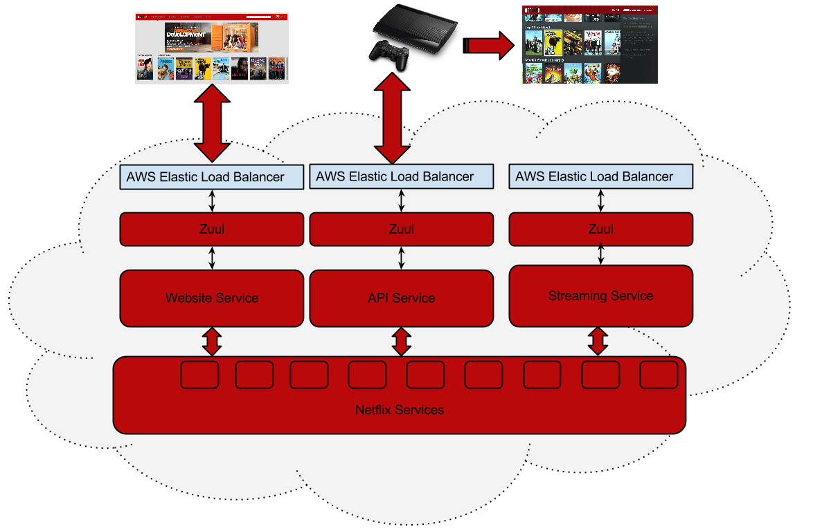

# 参考：

[外行人都能看懂的SpringCloud，错过了血亏！](https://segmentfault.com/a/1190000016157665)

[Spring Cloud 从入门到精通](http://blog.didispace.com/spring-cloud-learning/?utm_term=yudaoyuanma)

[Spring Cloud ](https://windmt.com/tags/Spring-Cloud/)

[Spring Cloud ](http://cmsblogs.com/?cat=166&paged=29)

[SpringCloud系列教程](https://www.geekdigging.com/category/springcloud/)

[SpringCloud 之 Eureka 服务注册中心 [ 注册数据、视图微服务 ]（一）](https://blog.csdn.net/Hack_Different/article/details/103049169)

[Spring Cloud Gateway-API文档](https://www.jianshu.com/p/a114a606a1f4)

[Spring Cloud Gateway 2.1.0 中文官网文档](https://blog.csdn.net/guying4875/article/details/88390111)

[TOC]

# 一、Spring Cloud介绍

## 1、什么是微服务

要了解 Spring Cloud 就绕不开微服务这个概念。因为 Spring Cloud 是 Spring 为微服务架构思想做的一个一站式实现。从某种程度是可以简单的理解为，微服务是一个概念、一个项目开发的架构思想。Spring Cloud 是微服务架构的一种 Java 实现。

微服务的概念源于 Martin Fowler 于 2014 年 3 月 25 日写的一篇文章 [Microservices](https://martinfowler.com/articles/microservices.html)（中文版翻译[点击查看](http://www.cnblogs.com/liuning8023/p/4493156.html)）

微服务架构模式（Microservices Architecture Pattern）的目的是**将大型的、复杂的、长期运行的应用程序构建为一组相互配合的服务，每个服务都可以很容易得局部改良**。 Micro 这个词意味着每个服务都应该足够小，但是，这里的小不能用代码量来比较，而应该是从业务逻辑上比较 —— 符合 [SRP 原则](https://en.wikipedia.org/wiki/Single_responsibility_principle)的才叫微服务。

关于微服务的一个形象表达：
[](https://src.windmt.com/img/006tNc79ly1fqc291i8v8j30go0aygly.jpg)
X 轴：水平扩展，即在负载均衡服务器后增加多个运行实例
Z 轴：数据库的扩展，即分库分表
Y 轴：功能分解，即将不同职能的模块分成不同的服务

## 2、微服务架构优势

**复杂度可控：**在将应用分解的同时，规避了原本复杂度无止境的积累。每一个微服务专注于单一功能，并通过定义良好的接口清晰表述服务边界。由于体积小、复杂度低，每个微服务可由一个小规模开发团队完全掌控，易于保持高可维护性和开发效率。
**独立部署：**由于微服务具备独立的运行进程，所以每个微服务也可以独立部署。当某个微服务发生变更时无需编译、部署整个应用。由微服务组成的应用相当于具备一系列可并行的发布流程，使得发布更加高效，同时降低对生产环境所造成的风险，最终缩短应用交付周期。
**技术选型灵活：**微服务架构下，技术选型是去中心化的。每个团队可以根据自身服务的需求和行业发展的现状，自由选择最适合的技术栈。由于每个微服务相对简单，故需要对技术栈进行升级时所面临的风险就较低，甚至完全重构一个微服务也是可行的。
**容错（fault isolation）：**当某一组建发生故障时，在单一进程的传统架构下，故障很有可能在进程内扩散，形成应用全局性的不可用。在微服务架构下，故障会被隔离在单个服务中。若设计良好，其他服务可通过重试、平稳退化等机制实现应用层面的容错。
**扩展：**每个服务**可以各自进行 x 扩展和 z 扩展，而且，每个服务可以根据自己的需要部署到合适的硬件服务器上**。当应用的不同组件在扩展需求上存在差异时，微服务架构便体现出其灵活性，因为每个服务可以根据实际需求独立进行扩展。

## 3、为什么微服务架构需要 Spring Cloud

简单来说，**服务化的核心就是将传统的一站式应用根据业务拆分成一个一个的服务，而微服务在这个基础上要更彻底地去耦合（不再共享 DB、KV，去掉重量级 ESB），并且强调 DevOps 和快速演化**。这就要求我们必须采用与一站式时代、泛 SOA 时代不同的技术栈，而 `Spring Cloud` 就是其中的佼佼者。

> `DevOps` 是英文 `Development` 和 `Operations` 的合体，他要求开发、测试、运维进行一体化的合作，进行更小、更频繁、更自动化的应用发布，以及围绕应用架构来构建基础设施的架构。这就要求应用充分的内聚，也方便运维和管理。这个理念与微服务理念不谋而合。

### 3.1、从使用 nginx 说起

最初的服务化解决方案是给提供相同服务提供一个统一的域名，然后服务调用者向这个域名发送 HTTP 请求，由 `Nginx` 负责请求的分发和跳转。


这种架构存在很多问题:

- `Nginx` 作为中间层，**在配置文件中耦合了服务调用的逻辑，这削弱了微服务的完整性，也使得 `Nginx` 在一定程度上变成了一个重量级的 `ESB`(中心化)。**
- 服务的信息分散在各个系统，无法统一管理和维护。**每一次的服务调用都是一次尝试，服务消费者并不知道有哪些实例在给他们提供服务**。这不符合 `DevOps` 的理念。
- 无法直观的看到服务提供者和服务消费者当前的运行状况和通信频率。这也不符合 `DevOps` 的理念。
- 消费者的失败重发，负载均衡等都没有统一策略，这加大了开发每个服务的难度，不利于快速演化。

为了解决上面的问题，我们**需要一个现成的中心组件对服务进行整合，将每个服务的信息汇总，包括服务的组件名称、地址、数量等。服务的调用方在请求某项服务时首先通过中心组件获取提供这项服务的实例的信息（IP、端口等），再通过默认或自定义的策略选择该服务的某一提供者直接进行访问**。所以，我们引入了 `Dubbo`。

### 3.2、基于 Dubbo 实现微服务

Dubbo 是阿里开源的一个 `SOA` 服务治理解决方案，文档丰富，在国内的使用度非常高。

[](https://src.windmt.com/img/006tNc79ly1fqc31r2nulj30e90bsdfv.jpg)

使用 `Dubbo` 构建的微服务，已经可以比较好地解决上面提到的问题：

- 调用中间层变成了可选组件，消费者可以直接访问服务提供者。
- 服务信息被集中到 `Registry` 中，形成了服务治理的中心组件。
- 通过 `Monitor` 监控系统，可以直观地展示服务调用的统计信息。
- `Consumer` 可以进行负载均衡、服务降级的选择。

但是对于微服务架构而言，`Dubbo` 也并不是十全十美的：

- `Registry` 严重依赖第三方组件（`zookeeper` 或者 `redis`），当这些组件出现问题时，服务调用很快就会中断。
- `Dubbo` 只支持 `RPC（服务远程调用，机制是根据语言的API来定义的）` 调用。**使得服务提供方与调用方在代码上产生了强依赖，服务提供者需要不断将包含公共代码的 jar 包打包出来供消费者使用。一旦打包出现问题，就会导致服务调用出错。**

### 3.3、新的选择 ——Spring Cloud

`Spring Cloud`是**一系列框架的有序集合**。它利用`Spring Boot`的开发便利性巧妙地简化了分布式系统基础设施的开发，如服务发现注册、配置中心、消息总线、负载均衡、断路器、数据监控等，都可以用`Spring Boot`的开发风格做到一键启动和部署。**`Spring Cloud`并没有重复制造轮子，它只是将目前各家公司开发的比较成熟、经得起实际考验的服务框架组合起来，通过Spring Boot风格进行再封装屏蔽掉了复杂的配置和实现原理，最终给开发者留出了一套简单易懂、易部署和易维护的分布式系统开发工具包**。

 根据微服务架构在各方面的要素，我们把 `Spring Cloud` 与 `Dubbo` 进行一番对比。

**微服务（Microservices）：** 是一种架构风格，一**个大型复杂软件应用由一个或多个微服务组成。系统中的各个微服务可被独立部署，各个微服务之间是松耦合的**。每个微服务仅关注于完成一件任务并很好地完成该任务。在所有情况下，每个任务代表着一个小的业务能力。

**Dubbo：** `Dubbo`是一个分布式服务框架，致力于提供高性能和透明化的 `RPC` 远程服务调用方案，以及 `SOA` 服务治理方案。简单的说，**`Dubbo` 就是个服务框架，说白了就是个远程服务调用的分布式框架**。

**springcloud：** `springcloud`是一整套的微服务解决方案，提供了一系列的工具或者框架。

其实把 `Spring Cloud` 和 `Dubbo` 放一起对比有点不公平，`Dubbo` 只是实现了服务治理，而 `Spring Cloud` 下面有 23 个子项目（截止到 2018.4）分别覆盖了微服务架构下的方方面面，服务治理只是其中的一个方面，一定程度来说，**`Dubbo` 只是 `Spring Cloud Netflix` 中的一个子集**。但是在选择框架上，方案完整度恰恰是一个需要重点关注的内容。

|              | Dubbo         | Spring Cloud                 |
| :----------- | :------------ | ---------------------------- |
| 服务注册中心 | Zookeeper     | Spring Cloud Netflix Eureka  |
| 服务调用方式 | RPC           | REST API                     |
| 服务监控     | Dubbo-monitor | Spring Boot Admin            |
| 断路器       | 不完善        | Spring Cloud Netflix Hystrix |
| 服务网关     | 无            | Spring Cloud Netflix Zuul    |
| 分布式配置   | 无            | Spring Cloud Config          |
| 服务跟踪     | 无            | Spring Cloud Sleuth          |
| 消息总线     | 无            | Spring Cloud Bus             |
| 数据流       | 无            | Spring Cloud Stream          |
| 批量任务     | 无            | Spring Cloud Task            |
| ……           | ……            | ……                           |

> 服务调用方式：`Spring Cloud` 抛弃了 `Dubbo` 的 **RPC 通信**，采用的是基于 `HTTP` 的 **REST 方式**。严格来说，这两种方式各有优劣。虽然从一定程度上来说，**后者牺牲了服务调用的性能，但也避免了上面提到的原生 RPC 带来的问题（开发语言局限性，所有服务需要采用相同的语言开发）。而且 REST 相比 RPC 更为灵活，服务提供方和调用方的依赖只依靠一纸契约，不存在代码级别的强依赖**，这在强调快速演化的微服务环境下，显得更加合适。

### 3.4、Spring Cloud 技术概览

下图展示了 Spring Cloud 的完整技术组成：

[](https://src.windmt.com/img/006tNc79ly1fqc4dcx75gj31ab0o775w.jpg)

- 服务治理：这是 Spring Cloud 的核心。目前 Spring Cloud 主要通过整合 Netflix 的相关产品来实现这方面的功能（Spring Cloud Netflix），包括用于服务注册和发现的 `Eureka`，调用断路器 `Hystrix`，调用端负载均衡 `Ribbon`，Rest 客户端 `Feign`，智能服务路由 `Zuul`，用于监控数据收集和展示的 `Spectator`、`Servo`、`Atlas`，用于配置读取的 `Archaius` 和提供 `Controller` 层 `Reactive` 封装的 `RxJava`。除此之外，针对于服务的注册和发现，除了 `Eureka`，Spring Cloud 也整合了 `Consul` 和 `Zookeeper` 作为备选，但是因为这两个方案在 CAP 理论上都遵循 CP 而不是 AP，所以官方并没有推荐使用。

  > `Feign` 和 `RxJava` 并不是 `Netflix` 的产品，但是被整合到了 `Spring Cloud Netflix` 中。

- 分布式链路监控：`Spring Cloud Sleuth` 提供了全自动、可配置的数据埋点，以收集微服务调用链路上的性能数据，并发送给 Zipkin 进行存储、统计和展示。

- 消息组件：Spring Cloud Stream 对于分布式消息的各种需求进行了抽象，包括发布订阅、分组消费、消息分片等功能，实现了微服务之间的异步通信。Spring Cloud Stream 也集成了第三方的 RabbitMQ 和 Apache Kafka 作为消息队列的实现。而 Spring Cloud Bus 基于 Spring Cloud Stream，主要提供了服务间的事件通信（比如刷新配置）。

- 配置中心：基于 Spring Cloud Netflix 和 Spring Cloud Bus，Spring 又提供了 Spring Cloud Config，实现了配置集中管理、动态刷新的配置中心概念。配置通过 Git 或者简单文件来存储，支持加解密。

- 安全控制：Spring Cloud Security 基于 OAuth2 这个开放网络的安全标准，提供了微服务环境下的单点登录、资源授权、令牌管理等功能。

- 命令行工具：Spring Cloud Cli 提供了以命令行和脚本的方式来管理微服务及 Spring Cloud 组件的方式。

- 集群工具：Spring Cloud Cluster 提供了集群选主、分布式锁（暂未实现）、一次性令牌（暂未实现）等分布式集群需要的技术组件。

**以下排序不分先后**

- **Spring Cloud Config 配置中心：** 利用 Git 集中管理程序的配置。
- **Spring Cloud Netflix Eureka：** 服务中心（类似于管家的概念，需要什么直接从这里取，就可以了），一个基于 REST 的服务，用于定位服务，以实现云端中间层服务发现和故障转移。
- **Spring Cloud Netflix Hystrix 熔断器：** 容错管理工具，旨在通过熔断机制控制服务和第三方库的节点，从而对延迟和故障提供更强大的容错能力。
- **Spring Cloud Netflix Zuul 网关：** 是在云平台上提供动态路由，监控，弹性，安全等边缘服务的框架。Web 网站后端所有请求的前门。
- **Spring Cloud Netflix Archaius：** 配置管理 API，包含一系列配置管理API，提供动态类型化属性、线程安全配置操作、轮询框架、回调机制等功能。
- **Spring Cloud Netflix Ribbon：** 负载均衡。
- **Spring Cloud Netflix Fegin：** REST客户端。
- **Spring Cloud Bus：** 消息总线，利用分布式消息将服务和服务实例连接在一起，用于在一个集群中传播状态的变化。
- **Spring Cloud Security：** 安全控制。
- **Spring Cloud Sleuth：** 分布式链路监控，SpringCloud 应用的分布式追踪系统，和 Zipkin，HTrace，ELK 兼容。
- **Spring Cloud Stream：** 消息组件，基于 Redis，Rabbit，Kafka 实现的消息微服务，简单声明模型用以在 Spring Cloud 应用中收发消息。

#### 3.4.1、Eureka

`Eureka` 是 `Netflix` 开源的一款提供服务注册和发现的产品，它提供了完整的 `Service Registry` 和 `Service Discovery` 实现。也是 Spring Cloud 体系中最重要最核心的组件之一。

用大白话讲，`Eureka` 就是一个服务中心，**将所有的可以提供的服务都注册到它这里来管理，其它各调用者需要的时候去注册中心获取，然后再进行调用，避免了服务之间的直接调用，方便后续的水平扩展、故障转移等**。如下图：


当然服务中心这么重要的组件一但挂掉将会影响全部服务，因此**需要搭建 `Eureka` 集群来保持高可用性，生产中建议最少两台。随着系统的流量不断增加，需要根据情况来扩展某个服务**，`Eureka` 内部已经提供均衡负载的功能，只需要增加相应的服务端实例既可。那么在系统的运行期间某个实例挂了怎么办？Eureka 内容有一个心跳检测机制，如果某个实例在规定的时间内没有进行通讯则会自动被剔除掉，避免了某个实例挂掉而影响服务。

因此使用了 `Eureka` 就自动具有了**注册中心、负载均衡、故障转移的功能**。

#### 3.4.2、Hystrix

在微服务架构中通常会有多个服务层调用，**基础服务的故障可能会导致级联故障**，进而造成整个系统不可用的情况，这种现象被称为**服务雪崩效应**。服务雪崩效应是**一种因 “服务提供者” 的不可用导致 “服务消费者” 的不可用，并将不可用逐渐放大的过程**。

如下图所示：A 作为服务提供者，B 为 A 的服务消费者，C 和 D 是 B 的服务消费者。A 不可用引起了 B 的不可用，并将不可用像滚雪球一样放大到 C 和 D 时，雪崩效应就形成了。


在**这种情况下就需要整个服务机构具有故障隔离的功能，避免某一个服务挂掉影响全局**。在 Spring Cloud 中 `Hystrix` 组件就扮演这个角色。

> `Hystrix` 会在某个服务连续调用 N 次不响应的情况下，立即通知调用端调用失败，避免调用端持续等待而影响了整体服务。`Hystrix` 间隔时间会再次检查此服务，如果服务恢复将继续提供服务。

#### 3.4.3、Hystrix Dashboard 和 Turbine

当熔断发生的时候需要迅速的响应来解决问题，避免故障进一步扩散，那么对熔断的监控就变得非常重要。熔断的监控现在有两款工具：`Hystrix-dashboard` 和 `Turbine`

`Hystrix-dashboard` 是一款针对 `Hystrix` 进行实时监控的工具，通过 `Hystrix Dashboard` 我们可以直观地看到各 `Hystrix Command` 的请求响应时间，请求成功率等数据。但是只使用 `Hystrix Dashboard` 的话，你只能看到单个应用内的服务信息，这明显不够。我们需要一个工具能让我们汇总系统内多个服务的数据并显示到 `Hystrix Dashboard` 上，这个工具就是 `Turbine`.
监控的效果图如下：

[](https://src.windmt.com/img/006tNc79ly1fqc5gk1wivj30gn0am0th.jpg)

#### 3.4.4、Spring Cloud Config

> 随着微服务不断的增多，每个微服务都有自己对应的配置文件。在研发过程中有测试环境、UAT环境（用户接受度测试 即验收测试，所以UAT环境主要是用来作为客户体验的环境。）、生产环境，因此每个微服务又对应至少三个不同环境的配置环境。这么多的配置环境，如果需要修改某个公共服务的配置信息，如：缓存，数据库等，难免会产生混乱，这个时候就需要引入Spring Cloud另外一个组件：Spring Cloud Config。

Spring Cloud Config 是一个解决分布式系统的配置管理方案。她包含了`Client`和`Server`两个部分，`Server`提供配置文件的存储、以接口的形式将配置文件提供出去，`Client`通过接口获取数据，并依据此数据初始化自己的应用。

**其实就是 `Server` 端将所有的配置文件服务化，需要配置文件的服务实例去 Config Server 获取对应的数据。将所有的配置文件统一整理，避免了配置文件碎片化。**

如果服务运行期间改变配置文件，服务是不会得到最新的配置信息，需要解决这个问题就需要引入 `Refresh`。可以在服务的运行期间重新加载配置文件。

当所有的配置文件都存储在配置中心的时候，配置中心就成为了一个非常重要的组件。如果配置中心出现问题将会导致灾难性的后果，因此**在生产中建议对配置中心做集群，来支持配置中心高可用性**。

#### 3.4.5、Spring Cloud Bus

上面的 `Refresh` 方案虽然可以解决单个微服务运行期间重载配置信息的问题，但是在真正的实践生产中，**可能会有 N 多的服务需要更新配置，如果每次依靠手动 Refresh 将是一个巨大的工作量**，这时候 Spring Cloud 提出了另外一个解决方案：`Spring Cloud Bus`。

`Spring Cloud Bus` **通过轻量消息代理连接各个分布的节点**。这会**用在广播状态的变化**（例如配置变化）或者其它的消息指令中。`Spring Cloud Bus` 的一个**核心思想是通过分布式的启动器对 Spring Boot 应用进行扩展，也可以用来建立一个或多个应用之间的通信频道**。目前唯一实现的方式是用 `AMQP` 消息代理作为通道。

`Spring Cloud Bus` 是轻量级的通讯组件，也可以用在其它类似的场景中。有了 `Spring Cloud Bus` 之后，当我们改变配置文件提交到版本库中时，会自动的触发对应实例的 `Refresh`，具体的工作流程如下：


#### 3.4.6、Spring Cloud Zuul

在微服务架构模式下，后端服务的实例数一般是动态的，对于客户端而言很难发现动态改变的服务实例的访问地址信息。因此在基于微服务的项目中为了简化前端的调用逻辑，通常会引入 `API Gateway` 作为轻量级网关，同时 `API Gateway` 中也会实现相关的认证逻辑从而简化内部服务之间相互调用的复杂度。


Spring Cloud 体系中支持 API Gateway 落地的技术就是 `Zuul`。Spring Cloud Zuul 路由是微服务架构中不可或缺的一部分，**提供动态路由，监控，弹性，安全等的边缘服务**。`Zuul` 是 `Netflix` 出品的一个**基于 JVM 路由和服务端的负载均衡器**。

> 它的具体作用就是服务转发，接收并转发所有内外部的客户端调用。使用 Zuul 可以作为资源的统一访问入口，同时也可以在网关做一些权限校验等类似的功能。

#### 3.4.7、链路跟踪

随着服务越来越多，对调用链的分析会越来越复杂，如服务之间的调用关系、某个请求对应的调用链、调用之间消费的时间等，对这些信息进行监控就成了一个问题。在实际的使用中我们需要监控服务和服务之间通讯的各项指标，这些数据将是我们改进系统架构的主要依据。因此分布式的链路跟踪就变的非常重要，`Spring Cloud` 也给出了具体的解决方案：`Spring Cloud Sleuth` 和 `Zipkin`


`Spring Cloud Sleuth` 为服务之间调用提供链路追踪。通过 `Sleuth` 可以很清楚的了解到一个服务请求经过了哪些服务，每个服务处理花费了多长时间。从而让我们可以很方便的理清各微服务间的调用关系。

`Zipkin` 是 `Twitter` 的一个开源项目，允许开发者收集 `Twitter` 各个服务上的监控数据，并提供查询接口。

分布式链路跟踪需要 `Sleuth + Zipkin` 结合来实现。

## 4、总结

我们从整体上来看一下 Spring Cloud 各个组件如何来配套使用：


从上图可以看出 Spring Cloud 各个组件相互配合，合作支持了一套完整的微服务架构。

- 其中 Eureka 负责服务的注册与发现，很好将各服务连接起来
- Hystrix 负责监控服务之间的调用情况，连续多次失败进行熔断保护
- Hystrix dashboard，Turbine 负责监控 Hystrix 的熔断情况，并给予图形化的展示
- Spring Cloud Config 提供了统一的配置中心服务
- 当配置文件发生变化的时候，Spring Cloud Bus 负责通知各服务去获取最新的配置信息
- 所有对外的请求和服务，我们都通过 Zuul 来进行转发，起到 API 网关的作用
- 最后我们使用 Sleuth+Zipkin 将所有的请求数据记录下来，方便我们进行后续分析

# 二、服务治理技术

## 1、Spring Cloud Netflix 的优势

**对于微服务的治理而言，核心就是服务的注册和发现**。所以选择哪个组件，很大程度上要看它对于服务注册与发现的解决方案。在这个领域，开源架构很多，最常见的是 `Zookeeper`，但这并不是一个最佳选择。

在分布式系统领域有个著名的 CAP 定理：**C—— 数据一致性，A—— 服务可用性，P—— 服务对网络分区故障的容错性**。这三个特性在任何分布式系统中不能同时满足，最多同时满足两个。

`Zookeeper` 是著名 `Hadoop` 的一个子项目，很多场景下 `Zookeeper` 也作为 `Service` 发现服务解决方案。**`Zookeeper` 保证的是 CP**，**即任何时刻对 `Zookeeper` 的访问请求能得到一致的数据结果，同时系统对网络分割具备容错性，但是它不能保证每次服务请求的可用性**。从实际情况来分析，在使用 `Zookeeper` 获取服务列表时，如果 zookeeper 正在选主，或者 Zookeeper 集群中半数以上机器不可用，那么将就无法获得数据了。所以说，Zookeeper 不能保证服务可用性。

诚然，对于大多数分布式环境，尤其是涉及到数据存储的场景，数据一致性应该是首先被保证的，这也是 `zookeeper` 设计成 CP 的原因。但是对于服务发现场景来说，情况就不太一样了：针对同一个服务，即使注册中心的不同节点保存的服务提供者信息不尽相同，也并不会造成灾难性的后果。因为对于服务消费者来说，能消费才是最重要的 —— 拿到可能不正确的服务实例信息后尝试消费一下，也好过因为无法获取实例信息而不去消费。**所以，对于服务发现而言，可用性比数据一致性更加重要 ——AP 胜过 CP**。而 **`Spring Cloud Netflix` 在设计 Eureka 时遵守的就是 AP 原则。**

`Eureka` 本身是 `Netflix` 开源的一款提供服务注册和发现的产品，并且提供了相应的 Java 封装。在它的实现中，**节点之间是相互平等的，部分注册中心的节点挂掉也不会对集群造成影响，即使集群只剩一个节点存活，也可以正常提供发现服务**。哪怕是所有的服务注册节点都挂了，**`Eureka Clients` 上也会缓存服务调用的信息(服务实例，IP地址、端口号等)**。这就保证了我们微服务之间的互相调用是足够健壮的。

除此之外，Spring Cloud Netflix 背后强大的开源力量，也促使我们选择了 Spring Cloud Netflix：

- 前文提到过，Spring Cloud 的社区十分活跃，其在业界的应用也十分广泛（尤其是国外），而且整个框架也经受住了 Netflix 严酷生产环境的考验。
- 除了服务注册和发现，Spring Cloud Netflix 的其他功能也十分强大，包括 Ribbon，hystrix，Feign，Zuul 等组件，结合到一起，让服务的调用、路由也变得异常容易。
- Spring Cloud Netflix 作为 Spring 的重量级整合框架，使用它也意味着我们能从 Spring 获取到巨大的便利。Spring Cloud 的其他子项目，比如 Spring Cloud Stream、Spring Cloud Config 等等，都为微服务的各种需求提供了一站式的解决方案。

> Netflix 和 Spring Cloud 是什么关系呢？
> 我第一次 Netflix 这个单词时，是在美剧《纸牌屋》的片头。对，这是一家互联网流媒体播放商，可以这么说该网站上的美剧应该是最火的。由于是美国视频巨头，访问量非常的大，从而促使其技术快速的发展在背后支撑着，也正是如此，Netflix 开始把整体的系统往微服务上迁移。
> 他家的微服务做的不是最早的，但是却是最大规模的在生产级别微服务的尝试。几年前，Netflix 就把它的几乎整个微服务框架栈开源贡献给了社区，叫做 Netflix OSS。
> Spring 背后的 Pivotal 在 2015 年推出的 Spring Cloud 开源产品，主要对 Netflix 开源组件的进一步封装，方便 Spring 开发人员构建微服务基础框架。(虽然 Spring Cloud 到现在为止不只有 Netflix 提供的方案可以集成，还有很多方案，但 Netflix 是最成熟的。)

## 2、Spring Cloud Netflix 主要组件

`Spring Cloud Netflix` 的核心是用于服务注册与发现的 Eureka，接下来我们将以 Eureka 为线索，介绍 `Eureka`、`Ribbon`、`Hystrix`、`Feign` 这些 `Spring Cloud Netfli` 主要组件。

### 2.1、服务注册与发现 Eureka

`Spring Cloud Eureka` 是 Spring Cloud Netflix 微服务套件的一部分，基于 `Netflix Eureka` 做了二次封装，主要负责完成微服务架构中的服务治理功能，**服务治理可以说是微服务架构中最为核心和基础的模块，他主要用来实现各个微服务实例的自动化注册与发现**。

- **服务注册：**在服务治理框架中，通常都会**构建一个注册中心，每个服务单元向注册中心登记自己提供的服务，将主机与端口号、版本号、通信协议等一些附加信息告知注册中心**，注册中心按照服务名分类组织清单，**服务注册中心还需要以心跳的方式去监控清单中的服务是否可用，若不可用需要从清单中剔除**，达到排除故障服务的效果。
- **服务发现：**由于在服务治理框架下运行，**服务间的调用不再通过指定具体的实例地址来调用，而是通过向服务名发起请求调用实现**。

`Spring Cloud Eureka` 使用 `Netflix Eureka` 来实现服务注册与发现，即包括了服务端组件，也包含了客户端组件，并且服务端和客户端均采用 Java 编写，所以 Eureka 主要适用与通过 Java 实现的分布式系统，或是与 JVM 兼容语言构建的系统，但是，由于 Eureka 服务端的服务治理机制提供了完备的 RESTful API，所以他也支持将非 Java 语言构建的微服务纳入 Eureka 的服务治理体系中来。

Eureka由多个服务实例组成，这些服务实例可以分为两种：`Eureka Server` 和 `Eureka Client`。为了便于理解，我们将 `Eureka Client`再分为`Service Provider` 和 `Service Consumer`。如下图所示：


- **Eureka Server**：服务的注册中心，负责维护注册的服务列表，同其他服务注册中心一样，支持高可用配置。
- **Service Provider**：服务提供方，作为一个 Eureka Client，向 Eureka Server 做服务注册、续约和下线等操作，注册的主要数据包括服务名、机器 ip、端口号、域名等等。
- **Service Consumer**：服务消费方，作为一个 Eureka Client，向 Eureka Server 获取 Service Provider 的注册信息，并通过远程调用与 Service Provider 进行通信。

**举个例子：**

- 3y跟女朋友去东站的东方宝泰逛街，但不知道东方宝泰有什么好玩的。于是就去**物业**搜了一下**东方宝泰商户清单**，发现一楼有优衣库，二楼有星巴克，三楼有麦当劳。
- 在优衣库旁边，有新开张的KFC，在墙壁打上了很大的标识“欢迎KFC**入驻**东方宝泰”。
- 商家们需要定时**交物业费**给物业。
- **物业维持**东方宝泰的稳定性。如果某个商家不想在东方宝泰运营了，告诉了物业。物业自然就会将其在东方宝泰商户清单去除。

> Service Provider 和 Service Consumer 不是严格的概念，Service Consumer 也可以随时向 Eureka Server 注册，来让自己变成一个 Service Provider。
>
> Spring Cloud 针对服务注册与发现，进行了一层抽象，并提供了三种实现：Eureka、Consul、Zookeeper。目前支持得最好的就是 Eureka，其次是 Consul，最后是 Zookeeper。在层抽象的作用下，我们可以无缝地切换服务治理实现，并且不影响任何其他的服务注册、服务发现、服务调用等逻辑。

#### 2.1.1、Eureka Server

`Eureka Server` 作为一个独立的部署单元，**以 `REST API` 的形式为服务实例提供了注册、管理和查询等操作**。同时，`Eureka Server` 也为我们提供了可视化的监控页面，可以直观地看到各个 `Eureka Server` 当前的运行状态和所有已注册服务的情况。

##### 2.1.1.1、Eureka Server 的高可用集群

`Eureka Server` 可以运行多个实例来构建集群，解决单点问题，但不同于 `ZooKeeper` 的选举 `leader` 的过程，**`Eureka Server` 采用的是 `Peer to Peer` 对等通信。这是一种去中心化的架构，无 `master/slave` 区分，每一个 `Peer` 都是对等的**。在这种架构中，**节点通过彼此互相注册来提高可用性，每个节点需要添加一个或多个有效的 `serviceUrl` 指向其他节点**。每个节点都可被视为其他节点的副本。

**如果某台 `Eureka Server` 宕机，`Eureka Client` 的请求会自动切换到新的 `Eureka Server` 节点，当宕机的服务器重新恢复后，`Eureka` 会再次将其纳入到服务器集群管理之中**。当节点开始接受客户端请求时，所有的操作都会进行 `replicateToPeer`（节点间复制）操作，将请求复制到其他 `Eureka Server` 当前所知的所有节点中。

**一个新的`Eureka Server`节点启动后，会首先尝试从邻近节点获取所有实例注册表信息，完成初始化**。`Eureka Server`通过`getEurekaServiceUrls()`方法获取所有的节点，并且会**通过心跳续约的方式定期更新**。默认配置下，如果**`Eureka Service`在一定的时间内没有接收到某个服务实例的心跳，`Eureka Server`将会注销该实例**（**默认为90秒**，通过 `eureka.instance.lease-expiration-duration-in-seconds` 配置）。**当 Eureka Server 节点在短时间内丢失过多的心跳时（比如发生了网络分区故障），那么这个节点就会进入自我保护模式**。下图为 `Eureka` 官网的架构图


##### 2.1.1.2、自我保护模式

如果在 Eureka Server 的首页看到以下这段提示，则说明 Eureka 已经进入了保护模式。

> EMERGENCY! EUREKA MAY BE INCORRECTLY CLAIMING INSTANCES ARE UP WHEN THEY’RE NOT. RENEWALS ARE LESSER THAN THRESHOLD AND HENCE THE INSTANCES ARE NOT BEING EXPIRED JUST TO BE SAFE.

**默认配置下，如果 `Eureka Server` 每分钟收到心跳续约的数量低于一个阈值，并且持续 15 分钟，就会触发自我保护。**

```
阈值 = instance的数量 × (60 / instance的心跳间隔秒数) × 自我保护系数
```

**在自我保护模式中，`Eureka Server` 会保护服务注册表中的信息，不再注销任何服务实例**。**当它收到的心跳数重新恢复到阈值以上时，该 `Eureka Server` 节点就会自动退出自我保护模式**。它的设计哲学前面提到过，那就是**宁可保留错误的服务注册信息，也不盲目注销任何可能健康的服务实例**。这样做会使客户端很容易拿到实际已经不存在的服务实例，会出现调用失败的情况。因此客户端要有容错机制，比如请求重试、断路器。该模式可以通过 `eureka.server.enable-self-preservation = false` 来禁用，~~同时 `eureka.instance.lease-renewal-interval-in-seconds` 可以用来更改心跳间隔（默认 30s），~~`eureka.server.renewal-percent-threshold` 可以用来修改自我保护系数（默认 0.85）。

**特别注意**
上边的那个阈值理论上是那么计算的，但是在实际中，并不是！！！并不是！！！并不是！！！
因为实际代码中是硬编码了，每个注册的实例都是**直接 + 2**，看下边 `eureka-core-1.8.7.jar!com.netflix.eureka.registry.AbstractInstanceRegistry#register` 中的这段代码就明白了

```java
// The lease does not exist and hence it is a new registration
synchronized (lock) {
    if (this.expectedNumberOfRenewsPerMin > 0) {
        // Since the client wants to cancel it, reduce the threshold
        // (1
        // for 30 seconds, 2 for a minute)
        this.expectedNumberOfRenewsPerMin = this.expectedNumberOfRenewsPerMin + 2;
        this.numberOfRenewsPerMinThreshold =
                (int) (this.expectedNumberOfRenewsPerMin * serverConfig.getRenewalPercentThreshold());
    }
}
```

##### 2.1.1.3、Eureka Server 的 Region、Zone

Region、Zone、Eureka 集群三者的关系，如下图所示：


`region` 和 `zone`（或者 `Availability Zone`）均是亚马逊网络服务 (AWS) 的概念。在非 AWS 环境下，我们可以先简单地**将 `region` 理解为 `Eureka` 集群，`zone` 理解成机房。上图就可以理解为一个 `Eureka` 集群被部署在了 `zone1` 机房和 `zone2` 机房中**。

##### 2.1.1.4、Service Provider

###### 服务注册

`Service Provider` 本质上是一个 `Eureka Client`。它启动时，会调用服务注册方法，向 `Eureka Server` 注册自己的信息。`Eureka Server` 会维护一个已注册服务的列表，这个列表为一个嵌套的 `HashMap`：

```java
private final ConcurrentHashMap<String, Map<String, Lease<InstanceInfo>>> registry
        = new ConcurrentHashMap<String, Map<String, Lease<InstanceInfo>>>();
```

- 第一层，application name 和对应的服务实例。
- 第二层，服务实例及其对应的注册信息，包括IP，端口号等。

当实例状态发生变化时（如自身检测认为 Down 的时候），也会向 Eureka Server 更新自己的服务状态，同时用 `replicateToPeers()` 向其它 Eureka Server 节点做状态同步。


###### 续约与剔除

前面提到过，**服务实例启动后，会周期性地向 `Eureka Server` 发送心跳以续约自己的信息，避免自己的注册信息被剔除。续约的方式与服务注册基本一致：首先更新自身状态，再同步到其它 Peer**。

如果 Eureka Server 在一段时间（90秒）内没有接收到某个微服务节点的心跳，Eureka Server 将会注销该微服务节点（自我保护模式除外）。


##### 2.1.1.5、Service Consumer

`Service Consumer` 本质上也是一个 `Eureka Client`（它也会向 `Eureka Server` 注册，只是这个注册信息无关紧要罢了）。它**启动后，会从`Eureka Server`获取所有实例的注册信息，包括IP地址、端口号等，并缓存到本地。这些信息默认每30秒更新一次**。前文提到过，如果与 `Eureka Server` 通信中断，`Service Consumer` 仍然可以通过本地缓存与 `Service Provider` 通信。

实际开发 Eureka 的过程中，有时会遇见 Service Consumer 获取到 Server Provider 的信息有延迟，在 [Eureka Wiki](https://github.com/Netflix/eureka/wiki/Understanding-eureka-client-server-communication) 中有这么一段话:

> All operations from Eureka client may take some time to reflect in the Eureka servers and subsequently in other Eureka clients. This is because of the caching of the payload on the eureka server which is refreshed periodically to reflect new information. Eureka clients also fetch deltas periodically. Hence, **it may take up to 2 mins for changes to propagate to all Eureka clients.**

最后一句话提到，服务端的更改可能需要 2 分钟才能传播到所有客户端，至于原因并没有介绍。**这是因为 Eureka 有三处缓存和一处延迟造成的。**

- `Eureka Server` 对注册列表进行缓存，默认时间为 30s。
- `Eureka Client` 对获取到的注册信息进行缓存，默认时间为 30s。
- `Ribbon` 会从上面提到的 `Eureka Client` 获取服务列表，将负载均衡后的结果缓存 30s。
- 如果不是在 Spring Cloud 环境下使用这些组件 (`Eureka`, `Ribbon`)，服务启动后并不会马上向 Eureka 注册，而是需要等到第一次发送心跳请求时才会注册。心跳请求的发送间隔默认是 30s。Spring Cloud 对此做了修改，服务启动后会马上注册。

基于 `Service Consumer` 获取到的服务实例信息，我们就可以进行服务调用了。而 Spring Cloud 也为 Service Consumer 提供了丰富的服务调用工具：

- Ribbon，实现客户端的负载均衡。
- Hystrix，断路器。
- Feign，RESTful Web Service 客户端，整合了 Ribbon 和 Hystrix。

### 2.2、服务调用端负载均衡 ——Ribbon

`Ribbon` 是 Netflix 发布的开源项目，**主要功能是为 `REST客户端`实现负载均衡**。它主要包括六个组件：

-  **`ServerList`**，负载均衡使用的服务器列表。这个列表会缓存在负载均衡器中，并定期更新。当`Ribbon`与`Eureka`结合使用时，`ServerList`的实现类就是`DiscoveryEnabledNIWSServerList`，它会保存 `Eureka Server` 中注册的服务实例表。

- **`ServerListFilter`**，服务器列表过滤器。这是一个接口，主要用于对 Service Consumer 获取到的服务器列表进行预过滤，过滤的结果也是 ServerList。Ribbon 提供了多种过滤器的实现。

- **`IPing`**，探测服务实例是否存活的策略。

- **`IRule`**，负载均衡策略，其实现类表述的策略包括：轮询、随机、根据响应时间加权等，其类结构如下图所示。

  

  > 我们也可以自己定义负载均衡策略，比如我们就利用自己实现的策略，实现了服务的版本控制和直连配置。实现好之后，将实现类重新注入到 `Ribbon` 中即可。

- **`ILoadBalancer`**，负载均衡器。这也是一个接口，`Ribbon` 为其提供了多个实现，比如 `ZoneAwareLoadBalancer`。而**上层代码通过调用其 API 进行服务调用的负载均衡选择**。一般 `ILoadBalancer` 的实现类中会引用一个 `IRule`。

- **`RestClient`**，服务调用器。顾名思义，这就是负载均衡后，Ribbon 向 Service Provider 发起 REST 请求的工具。

**`Ribbon` 工作时会做四件事情：**

1. 优先选择在同一个 `Zone` 且负载较少的 `Eureka Server`；
2. 定期从 `Eureka` 更新并过滤服务实例列表；
3. 根据用户指定的策略，在从 Server 取到的服务注册列表中选择一个实例的地址；
4. 通过 `RestClient` 进行服务调用。

### 2.3、服务调用端熔断 ——Hystrix

#### 2.3.1、雪崩效应

> **在微服务架构中通常会有多个服务层调用，基础服务的故障可能会导致级联故障，进而造成整个系统不可用的情况，这种现象被称为服务雪崩效应**。服务雪崩效应是一种因 “服务提供者” 的不可用导致 “服务消费者” 的不可用，并将不可用逐渐放大的过程。

如果下图所示：A 作为服务提供者，B 为 A 的服务消费者，C 和 D 是 B 的服务消费者。A 不可用引起了 B 的不可用，并将不可用像滚雪球一样放大到 C 和 D 时，雪崩效应就形成了。


##### 2.3.1.1、断路器

> Netflix 创建了一个名为 `Hystrix` 的库，实现了断路器的模式。**“断路器” 本身是一种开关装置，当某个服务单元发生故障之后，通过断路器的故障监控（类似熔断保险丝），向调用方返回一个符合预期的、可处理的备选响应（FallBack），而不是长时间的等待或者抛出调用方无法处理的异常，这样就保证了服务调用方的线程不会被长时间、不必要地占用，从而避免了故障在分布式系统中的蔓延，乃至雪崩**。


> 当然，**在请求失败频率较低的情况下，`Hystrix` 还是会直接把故障返回给客户端**。只**有当失败次数达到阈值时，断路器打开并且不进行后续通信，而是直接返回备选响应**。当然，`Hystrix` 的备选响应也是可以由开发者定制的。


##### 2.3.1.2、监控

> 除了隔离依赖服务的调用以外，`Hystrix` 还提供了准实时的调用监控（**`Hystrix Dashboard`**），`Hystrix` 会持续地记录所有通过 Hystrix 发起的请求的执行信息，并以统计报表和图形的形式展示给用户，包括每秒执行多少请求多少成功，多少失败等。Netflix 通过 `hystrix-metrics-event-stream` 项目实现了对以上指标的监控。Spring Cloud 也提供了 `Hystrix Dashboard` 的整合，对监控内容转化成可视化界面，[Hystrix Dashboard Wiki](https://github.com/Netflix/Hystrix/wiki/Dashboard) 上详细说明了图上每个指标的含义。


### 2.4、服务调用端代码抽象和封装 ——Feign

`Feign`是一个声明式的`Web Service`客户端，它的目的就是让`Web Service`调用更简单。它整合了`Ribbon`和`Hystrix`，从而让我们不再显示地使用这两个组件。`Feign`还提供了HTTP请求的模板，通过编写简单的接口和插入注解，我们就可以定义好HTTP请求参数、格式、地址等信息。接下来，`Feign`会完全代理HTTP的请求，我们只需要像调用方法一样调用它就可以完成服务请求。

**Feign具有如下特性：**

- 可插拔的注解支持，包括`Feign`注解和`JAS-RX`注解。
- 支持可插拔的HTTP编码器和解码器。
- 支持`Hystrix`和它的`fallback`。
- 支持Ribbon的负载均衡。
- 支持HTTP请求和响应的压缩。

## 3、服务注册与发现 Eureka

### 3.1、服务注册中心

#### 3.1.1、注册中心的意义

管理各种服务功能包括服务的注册、发现、熔断、负载、降级等，比如dubbo admin后台的各种功能。

有了注册中心，调用关系的变化，画几个简图来看一下。

服务A调用服务B


[](https://springcloud-oss.oss-cn-shanghai.aliyuncs.com/chapter2/simple.png?raw=true)


有了注册中心之后，任何一个服务都不在是直连的，都需要通过注册中心去调用。


[](https://springcloud-oss.oss-cn-shanghai.aliyuncs.com/chapter2/simple_register_center.png?raw=true)


如果是一个连续调用：

服务A调用服务B，服务B调用服务C


[](https://springcloud-oss.oss-cn-shanghai.aliyuncs.com/chapter2/simple_two.png?raw=true)


这里如果加上注册中心，整个调用流程就会分为两步，服务A先从注册中心请求服务B，服务B再从注册中心请求服务C


[](https://springcloud-oss.oss-cn-shanghai.aliyuncs.com/chapter2/simple_two_register_center.png?raw=true)


上面的示例只是描述了两三个服务之间的互相调用，可能加上注册中心还会稍显繁琐，如果一条调用链上面有几十个服务（这个丝毫不是开玩笑哦，正常的业务流程中很可能出现这种复杂的调用过程），在工作中我就遇到过超过20个服务的互相调用，这种复杂业务场景的互相调用，如果不使用注册中心，画出来的图会连成一个网状结构，单从图上面已经很难找出服务的上下游关系了。其中如果一个服务有改动，就会牵扯到上下游多台机器的重启，整个架构设计完全耦合在一起，每次改动所需要的工作量完全超出想象。通过注册中心去注册服务，完全不在需要关心上下游机器的ip地址，由几台服务器组成，是否重启才会生效，注册中心已经帮我们把服务的注册和发现做好了，我们只需要知道注册中心在哪里，对应的服务名是什么就ok啦~~

由于各种服务都注册到了服务中心，就有了去做很多高级功能条件。比如几台服务提供相同服务来做均衡负载；监控服务器调用成功率来做熔断，移除服务列表中的故障点；监控服务调用时间来对不同的服务器设置不同的权重等等。

#### 3.1.2、案例实践

先创建一个父工程，然后后续的工程都以这个工程为父，实现maven的聚合。这样可以在一个窗口看到所有工程。**在实际开发中，每个微服务可独立一个工程**。

##### 3.1.2.1、创建父工程


**修改主工程的pom.xml**

```xml
<?xml version="1.0" encoding="UTF-8"?>
<project xmlns="http://maven.apache.org/POM/4.0.0" xmlns:xsi="http://www.w3.org/2001/XMLSchema-instance"
         xsi:schemaLocation="http://maven.apache.org/POM/4.0.0 https://maven.apache.org/xsd/maven-4.0.0.xsd">
    <modelVersion>4.0.0</modelVersion>

    <!-- 子工程引用，创建子项目后在此添加即可 -->
    <modules>
		
    </modules>

    <parent>
        <groupId>org.springframework.boot</groupId>
        <artifactId>spring-boot-starter-parent</artifactId>
        <version>2.1.6.RELEASE</version>
        <relativePath/> <!-- lookup parent from repository -->
    </parent>

    <groupId>com.jjcc</groupId>
    <artifactId>springcloud-study</artifactId>
    <version>0.0.1-SNAPSHOT</version>
    <packaging>pom</packaging>
    <name>springcloud-study</name>
    <description>Demo project for Spring Boot</description>

    <properties>
        <project.build.sourceEncoding>UTF-8</project.build.sourceEncoding>
        <project.reporting.outputEncoding>UTF-8</project.reporting.outputEncoding>
        <java.version>1.8</java.version>
        <spring-cloud.version>Greenwich.SR1</spring-cloud.version>
    </properties>

    <dependencies>
        <dependency>
            <groupId>org.springframework.boot</groupId>
            <artifactId>spring-boot-starter-test</artifactId>
            <scope>test</scope>
        </dependency>
    </dependencies>

    <dependencyManagement>
        <dependencies>
            <dependency>
                <groupId>org.springframework.cloud</groupId>
                <artifactId>spring-cloud-dependencies</artifactId>
                <version>${spring-cloud.version}</version>
                <type>pom</type>
                <scope>import</scope>
            </dependency>
        </dependencies>
    </dependencyManagement>

    <build>
        <plugins>
            <plugin>
                <groupId>org.springframework.boot</groupId>
                <artifactId>spring-boot-maven-plugin</artifactId>
            </plugin>
        </plugins>
    </build>

</project>

```

- **parent：** 父级依赖项目，这里能看到依赖的父级的springboot的版本是2.1.6.RELEASE。
- **properties：** 当前配置文件一些配置，可以看到Java的版本是1.8，springcloud的版本是Greenwich.SR1。
- **dependencies：** 当前项目依赖的组件，这里能看出来依赖两个组件，一个是Eureka，还有一个是test测试框架。
- **dependencyManagement：** 这里是声明依赖，并不实现引入，如果不在子项目中声明依赖，是不会从父项目中继承下来的；只有在子项目中写了该依赖项，并且没有指定具体版本，才会从父项目中继承该项，并且version和scope都读取自父pom;另外如果子项目中指定了版本号，那么会使用子项目中指定的jar版本。
- **build：** 在build中声明了当前使用的插件，spring-boot-maven-plugin，主要功能：能够将Spring Boot应用打包为可执行的jar或war文件，然后以通常的方式运行Spring Boot应用。

父工程创建完成。

##### 3.1.2.2、创建子工程服务注册中心

**用于注册各种微服务，以便于其他微服务找到和访问。**


**修改子工程服务注册的pom文件**

创建完后的工程，其pom.xml继承了父pom文件，并引入`spring-cloud-starter-netflix-eureka-server`的依赖，代码如下：

```xml
<?xml version="1.0" encoding="UTF-8"?>
<project xmlns="http://maven.apache.org/POM/4.0.0" xmlns:xsi="http://www.w3.org/2001/XMLSchema-instance"
         xsi:schemaLocation="http://maven.apache.org/POM/4.0.0 https://maven.apache.org/xsd/maven-4.0.0.xsd">
    <modelVersion>4.0.0</modelVersion>
    <parent>
        <groupId>com.jjcc</groupId>
        <artifactId>springcloud-study</artifactId>
        <version>0.0.1-SNAPSHOT</version>
    </parent>

    <groupId>com.jjcc.cloud</groupId>
    <artifactId>eureka-server</artifactId>
    <version>0.0.1-SNAPSHOT</version>
    <name>eureka-server</name>
    <description>Demo project for Spring Boot</description>

    <dependencies>
        <dependency>
            <groupId>org.springframework.cloud</groupId>
            <artifactId>spring-cloud-starter-netflix-eureka-server</artifactId>
        </dependency>
    </dependencies>
</project>

```

**编辑 application.yml**

eureka是一个高可用的组件，它没有后端缓存，每一个实例注册之后需要向注册中心发送心跳（因此可以在内存中完成），在默认情况下erureka server也是一个eureka client ,必须要指定一个 server。eureka server的配置文件appication.yml：

```yml
server:
  #  注册中心的端口
  port: 8761

# 注册中心配置
eureka:
  server:
    # 关闭Eureka的自我保护模式；建议只在开发环境中使用
    enable-self-preservation: false
  instance:
    # 主机名称
    hostname: localhost
  client:
    # 是否注册到服务器。因为他本身就是服务器，所以无需注册到服务器
    register-with-eureka: false
    # 是否获取注册中心的注册信息
    fetch-registry: false
    serviceUrl:
      # http://${eureka.instance.hostname}:${server.port}/eureka/ 自己作为服务器，公布出来的地址。
      # 比如后续某个微服务要把自己注册到 eureka server, 那么就要使用这个地址：http://localhost:8761/eureka/
      defaultZone: http://${eureka.instance.hostname}:${server.port}/eureka/

spring:
  application:
    # 应用名称，会在Eureka中作为服务的id标识（serviceId）
    name: eureka-server
```

- **eureka.client.register-with-eureka：**

  表示是否将自己注册到`Eureka Server`，默认为 true。

- **eureka.client.fetch-register：**

  表示是否从`Eureka Server`获取注册信息，默认为ture。

- **eureka.client.serviceUrl.defaultZone：**

  设置与Eureka Server交互的地址，查询服务和注册服务都需要依赖这个地址。默认是http://localhost:8761/eureka ；多个地址可使用英文逗号（,）分隔。

- **spring.application.name：**

  应用名称，会在Eureka中作为服务的id标识（serviceId）

##### 3.1.2.3、启动服务注册中心

通过 `@EnableEurekaServer` 注解启动一个服务注册中心提供给其他应用进行对话。只需要在一个普通的 Spring Boot 应用中添加这个注解就能开启此功能。

```java
package com.springcloud.Eureka;

import org.springframework.boot.SpringApplication;
import org.springframework.boot.autoconfigure.SpringBootApplication;
import org.springframework.cloud.netflix.eureka.server.EnableEurekaServer;

@SpringBootApplication
@EnableEurekaServer
public class EurekaApplication {

    public static void main(String[] args) {
        SpringApplication.run(EurekaApplication.class, args);
    }

}
```

增加注解`@EnableEurekaServer`，在这个main函数上，直接右键debug就可以启动了，访问 http://127.0.0.1:8761/ ，启动成功如下图所示：


> No application available 没有服务被发现 ……_
> 因为没有注册服务当然不可能有服务被发现了。

### 3.2、Eureka Server集群

注册中心这么关键的服务，如果是单点话，遇到故障就是毁灭性的。**在一个分布式系统中，服务注册中心是最重要的基础部分，理应随时处于可以提供服务的状态。为了维持其可用性，使用集群是很好的解决方案**。**Eureka 通过互相注册的方式来实现高可用的部署，所以我们只需要将 `Eureke Server` 配置其他可用的 `service-url` 就能实现高可用部署**。

多个Eureka Server之间也会互相注册为服务，**当服务提供者注册到Eureka Server集群中的某个节点时，该节点会把务的信息同步给集群中的每个节点，从而实现数据同步**。因此，无论客户端访问到Eureka Server集群中的任意一个节点，都可以获取到完整的服务列表信息。

而作为客户端，需要把信息注册到每个Eureka中：


如果有三个Eureka，则每一个EurekaServer都需要注册到其它几个Eureka服务中，例如：有三个分别为7000、
7001、7002，则：

- 7000要注册到7001和7002上
- 7001要注册到7000和7002上
- 7002要注册到7000和7001上

**1、修改原来的EurekaServer配置**

```yml
server:
  #  注册中心的端口
  port: 7000

# 注册中心配置
eureka:
  server:
    # 关闭注册中心的自我保护模式。建议只在开发环境中开启。；
    # 每分钟收到的心跳续约量少于一定的阈值，并且持续15分钟，就会触发自我保护模式
    # 自我保护模式下，会保护服务注册表的信息，不再注销任何服务实例。
    enable-self-preservation: false
  instance:
    # 主机名称
    hostname: localhost
  client:
    # 是否注册到服务器，因为它本身就是服务器，所需无需注册到服务器。
    # 做集群需要设置为true
    register-with-eureka: true
    # 是否获取注册中心的注册信息
    # Eureka Server做集群需要设置为true
    fetch-registry: true
    serviceUrl:
      # 自己作为服务器，公布出来的地址。后续微服务要把自己注册到Eureka Server，需要访问这个地址。
      defaultZone: http://127.0.0.1:7001/eureka/, http://127.0.0.1:7002/eureka/

spring:
  application:
    # 微服务的名称。
    name: eureka-server
```

**所谓的高可用注册中心，其实就是把`EurekaServer`自己也作为一个服务，注册到其它`EurekaServer`上，这样多个`EurekaServer`之间就能互相发现对方，从而形成集群**。因此我们做了以下修改：

> 把`register-with-eureka`和`fetch-registry`修改为true或者注释掉

**2、新建的多个EurekaServer配置**

```yml
server:
  port: 7001

spring:
  application:
    # 微服务名称，会在Eureka中作为服务的标识（serviceId）
    name: eureka-server

eureka:
  instance:
    hostname: localhost
  server:
    # 是否开启自我保护模式
    enable-self-preservation: false
  client:
    register-with-eureka: true
    fetch-registry: true
    service-url:
      defaultZone: http://127.0.0.1:7000/eureka/, http://127.0.0.1:7002/eureka/
```

```yml
server:
  port: 7002

spring:
  application:
    # 微服务名称，会在Eureka中作为服务的标识（serviceId）
    name: eureka-server

eureka:
  instance:
    hostname: localhost
  server:
    # 是否开启自我保护模式
    enable-self-preservation: false
  client:
    register-with-eureka: true
    fetch-registry: true
    service-url:
      defaultZone: http://127.0.0.1:7000/eureka/, http://127.0.0.1:7001/eureka/
```

**3、启动测试**


在刚启动第一个`Eureka Server`的时候，启动完成后会在控制台看到一些异常信息，大致就是拒绝连接、请求超时这一类的，这个不用管，启动后续`Eureka Server`后就好了。

依次启动完成后，访问 http://localhost:7001/，效果如下:


根据图可以看出 peer1 的注册中心 DS Replicas 已经有了 peer2 的相关配置信息，并且出现在 available-replicas 中。我们手动停止 peer2 来观察，发现 peer2 就会移动到 unavailable-replicas 一栏中，表示 peer2 不可用。


到此双节点的配置已经完成。

**注意事项**

-  在搭建 Eureka Server 双节点或集群的时候，**要把 `eureka.client.register-with-eureka` 和 `eureka.client.fetch-registry` 均改为 `true`（默认）。否则会出现实例列表为空，且 peer2 不在 available-replicas 而在 unavailable-replicas 的情况（这时其实只是启动了两个单点实例）**。

- **在注册的时候，配置文件中的 `spring.application.name` 必须一致**，否则情况会是这样的

  

## 4、服务提供与调用 Eureka

案例中有三个角色：服务注册中心、服务提供者、服务消费者，其中服务注册中心就是前面的Eureka server单节点启动即可。

流程如下：

1. 启动注册中心
2. 服务提供者生产服务并注册到服务中心中。
3. 消费者从服务中心中获取服务实例并调用服务提供者执行。


### 4.1、服务提供者

当client向server注册时，它会提供一些元数据，例如主机和端口，URL，主页等。Eureka server 从每个client实例接收心跳消息。 如果心跳超时，则通常将该实例从注册server中删除。

#### 4.1.1、POM 包配置

创建过程同`Eureka Server`类似,创建完pom.xml如下：

```xml
   <parent>
        <groupId>com.jjcc</groupId>
        <artifactId>springcloud-study</artifactId>
        <version>0.0.1-SNAPSHOT</version>

    </parent>

    <groupId>com.jjcc.provider</groupId>
    <artifactId>eureka-client-provider-two</artifactId>
    <version>0.0.1-SNAPSHOT</version>
    <name>eureka-client-provider-two</name>
    <description>Demo project for Spring Boot</description>


    <dependencies>
        <dependency>
            <groupId>org.springframework.cloud</groupId>
            <artifactId>spring-cloud-starter-netflix-eureka-client</artifactId>
        </dependency>

        <dependency>
            <groupId>org.springframework.boot</groupId>
            <artifactId>spring-boot-starter-web</artifactId>
        </dependency>
    </dependencies>
```

#### 4.1.2、配置文件application.yml

```yml
spring:
  application:
    name: eureka-producer
eureka:
  client:
    service-url:
      defaultZone: http://localhost:7000/eureka/
server:
  port: 8000
```

通过`spring.application.name`属性，**我们可以指定微服务的名称后续在调用的时候只需要使用该名称就可以进行服务访问**。`eureka.client.service-url.defaultZone`属性对应服务注册中心的配置内容，指定服务注册中心的位置。

#### 4.1.3、启动类

保持默认生成的即可，`Finchley.RC1` 这个版本的 Spring Cloud开始已经无需添加`@EnableDisccoveryClient`注解了。（如果引入的相关的jar包，又想禁用服务注册与发现功能，设置`eureka.client.enabled=false`）

```java
@SpringBootApplication
public class EurekaClientProviderTwoApplication {

    public static void main(String[] args) {
        SpringApplication.run(EurekaClientProviderTwoApplication.class, args);
    }

}
```

#### 4.1.4、Controller

提供 hello 服务

```java
@RestController
@RequestMapping(value = "/hello")
public class HelloController {

    @GetMapping("/{name}")
    public String hello(@PathVariable String name) {
        return "Hello，" + name + "。当前时间：" + LocalDateTime.now();
    }


}
```

启动工程后，就可以在注册中心 [Eureka](http://localhost:7000/) 的页面看到 `EUERKA-PRODUCER` 服务。


### 4.2、服务消费者

在微服务架构中，业务都会被拆分成一个独立的服务，服务与服务的通讯是基于http restful的。Spring cloud有两种服务调用方式，一种是`ribbon+restTemplate`，另一种是`feign`。实际使用中用的应该都是 `Feign`。

`Ribbon`它是一个基于 HTTP 和 TCP 的客户端负载均衡器。它**可以通过在客户端中配置 `ribbonServerList` 来设置服务端列表去轮询访问以达到均衡负载的作用**。

当 `Ribbon` 与 `Eureka` 联合使用时，`ribbonServerList` 会被 `DiscoveryEnabledNIWSServerList` 重写，扩展成从 Eureka 注册中心中获取服务实例列表。同时它也会用 NIWSDiscoveryPing 来取代 IPing，它将职责委托给 Eureka 来确定服务端是否已经启动。

#### 4.2.1、ribbon+restTemplate

##### 4.2.1.1、POM 包配置

在它的pom.xml继承了父pom文件，并引入了以下依赖：

```xml
<?xml version="1.0" encoding="UTF-8"?>
<project xmlns="http://maven.apache.org/POM/4.0.0" xmlns:xsi="http://www.w3.org/2001/XMLSchema-instance"
         xsi:schemaLocation="http://maven.apache.org/POM/4.0.0 https://maven.apache.org/xsd/maven-4.0.0.xsd">
    <modelVersion>4.0.0</modelVersion>
    <parent>
        <groupId>com.jjcc</groupId>
        <artifactId>springcloud-study</artifactId>
        <version>0.0.1-SNAPSHOT</version>
    </parent>

    <groupId>com.jjcc.consummer</groupId>
    <artifactId>eureka-consummer-one</artifactId>
    <version>0.0.1-SNAPSHOT</version>
    <name>eureka-consummer-one</name>
    <description>Demo project for Spring Boot</description>


    <dependencies>
        <dependency>
            <groupId>org.springframework.cloud</groupId>
            <artifactId>spring-cloud-starter-netflix-eureka-client</artifactId>
        </dependency>

        <dependency>
            <groupId>org.springframework.boot</groupId>
            <artifactId>spring-boot-starter-web</artifactId>
        </dependency>
    </dependencies>
    
</project>
```

Spring Cloud 版本 Finchley.RC1开始，`spring-cloud-starter-netflix-eureka-client` 里边已经包含了 `spring-cloud-starter-netflix-ribbon` 了。

##### 4.2.1.2、配置文件

```yml
server:
  port: ${port:8000}

spring:
  application:
    name: eureka-produce

eureka:
  client:
    service-url:
      # 指向Eureka Server注册中心的地址
      defaultZone: http://localhost:7000/eureka/

```

##### 4.2.1.3、启动类

在工程的启动类中无需添加`@EnableDiscoveryClient`注解，`Finchley.RC1`版本开始随服务自动启动。

通过`@LoadBalanced`注解表明这个`restRemplate`开启负载均衡的功能。

```java
@SpringBootApplication
public class EurekaConsummerOneApplication {

    public static void main(String[] args) {
        SpringApplication.run(EurekaConsummerOneApplication.class, args);
    }
    
    /**
     * @LoadBalanced注解表明这个RestTemplate开启负载均衡的功能。
     * @title restTemplate
     * @author Jjcc
     * @return org.springframework.web.client.RestTemplate
     * @createTime 2020/1/8 14:17
     */
    @Bean
    @LoadBalanced
    public RestTemplate restTemplate() {
        return new RestTemplate();
    }
}
```

##### 4.2.1.4、Controller

通过之前注入IOC容器的`restTemplate`来消费 `server-provider`服务的 "/hello" 接口。

```java
@RestController
@RequestMapping("/hello")
public class HelloController {

    private RestTemplate restTemplate;

    @Autowired
    public HelloController(RestTemplate restTemplate) {
        this.restTemplate = restTemplate;
    }

    @GetMapping("/{name}")
    public String hello(@PathVariable String name) {
        String url = "http://eureka-produce/hello/" + name;
        return restTemplate.getForObject(url, String.class);
    }
}
```

这里用服务名`eureka-produce`取代了具体的`host:port`。在`ribbon`中，`ribbon`有一个拦截器，拦截到请求后，它会根据服务名来选择具体的服务实例，并将这里的服务名替换成实际要求的IP地址和端口号，从而完成服务接口的调用。

在浏览器多次访问 http://localhost:9000/hello/windmt 

```
Hello, windmt! Fri Apr 13 22:24:14 CST 2018：8000
Hello, windmt! Fri Apr 13 22:24:14 CST 2018：8001
```

这说明当我们通过调用`restTemplate.getForObject(url, String.class)`方法时，已经做了负载均衡，访问了不同的端口的服务实例。

##### 4.2.1.5、此时的架构


- 一个服务注册中心，`Eureka Server`端口号为8761
- 两个服务提供方，`Service-hi`端口分别为8762、8763，分别向服务中心注册
- 一个服务消费者，`sercvice-ribbon`端口为8764,向服务注册中心注册
- `server-ribbon`通过`restTemplate`调用service-hi的接口时，因为用Ribbon实现了负载均衡，会轮流的调用service-hi：8762和8763 两个端口的hi接口；

##### 启动多个服务方式

如果找不到`Services`，参考：

https://blog.csdn.net/jianxia801/article/details/99576764

https://blog.csdn.net/sheinenggaosuwo/article/details/86624759


**springboot配置信息外部大于内部，这里重新指定一个端口号，保存后，启动即可。**

#### 4.2.2、Spring Cloud Feign

`Feign`是一个声明式的伪http客户端，它使得Http客户端变得更简单。**使用Feign，只需要创建一个接口并注解**。它具有可插拔的注解特性，可使用`Feign`和`JAX-RX`注解。Feign支持可插拔的编码器和解码器。Feign默认集成了`Ribbon`和`Hystrix`，并和Eureka结合，默认实现了负载均衡的效果。

简而言之：

- Feign采用的是基于接口的注解
- Feign整合了Ribbon，具有负载均衡的功能
- 整合了Hystrix，具有熔断的能力

##### 4.2.2.1、POM 包配置

创建一个springboot项目，在它的pom文件引入Feign的起步依赖`spring-cloud-starter-feign`、Eureka的起步依赖`spring-cloud-starter-netflix-eureka-client`、Web的起步依赖`spring-boot-starter-web`

```xml
<dependency>
    <groupId>org.springframework.boot</groupId>
    <artifactId>spring-boot-starter-web</artifactId>
</dependency>
<dependency>
    <groupId>org.springframework.cloud</groupId>
    <artifactId>spring-cloud-starter-openfeign</artifactId>
</dependency>
<dependency>
    <groupId>org.springframework.cloud</groupId>
    <artifactId>spring-cloud-starter-netflix-eureka-client</artifactId>
</dependency>
```

##### 4.2.2.2、配置文件

指定程序名为service-consumer，端口号为9001，服务注册地址为http://127.0.0.1/7000/eureka/ 

```yml
server:
  port: 9000

spring:
  application:
    name: eureka-consumer

eureka:
  client:
    service-url:
      deufaltZone: http://127.0.0.1/7000/eureka/
```

##### 4.2.2.3、启动类

在启动类上添加`@EnableFeignClient`注解开启Feign功能。

- `@EnableFeignClient`：springboot在启动的时候，会扫描被`@FeignClent`注解的类。
- `@FeignClient`：在进行远程服务调用的时候会用到。

```java
/**
 * @EnableFeign 这个注解是通知Springboot在启动的时候扫描被@FeignClient修饰的类。
 * @FeignClient 这个注解在进行远程调用的时候会用到。
 * @author Jjcc
 */
@EnableFeignClients
@SpringBootApplication
public class EurekaConsumerFeignApplication {

    public static void main(String[] args) {
        SpringApplication.run(EurekaConsumerFeignApplication.class, args);
    }

}
```

##### 4.2.2.4、Feign 调用实现

Feign是一个声明式`Web Service`客户端。**使用Feign能让编写Web Service客户端更加简单，它的使用方法是定义一个接口，然后在上面添加注解，同时也支持`JAX-RX`标准的注解**。Feign也支持可插拔式的编码器和解码器。Spring Cloud对Feign进行了封装，使其支持了Spring MVC标准注解和HttpMessageConverters。Feign可以与Eureka和Ribbon组合使用以支持负载均衡。

创建一个 `Feign` 的客户端接口定义。**使用 `@FeignClient` 注解来指定这个接口所要调用的服务名称，接口中定义的各个函数使用 Spring MVC 的注解就可以来绑定服务提供方的 REST 接口**，比如下面就是绑定 eureka-producer 服务的 `/hello/` 接口的例子：

```java
@Feign(name = "eureka-produce")
public interface HelloRemote {

    ("/hello/")
    String hello(@RequestParam(value = "name") String name);

}
```

**此类中的方法和服务提供者中 Contoller 中的方法名和参数需保持一致。**

##### 4.2.2.5、Controller

修改 Controller，将 `HelloRemote` 注入到 controller 层，像普通方法一样去调用即可

```java
@RestController
@RequestMapping("/hello")
public class HelloController {

    private IHelloRemote helloRemote;

    @Autowired
    public HelloController(IHelloRemote iHelloRemote) {
        this.helloRemote = iHelloRemote;
    }

    @GetMapping("/{name}")
    public String hello(@PathVariable String name) {
        return helloRemote.hello(name);
    }
}
```

通过Spring Cloud Feign来实现服务调用的方式非常简单，**通过`@FeignClient` 定义的接口来统一声明我们需要依赖的微服务接口。而在具体使用的时候就跟调用本地方法一样的进行调用即可。由于Feign是基于Ribbon实现了，所以它自带了负载均衡功能，也可以通过Ribbon的IRule进行策略扩展**。另外，Feign 还整合的 Hystrix 来实现服务的容错保护。

要想使用 Feign，至少需要以下三个依赖

- `spring-boot-starter-web`
- `spring-cloud-starter-openfeign`
- `spring-cloud-starter-netflix-eureka-client`

## 5、 服务容错保护 Hystrix

### 5.1、什么是服务熔断？

#### 5.1.1、简介

熔断这一概念来源于电子工程中的断路器（`Circuit Breaker`）。**在互联网系统中，当下游服务因访问压力过大而响应变慢或失败，上游服务为了保证系统的可用性，可以暂时切断对下游服务的访问**。

> **这种牺牲局部，保全整体的措施就叫熔断**。

如果不采取熔断措施，我们的系统会怎样呢？我们来看一个栗子。

当前系统中有A，B，C三个服务，服务A是上游，服务B是中游，服务C是下游。它们的调用链如下：


一旦下游服务C因某些原因变得不可用，积压了大量请求，服务B的请求线程也随之阻塞。线程资源逐渐耗尽，使得服务B也变得不可用。紧接着，服务A也变为不可用，整个调用链路被拖垮。


像这种调用链路的连锁故障，叫做雪崩。

正所谓刮骨疗毒，壮士断腕。在这种时候，就需要我们的熔断机制来挽救整个系统。熔断机制的大体流程和刚才所讲的考试策略如出一辙：


**这里需要解释两点**：

1. 开启熔断
   在快照时间窗内（`最近的10s`），接口调用超时比率达到一个阈值（快照时间窗内请求总数大于指定数`20次`，请求失败率超过指定的阈值 `50%`），会开启熔断。进入熔断状态后，后续对该服务接口的调用不在经过网络，直接执行本地的默认方法（`fallback`），达到服务降级的效果。
2. 熔断恢复
   熔断不可能是永久的。当经过了规定时间之后（`5s`），服务将从熔断状态恢复过来，再次接受调用方的调用。

#### 5.1.2、服务熔断的实际应用

`Spring Cloud Hystrix`是基于`NetFlix`的开源框架`Hystrix`实现，该框架实现了熔断服务、线程池隔离等一系列服务保护功能。

对于熔断机制的实现，Hystrix设计了三种状态：

1. 熔断关闭状态（`Closed`）
   服务没有故障时，熔断器所处的状态，对调用方的调用不做任何限制。
2. 熔断开启状态（`Open`）
   在快照时间窗口内（Hystrix默认是`10s`），接口调用错误比率达到一个阈值（默认为`50%`），会进入熔断开启状态。进入熔断状态后，后续对该服务的调用不再经过网络，直接执行本地的`fallback`方法。
3. 熔断半开状态（`Half-Open`）
   在进入熔断开启状态一段时间后（默认为`5s`），熔断器会进入半熔断状态。所谓半熔断就是尝试恢复服务调用，允许有限的流量调用该服务，并监控调用成功率。如果成功率达到阈值，则说明服务已恢复，进入熔断关闭状态；如果成功率仍旧很低，则重新进入熔断开启状态。


### 5.2、什么是服务降级？

#### 5.2.1、简介

**当服务压力剧增的情况下，根据实际业务情况及流量，`对一些服务和页面有策略的不处理或换种简单的方式处理，从而释放服务资源以保证核心服务正常运作或高效运作`**。

> 假如目前有很多人想要给我付钱，但我的服务器除了正在运行支付的服务之外，还有一些其它的服务在运行，比如搜索、定时任务和详情等等。然而这些不重要的服务就占用了JVM的不少内存与CPU资源，为了能把钱都收下来（钱才是目标），我设计了一个动态开关，把这些不重要的服务直接在最外层拒掉，这样处理后的后端处理收钱的服务就有更多的资源来收钱了（收钱速度更快了），这就是一个简单的服务降级的使用场景。

#### 5.2.2、使用场景

**当整个微服务架构整体的负载超出了预设的上限阈值或即将到来的流量预计将会超过预设的阈值时，为了保证重要或基本的服务能正常运行，可以将一些不重要或不紧急的服务或任务进行服务的 `延迟使用` 和 `暂停使用`**。

#### 5.2.3、核心设计

##### 5.2.3.1、分布式开关

根据上述需求，我们可以设置一个分布式开关，用于实现服务的降级，然后集中式管理开关配置信息即可。具体方案如下：


##### 5.2.3.2、自动降级

**超时降级**

主要配置好超时时间和超时重试次数和机制，并使用异步机制探测恢复情况。

**失败次数降级**

主要是一些不稳定的API，当失败调用次数达到一定阀值自动降级，同样要使用异步机制探测回复情况。

**故障降级**

如果调用的远程服务挂掉了（网络故障、DNS故障、Http服务返回错误的状态码和RPC服务抛出异常），则可以直接降级。

**限流降级**

当触发了限流超额时，可以使用暂时屏蔽的方式来进行短暂的屏蔽。

> 当我们去秒杀或者抢购一些限购商品时，此时**`可能会因为访问量太大而导致系统崩溃，此时开发者会使用限流来进行限制访问量，当达到限流阀值，后续请求会被降级`**；降级后的处理方案可以是：排队页面（将用户导流到排队页面等一会重试）、无货（直接告知用户没货了）、错误页（如活动太火爆了，稍后重试）。

##### 5.2.3.3、服务降级后的应对策略

当触发服务降级后，新的请求再次到达时，我们该如何来处理这些请求呢？从微服务架构全局的视角来看，通常有以下是几种常用的降级处理方案：

- 页面降级
  可视化页面禁用点击按钮，调整静态页面。
- 延迟服务
  如定时任务延迟处理、消息如MQ后延迟处理。
- 写降级
  直接禁止相关写操做的请求。
- 读降级
  直接禁止读相关操作的请求。
- 缓存降级
  使用缓存方式来降级部分读频繁的服务接口。

针对后端代码层面的降级处理策略，则我们通常使用以下几种处理措施进行降级处理：

- 抛异常
- 返回NULL
- 调用`Mock`数据
- 调用`fallback`处理逻辑

### 5.3、服务雪崩效应

#### 5.3.1、定义

服务雪崩效应是一种因**服务提供者**不可用而导致**服务调用者**不可用，并将**不可用逐渐放大**的过程。如图所示：


上图中，A 为服务提供者，B 为 A 的服务调用者，C 和 D 是 B 的服务调用者。当 A 的不可用，引起 B 的不可用，并将不可用逐渐放大 C 和 D 时，服务雪崩就形成了。

#### 5.3.2、形成的原因

把服务雪崩的参与者简化为**服务提供者**和**服务调用者**，并将服务雪崩产生的过程分为以下三个阶段来分析形成的原因：

1. 服务提供者不可用
2. 重试加大流量
3. 服务调用者不可用


服务雪崩的每个阶段都可能由不同的原因造成，比如造成**服务提供者不可用**的原因有：

- 硬件故障
  硬件故障可能为硬件损坏造成的服务器主机宕机，网络硬件故障造成的服务提供者的不可访问。
- 程序Bug
  程序BUG导致服务调用者远程调用后，提供方抛出异常且无响应，造成线程长时间阻塞，随着访问线程的积累，造成服务不可用。
- 缓存击穿
  **缓存击穿一般发生在缓存应用重启，所有缓存被清空时以及短时间内大量缓存失效时。大量的缓存不命中，使请求直击后端，造成服务提供者超负荷运行**，引起服务不可用。
- 用户大量请求
  在秒杀和大促销开始前，如果准备不充分，用户发起大量请求也会造成服务提供者的不可用。

而形成 **重试加大流量** 的原因有:

-  用户重试
  在服务提供者不可用后，用户由于忍受不了界面上长时间的等待，而不断刷新页面甚至提交表单。
- 代码逻辑重试
  服务调用端的会存在大量服务异常后的重试逻辑。

这些重试都会进一步加大请求流量。

**服务调用者不可用** 产生的主要原因是:

- 同步等待造成的资源耗尽
  当服务调用者使用 **同步调用** 时，会产生大量的等待线程占用系统资源。一旦线程资源被耗尽，服务调用者提供的服务也将处于不可用。

#### 5.3.3、应对策略

针对造成服务雪崩的不同原因，可以使用不同的对应策略：

1. 流量控制
2. 改进缓存机制
3. 服务自动扩容
4. 服务调用者降级服务

**流量控制** 的具体措施包括：

- 网关限流
- 用户交互限流
- 关闭重试

因为 Nginx 的高性能，目前一线互联网公司大量采用 `Nginx+Lua` 的网关进行流量控制，由此而来的 `OpenResty` 也越来越热门。

**用户交互限流** 的具体措施有：

1. 采用加载动画，提高用户的容忍等待时间。
2. 提交按钮添加强制等待时间机制。

**改进缓存模式** 的措施包括:

-  缓存预加载
- 同步改为异步刷新

**服务自动扩容** 的措施主要有:

- AWS 的 auto scaling

防止**服务调用者降级** 的措施包括：

- 资源隔离
  资源隔离**主要是对调用服务的线程池进行隔离**。它会**为每一个依赖服务创建一个独立的线程池**，这样就算某个依赖服务出现延迟过高的情况(长时间占用线程，随着请求积累，导致资源耗尽)，也只是对该依赖服务产生影响，而不会拖慢其它的依赖服务。
- 对依赖服务进行分类
  我们根据具体业务，**将依赖服务分为：强依赖和弱依赖。强依赖服务不可用会导致当前业务中止，而弱依赖服务的不可用不会导致当前业务的中止**。
- 不可用服务的调用快速失败(`fallback` 失败快速返回)
  不可用服务的调用快速失败一般通过**超时机制**，**熔断器** 和熔断后的 **降级方法**来实现。当某个服务单元发生故障（类似用电器发生短路）之后，通过断路器的故障监控（类似熔断保险丝）， **向调用方返回一个错误响应， 而不是长时间的等待**。这样就不会使得线程因调用故障服务被长时间占用不释放，**避免**了故障在分布式系统中的**蔓延**。

### 5.4、使用Hystrix预防服务雪崩

#### 5.4.1、快速响应失败（FallBack）

对于查询操作，我们可以实现一个`fallback`方法，当请求后端服务出现异常的时候，可以使用`fallback`方法返回的值，**向调用方返回一个错误响应，而不是长时间的等待**。这样就不会使得线程因调用故障服务被长时间占用不释放，避免了故障在分布式系统中的蔓延。`fallback`方法一般是设置的默认值或者来自缓存。

#### 5.4.2、资源隔离

货船为了进行防止漏水和火灾的扩散，会将货仓分隔为多个，如下图所示:


这种资源隔离减少风险的方式称为：`Bulkheads`(**舱壁隔离模式**);

`Hystrix`将同样的模式运用到了服务调用这上。

在`Hystrix`中，主要通过线程池来实现资源隔离。通常**在使用的时候会根据调用的远程服务划分出多个线程池**。例如调用产品服务的 Command 放入 A 线程池，调用账户服务的 Command 放入 B 线程池。这样做的**主要优点是运行环境被隔离开了**。这样**就算调用服务的代码存在 bug 或者由于其他原因导致自己所在线程池被耗尽时，不会对系统的其他服务造成影响**。

**通过对依赖服务的线程池隔离实现，可以带来如下优势**：

- **应用自身得到完全的保护，不会受不可控的依赖服务影响**。即便给依赖服务分配的线程池被填满，也不会影响应用自身的其余部分。
- **可以有效的降低接入新服务的风险**。如果新服务接入后运行不稳定或存在问题，完全不会影响到应用其他的请求。
- 当依赖的服务从失效恢复正常后，它的线程池会被清理并且能够马上恢复健康的服务，相比之下容器级别的清理恢复速度要慢得多。
- 当依赖的服务出现配置错误的时候，线程池会快速的反应出此问题（通过失败次数、延迟、超时、拒绝等指标的增加情况）。同时，我们可以在不影响应用功能的情况下通过实时的动态属性刷新（后续会通过 Spring Cloud Config 与 Spring Cloud Bus 的联合使用来介绍）来处理它。
- 当依赖的服务因实现机制调整等原因造成其性能出现很大变化的时候，此时线程池的监控指标信息会反映出这样的变化。同时，我们也可以通过实时动态刷新自身应用对依赖服务的阈值进行调整以适应依赖方的改变。
- **除了上面通过线程池隔离服务发挥的优点之外，每个专有线程池都提供了内置的并发实现，可以利用它为同步的依赖服务构建异步的访问**。

通过对依赖服务实现线程池隔离，让我们的应用更加健壮，**不会因为个别依赖服务出现问题而引起非相关服务的异常**。同时，也使得我们的应用变得更加灵活，**可以在不停止服务的情况下，配合动态配置刷新实现性能配置上的调整**。

虽然线程池隔离的方案带了如此多的好处，但是很多使用者可能会担心为每一个依赖服务都分配一个线程池是否会过多地增加系统的负载和开销。对于这一点，使用者不用过于担心，因为这些顾虑也是大部分工程师们会考虑到的，Netflix 在设计 Hystrix 的时候，认为线程池上的开销相对于隔离所带来的好处是无法比拟的。同时，Netflix 也针对线程池的开销做了相关的测试，以证明和打消 Hystrix 实现对性能影响的顾虑。

下图是 Netflix Hystrix 官方提供的一个 Hystrix 命令的性能监控，该命令以每秒 60 个请求的速度（QPS）向一个单服务实例进行访问，该服务实例每秒运行的线程数峰值为 350 个。


从图中的统计我们可以看到，使用线程池隔离与不使用线程池隔离的耗时差异如下表所示：

| 比较情况  | 未使用线程池隔离 | 使用了线程池隔离 | 耗时差距 |
| :-------- | :--------------- | :--------------- | :------- |
| 中位数    | 2ms              | 2ms              | 2ms      |
| 90 百分位 | 5ms              | 8ms              | 3ms      |
| 99 百分位 | 28ms             | 37ms             | 9ms      |

 在 99% 的情况下，使用线程池隔离的延迟有 9ms，对于大多数需求来说这样的消耗是微乎其微的，更何况为系统在稳定性和灵活性上所带来的巨大提升。**虽然对于大部分的请求我们可以忽略线程池的额外开销，而对于小部分延迟本身就非常小的请求（可能只需要 1ms），那么 9ms 的延迟开销还是非常昂贵的。实际上 Hystrix 也为此设计了另外的一个解决方案：信号量（`Semaphores`）**。

**`Hystrix` 中除了使用线程池之外，还可以使用信号量来控制单个依赖服务的并发度，信号量的开销要远比线程池的开销小得多，但是它不能设置超时和实现异步访问**。所以，只有在依赖服务是足够可靠的情况下才使用信号量。在 `HystrixCommand` 和 `HystrixObservableCommand` 中 2 处支持信号量的使用：

- 命令执行：如果隔离策略参数 `execution.isolation.strategy` 设置为 `SEMAPHORE`，`Hystrix` 会使用信号量替代线程池来控制依赖服务的并发控制。
- 降级逻辑：当 `Hystrix` 尝试降级逻辑时候，它会在调用线程中使用信号量。

信号量的默认值为 10，我们也可以通过动态刷新配置的方式来控制并发线程的数量。对于信号量大小的估算方法与线程池并发度的估算类似。仅访问内存数据的请求一般耗时在 1ms 以内，性能可以达到 5000rps，这样级别的请求我们可以将信号量设置为 1 或者 2，我们可以按此标准并根据实际请求耗时来设置信号量。

#### 5.4.3、断路器模式

断路器模式源于 `Martin Fowler` 的 [Circuit Breaker](https://martinfowler.com/bliki/CircuitBreaker.html) 一文。“断路器” 本身是一种开关装置，用于在电路上保护线路过载，当线路中有电器发生短路时，“断路器” 能够及时的切断故障电路，防止发生过载、发热、甚至起火等严重后果。

在分布式架构中，断路器模式的作用也是类似的，**当某个服务单元发生故障（类似用电器发生短路）之后，通过断路器的故障监控（类似熔断保险丝），直接切断原来的主逻辑调用**。但是，在 `Hystrix` 中的断路器除了切断主逻辑的功能之外，还有更复杂的逻辑，下面我们来看看它更为深层次的处理逻辑。

断路器开关相互转换的逻辑如下图：


当 `Hystrix Command` **请求后端服务失败数量超过一定阈值，断路器会切换到开路状态 (Open)。这时所有请求会直接失败而不会发送到后端服务（执行`fallback`）**。

> 这个阈值涉及到三个重要参数：**`快照时间窗`**、**`请求总数下限`**、**`错误百分比下限`**。这个参数的作用分别是：
>
> - 快照时间窗：**断路器确定是否打开需要统计一些请求和错误数据，而统计的时间范围就是快照时间窗，默认为最近的 10 秒**。
> - 请求总数下限：**在快照时间窗内，必须满足请求总数下限才有资格进行熔断。默认为 `20`，意味着在 10 秒内，如果该 `Hystrix Command` 的调用此时不足 `20` 次，即时所有的请求都超时或其他原因失败，断路器都不会打开**。
> - 错误百分比下限：**当请求总数在快照时间窗内超过了下限次数，比如发生了 `30` 次调用，如果在这 `30` 次调用中，有 `16` 次发生了超时异常或其它异常，也就是超过 `50%` 的错误百分比，在默认设定 `50%` 下限情况下，这时候就会将断路器打开**。
>
> **断路器保持在开路状态一段时间后 (默认 `5 秒`)，自动切换到半开路状态 (`HALF-OPEN`)。这时会判断下一次请求的返回情况，如果请求成功，断路器切回闭路状态 (`CLOSED`)，否则重新切换到开路状态 (`OPEN`)**。

简而言之就是；当`hystrix Command`请求后端在指定的时间范围内请求数达到了请求总数下限，且请求失败数量超过一定比率（默认`50%`），断路器会切到开路状态（`OPEN`）。这时请求会直接失败，而不会发送到后端服务（`fallback`）。断路器在保持开路状态一段时间后（默认5秒），自动切换到半开路状态（`HALF-OPEN`）。这时下一次请求不会直接返回错误响应，而是会判断请求的返回情况，如果请求成功，断路器切回闭路状态(`CLOSED`)，否则重新切换到开路状态（`OPEN`）。

`Hystrix`提供几个熔断关键参数：**`滑动窗口大小（10s）、请求总数下限（20个）、熔断器开关间隔（5s）、错误率（50%）`**

- 10秒中内每当20个请求中，有50%失败时，熔断器就会打开，此时再调用此服务，将会**直接返回失败**，不再调远程服务。
- 直到5s钟之后（**断路器半开状态**），重新检测该触发条件，**判断是否把熔断器关闭，或者继续打开**。

Hystrix还有请求合并、请求缓存这样强大的功能。

### 5.5、使用 Feign Hystrix

因为熔断只是作用在服务调用这一端，因此我们根据上一篇的示例代码只需要改动 `eureka-consumer-feign` 项目相关代码就可以。

#### 5.5.1、POM 配置

因为 `Feign` 中已经依赖了 `Hystrix` 所以在 `maven` 配置上不用做任何改动。

#### 5.5.2、配置文件

在原来的 application.yml 配置的基础上修改；其中新增了`feign.hystrix.enabled = true`

```yml
spring:
  application:
    name: eureka-consumer
eureka:
  client:
    service-url:
      defaultZone: http://localhost:7000/eureka/ # 访问服务注册中心的链接
server:
  port: 9000 # 服务端口号

feign:
  hystrix:
    # feign开启熔断
    enabled: true

```

#### 5.5.3、创建回调类

创建`HelloRemoteImpl`类实现`IHelloRemoteImpl`中实现回调的方法（`fallback`方法）。

```java
/**
 * fallback方法
 * @author Jjcc
 * @version 1.0.0
 * @className HelloRemoteImpl.java
 * @createTime 2020年01月14日 15:42:00
 */
@Component
public class HelloRemoteImpl implements IHelloRemote {
    @Override
    public String hello(String name) {
        return "Hello World！！！";
    }
}
```

#### 5.5.4、添加 fallback 属性

在 `IHelloRemote` 类添加指定 `fallback` 类，在服务熔断的时候返回 `fallback` 类中的内容。

```java
/**
 * feign通过创建一个接口并通过@FeignClient注解实现远程调用
 * @author Jjcc
 * @version 1.0.0
 * @className IHelloRemote.java
 * @createTime 2020年01月09日 22:58:00
 */
@FeignClient(name = "eureka-produce", fallback = HelloRemoteImpl.class)
public interface IHelloRemote {

    /**
     * 远程服务调用test
     * @title hello
     * @author Jjcc
     * @param name 参数
     * @return java.lang.String
     * @createTime 2020/1/9 23:01
     */
    @GetMapping("hello/{name}")
    String hello(@PathVariable String name);
}
```

#### 5.5.5、测试

依次启动 eureka-server、eureka-producer 和刚刚的 eureka-consumer-hystrix 这三个项目。

访问：http://localhost:9003/hello/windmt
返回：`[0]Hello, windmt! Sun Apr 15 23:14:25 CST 2018`

说明加入 Hystrix 后，不影响正常的访问。接下来我们手动停止 eureka-producer 项目再次测试：

访问：http://localhost:9003/hello/windmt
返回：`Hello World!`

这时候我们再次启动 eureka-producer 项目进行测试：

访问：http://localhost:9003/hello/windmt
返回：`[0]Hello, windmt! Sun Apr 15 23:14:52 CST 2018`

根据返回结果说明熔断成功。

> **通过使用 `Hystrix`，我们能方便的防止雪崩效应，同时使系统具有自动降级和自动恢复服务的效果。**

## 6、Hystrix 监控面板

[Hystrix 监控面板](https://windmt.com/2018/04/16/spring-cloud-5-hystrix-dashboard/)

[熔断监控Hystrix Dashboard和Turbine](https://www.geekdigging.com/2019/08/31/2746365378/)

[断路器监控(Hystrix Dashboard)](http://cmsblogs.com/?p=5551)

## 7、Hystrix 监控数据聚合

[Hystrix 监控数据聚合 Turbine](https://windmt.com/2018/04/17/spring-cloud-6-turbine/)

[熔断监控Hystrix Dashboard和Turbine](https://www.geekdigging.com/2019/08/31/2746365378/)

[断路器聚合监控(Hystrix Turbine)](http://cmsblogs.com/?p=5553)

# 二、配置中心

## 1、Spring Cloud Config配置中心

### 1.1、简介

> `Spring Cloud Config`是`Spring Cloud`团队创建的一个全新项目，**用来为分布式系统中的基础设施和微服务应用提供集中化的外部配置支持**。**其中`服务端`（`config server`）也称为分布式配置中心，它是一个独立的微服务应用，用来连接配置仓库并为客户端提供获取配置信息、加密 / 解密信息等访问接口**；**而`客户端`（`config client`）则是微服务架构中的各个微服务应用或基础设施，它们通过指定的配置中心来管理应用资源与业务相关的配置内容，并在启动的时候从配置中心获取和加载配置信息**。Spring Cloud Config 实现了对服务端和客户端中环境变量和属性配置的抽象映射，所以它**除了适用于 Spring 构建的应用程序之外，也可以在任何其他语言运行的应用程序中使用**。由于 Spring Cloud Config 实现的配置中心默认采用 Git 来存储配置信息，所以使用 Spring Cloud Config 构建的配置服务器，天然就支持对微服务应用配置信息的版本管理，并且可以通过 Git 客户端工具来方便的管理和访问配置内容。

在分布式系统中，由于服务量居多，**为了方便服务配置统一管理，实时更新，所以需要分布式配置中心组件**。在`Spring Cloud`中，有分布式配置中心组件`spring cloud config`，它支持配置文件信息放在配置服务的内存中（即本地），也支持放在远程Git仓库（github、码云）。在`spring cloud config` 组件中，分两个角色，一是`config server`，二是`config client`。

`Spring Cloud Config`项目是**一个解决分布式系统的配置信息管理方案**。它包含了`client`和`server`两个部分。

- `config server`（服务端）

  `server`一个独立的微服务应用，**提供配置文件的存储、以接口的形式将配置文件的内容提供出去**。

- `config client`（客户端）

  `client`是微服务架构中的各个微服务应用或基础设施，**通过接口获取数据、并依据此数据初始化自己的应用**。

简单来说，使用`Spring Cloud Config`就是将配置文件放在统一的位置管理（比如github、码云、本地磁盘），客户端通过服务端提供的接口去获取这些配置文件。

**Spring Cloud Config其他的知识**：

-  在`Spring Cloud Config`的服务端，对于配置仓库的默认实现采用Git，也可以配置SVN。
- 客户端获取服务端的配置文件是加密和解密的。
- 修改了配置文件，希望不用重启来动态刷新配置，可以配合`Sping Cloud Bus`使用。
- 可以提供不同版本的管理。
- 可以支持不同的语言
- 高可用（防止意外宕机导致配置不可用）

**使用Spring Cloud Config配置中心后的架构如下图**：


### 1.2、准备工作

准备一个 Git 仓库，在 Github 上面创建了一个文件夹 config-repo 用来存放配置文件，为了模拟生产环境，我们创建以下三个配置文件：

```
// 开发环境
config-client-dev.yml
// 测试环境
config-client-test.yml
// 生产环境
config-client-prod.yml

```

每个配置文件中都写一个属性 neo.hello, 属性值分别是 dev/test/prod。下面我们开始配置 Server 端。

### 1.3、Config Server端

创建一个基础的 Spring Boot 工程，命名为：config-server-git

#### 1.3.1、添加依赖

```xml
<?xml version="1.0" encoding="UTF-1"?>
<project xmlns="http://maven.apache.org/POM/4.0.0" xmlns:xsi="http://www.w3.org/2001/XMLSchema-instance"
         xsi:schemaLocation="http://maven.apache.org/POM/4.0.0 https://maven.apache.org/xsd/maven-4.0.0.xsd">
    <modelVersion>4.0.0</modelVersion>
    <parent>
        <groupId>com.jjcc</groupId>
        <artifactId>springcloud-study</artifactId>
        <version>0.0.1-SNAPSHOT</version>
        <relativePath/> <!-- lookup parent from repository -->
    </parent>
    <groupId>com.config</groupId>
    <artifactId>config-server-git</artifactId>
    <version>0.0.1-SNAPSHOT</version>
    <name>config-server-git</name>
    <description>Demo project for Spring Boot</description>

    <dependencies>
        <dependency>
            <groupId>org.springframework.cloud</groupId>
            <artifactId>spring-cloud-config-server</artifactId>
        </dependency>

    </dependencies>

</project>

```

#### 1.3.2、配置文件

在 application.yml 中添加配置服务的基本信息以及 Git 仓库的相关信息

```yml
server:
  port: 1200

spring:
  application:
    name: config-server
  cloud:
    config:
      server:
        git:
          uri: https://github.com/jjcc123312/springcloud-study.git # Git仓库地址
          search-paths: springcloud-config    # Git仓库目录
#          username:    # git账号
#          passphrase:  # git密码
      label: master     # 配置仓库的分支
```

- `spring.cloud.config.server.git.uri`：配置git仓库地址
- `spring.cloud.config.server.git.searchPaths`：配置仓库路径
- `spring.cloud.config.label`：配置仓库的分支
- `spring.cloud.config.server.git.username`：访问git仓库的用户名
- `spring.cloud.config.server.git.password`：访问git仓库的用户密码

> 如果Git仓库为公开仓库，可以不填写用户名和密码，如果是私有仓库需要填写

Spring Cloud Config 也提供本地存储配置的方式。我们只需要设置属性 `spring.profiles.active=native`，Config Server 会默认从应用的 `src/main/resource` 目录下检索配置文件。也可以通过 `spring.cloud.config.server.native.searchLocations=file:E:/properties/` 属性来指定配置文件的位置。虽然 Spring Cloud Config 提供了这样的功能，但是为了支持更好的管理内容和版本控制的功能，还是推荐使用 Git 的方式。

#### 1.3.3、启动类

启动类添加 `@EnableConfigServer`，激活对配置中心的支持

```java
@SpringBootApplication
@EnableConfigServer
public class ConfigServerGitApplication {

    public static void main(String[] args) {
        SpringApplication.run(ConfigServerGitApplication.class, args);
    }

}
```

#### 1.3.4、测试

首先我们先要测试 Server 端是否可以读取到 github 上面的配置信息，直接访问 http://localhost:12000/config-client/dev 返回信息如下：

```json
{
  "name": "config-client",
  "profiles": ["dev"],
  "label": null,
  "version": "4e3ca4b9e2bb96c9a0ba012f6c6e0b6cadc48f3e",
  "state": null,
  "propertySources": [
    {
      "name": "https://github.com/zhaoyibo/spring-cloud-study/config-repo/config-client-dev.yml",
      "source": {
        "info.profile": "dev"
      }
    }
  ]
}
```

上述的返回的信息包含了配置文件的位置、版本、配置文件的名称以及配置文件中的具体内容，说明 Server 端已经成功获取了 Git 仓库的配置信息。

如果直接查看配置文件中的配置信息可访问 http://localhost:12000/config-client-dev.yml 返回：

```
info:
  profile: dev
```

修改配置文件 `config-client-dev.yml` 中配置信息为：`dev update`, 再次在浏览器访问 http://localhost:12000/config-client-dev.yml 返回：`dev update`，说明 Server 端会自动读取最新提交的内容。

> 仓库中的配置文件会被转换成 Web 接口，访问可以参照以下的规则：
>
> - /{application}/{profile}[/{label}]
> - /{application}-{profile}.yml
> - /{label}/{application}-{profile}.yml
> - /{application}-{profile}.properties
> - /{label}/{application}-{profile}.properties
>
> 上面的 URL 会映射 `{application}-{profile}.yml` 对应的配置文件，其中 `{label}` 对应 Git 上不同的分支，默认为 master。以 config-client-dev.yml 为例子，它的 application 是 config-client，profile 是 dev。

### 1.4、Config Client端

创建一个基础的 Spring Boot 应用，命名为 config-client

#### 1.4.1、添加依赖

在 pom.xml 中添加下述依赖：

```xml
<dependency>
    <groupId>org.springframework.boot</groupId>
    <artifactId>spring-boot-starter-webflux</artifactId>
</dependency>
<dependency>
    <groupId>org.springframework.cloud</groupId>
    <artifactId>spring-cloud-starter-config</artifactId>
</dependency>
```

> 引入 `spring-boot-starter-webflux` 是为了方便 Web 测试。Spring WebFlux 是随 Spring 5 推出的响应式 Web 框架，这里不展开说明，如果不了解的话直接用 MVC 就好了。
>

#### 1.4.2、配置文件

需要配置两个配置文件，`application.yml` 和 `bootstrap.yml`，配置分别如下：
**application.yml**

```yml
spring:
  application:
    name: config-client
server:
  port: 13000

```

**bootstart.yml**

```yml
spring:
  cloud:
    config:
      uri: http://localhost:12000 # 配置中心的具体地址，即config-server
      name: config-client         # 对应{application}部分
      profile: dev                # 对应{profile}部分
      label: master        # 对应{label}部分，即Git的分支，如果配置中心使用的是本地存储，则该参数无用
```

- `spring.cloud.config.name`：对应{application}部分
- `spring.cloud.config.profile`：对应{profile}部分
- `spring.cloud.config.uri`：配置中心的具体地址
- `spring.cloud.config.label`：指明远程仓库的分支

> **特别注意**：上面这些与 Spring Cloud Config 相关的属性必须配置在 bootstrap.yml 中，config 部分内容才能被正确加载。因为 config 的相关配置会先于 `application.yml`，而 `bootstrap.yml` 的加载也是先于`application.yml`。

#### 1.4.3、启动类

启动类不用修改，只用 `@SpringBootApplication` 就行了

```java
@SpringBootApplication
public class ConfigClientApplication {

    public static void main(String[] args) {
        SpringApplication.run(ConfigClientApplication.class, args);
    }

}
```

在 Controller 中使用 `@Value` 注解来获取 Server 端参数的值

```java
@RestController
public class HelloController {

    ("${info.profile:error}")
    private String profile;

    ("/info")
    public Mono<String> hello() {
        return Mono.justOrEmpty(profile);
    }
}
```

#### 1.4.4、测试

启动项目后访问 http://localhost:13000/info 返回 `dev` 说明已经正确的从 Server 端获取到了参数。到此一个完整的服务端提供配置服务，客户端获取配置参数的例子就完成了。

我们再做一个小实验，手动修改 config-client-dev.yml 中配置信息为：`dev update` 提交到 Github, 再次在浏览器访问 http://localhost:13000/info 返回：`dev`，说明获取的信息还是旧的参数，这是为什么呢？

因为 Spring Cloud Config 分服务端和客户端，服务端负责将 Git 中存储的配置文件发布成 REST 接口，客户端可以从服务端 REST 接口获取配置。但客户端并不能主动感知到配置的变化，从而主动去获取新的配置。客户端如何去主动获取新的配置信息呢，Spring Cloud 已经给我们提供了解决方案，每个客户端通过 POST 方法触发各自的 `/actuator/refresh`。

#### 1.4.5、Refresh

仅修改客户端即 config-client 项目，就可以实现 refresh 的功能。

##### 1.4.5.1、添加依赖

在原有的config-client项目的pom.xml的基础增加新的依赖

```xml
<dependency>
    <groupId>org.springframework.boot</groupId>
    <artifactId>spring-boot-starter-actuator</artifactId>
</dependency>
```

增加了 `spring-boot-starter-actuator` 包，`spring-boot-starter-actuator` 是一套监控的功能，可以监控程序在运行时状态，其中就包括 `/actuator/refresh` 的功能。

##### 1.4.5.2、开启更新机制

需要给加载变量的类上面加载 `@RefreshScope`，在客户端执行 `/actuator/refresh` 的时候就会更新此类下面的变量值。

```java
@RestController
@RefreshScope
public class HelloController {

    @Value("${info.profile:error}")
    private String hello;

    @GetMapping("hello")
    public Mono<String> hello() {
        return Mono.justOrEmpty(hello);
    }
}
```

`@RefreshScope`：使用该注解的类，会在接到`SpringCloud`配置中心配置刷新的时候，自动将新的配置更新到该类对应的字段中。

##### 1.4.5.2、配置

Spring Boot 1.5.X 以上默认开通了安全认证，所以要在配置文件 application.yml 中添加以下配置以将 `/actuator/refresh` 这个 Endpoint 暴露出来

```yml
# springboot1.5.x开始，默认开通了安全认证
management:
  endpoints:
    web:
      exposure:
        include: refresh
```

- **management.security.enabled：** springboot 1.5.X 以上默认开通了安全认证，所以需要添加这个配置
- **management.endpoints.web.exposure.include：** springboot 2.x 默认只开启了info、health的访问，*代表开启所有访问

##### 1.4.5.3、测试

我们先访问客户端的测试连接：http://localhost:13000/hello， 这时，页面的显示是：hello dev update1，我们修改github上的信息，修改为：hello dev update，现在访问http://localhost:13000/hello，得到的信息还是：hello dev update1，现在我们刷新一下客户端，通过`cmd`命令行执行：`curl -X POST http://localhost:13000/actuator/refresh`，可以看到命令行上有显示：[“springcloud.hello”,”config.client.version”\]，意味着springcloud.hello这个配置已经刷新，这时，我们再去刷新一下页面，可以看到，页面上得到的信息已经变为了：hello](http://localhost:8081/actuator/refresh，可以看到命令行上有显示：["springcloud.hello","config.client.version"]，意味着springcloud.hello这个配置已经刷新，这时，我们再去刷新一下页面，可以看到，页面上得到的信息已经变为了：hello) dev update，这时我们refresh成功。


##### 1.4.5.4、Webhook

`Webhook` 是当某个事件发生时，通过发送 `HTTP POST` 请求的方式来通知信息接收方。Webhook 来监测你在 Github.com 上的各种事件，最常见的莫过于 push 事件。如果你设置了一个监测 push 事件的 Webhook，那么每当你的这个项目有了任何提交，这个 Webhook 都会被触发，这时 Github 就会发送一个 HTTP POST 请求到你配置好的地址。

如此一来，你就可以通过这种方式去自动完成一些重复性工作，比如，你可以用 Webhook 来自动触发一些持续集成（CI）工具的运作，比如 Travis CI；又或者是通过 Webhook 去部署你的线上服务器。下图就是 Github 上面的 Webhook 配置。


- `Payload URL` ：触发后回调的 URL
- `Content type` ：数据格式，两种一般使用 json
- `Secret` ：用作给 POST 的 body 加密的字符串。采用 HMAC 算法
- `events` ：触发的事件列表。

| events 事件类型 | 描述                         |
| :-------------- | :--------------------------- |
| push            | 仓库有 push 时触发。默认事件 |
| create          | 当有分支或标签被创建时触发   |
| delete          | 当有分支或标签被删除时触发   |

这样我们就可以利用 hook 的机制去触发客户端的更新，但是当客户端越来越多的时候，hook 机制也不够优雅了，另外每次增加客户端都需要改动 hook 也是不现实的。其实，Spring Cloud 给了我们更好解决方案 ——Spring Cloud Bus。后续我们将继续学习如何通过 Spring Cloud Bus 来实现以消息总线的方式进行通知配置信息的变化，完成集群上的自动化更新。

## 2、配置中心（服务化与高可用）

当服务实例很多时，都从配置中心读取文件，这时可以考虑将配置中心做成一个微服务，将其集群化，从而达到高可用，架构图如下：


### 2.1、高可用问题

#### 2.1.1、传统作法

通常在生产环境，Config Server 与服务注册中心一样，我们也需要将其扩展为高可用的集群。在之前实现的 config-server 基础上来实现高可用非常简单，不需要我们为这些服务端做任何额外的配置，只需要遵守一个配置规则：**将所有的 Config Server 都指向同一个 Git 仓库，这样所有的配置内容就通过统一的共享文件系统来维护，而客户端在指定 Config Server 位置时，只要配置 Config Server 外的均衡负载即可**，就像如下图所示的结构：


#### 2.1.2、注册为服务

虽然通过服务端负载均衡已经能够实现，但是作为架构内的配置管理，本身其实也是可以看作架构中的一个微服务。所以**，另外一种方式更为简单的方法就是把 `config-server` 也注册为服务，这样所有客户端就能以服务的方式进行访问**。通过这种方法，只需要启动多个指向同一 Git 仓库位置的 config-server 就能实现高可用了。

### 2.2、代码改造

#### 2.2.1、服务端改造

##### 2.2.1.1、添加依赖

在 pom.xml 里边添加以下依赖

```xml
<dependency>
    <groupId>org.springframework.cloud</groupId>
    <artifactId>spring-cloud-starter-netflix-eureka-client</artifactId>
</dependency>
```

##### 2.2.1.2、配置文件

在 application.yml 里新增 Eureka 的配置

```yml
eureka:
  client:
    service-url:
      defaultZone: http://localhost:7000/eureka/

```

这样 Server 端的改造就完成了。先启动 Eureka 注册中心，在启动 Server 端，在浏览器中访问：http://localhost:7000/ 就会看到 Server 端已经注册了到注册中心了。


#### 2.2.2、客户端改造

##### 2.2.2.1、添加依赖

```xml
<dependency>
    <groupId>org.springframework.cloud</groupId>
    <artifactId>spring-cloud-starter-netflix-eureka-client</artifactId>
</dependency>
```

##### 2.2.2.1、配置文件

**bootstrap.yml**

```yml
spring:
  cloud:
    config:
#      uri: http://localhost:12000
      # 配置中心的具体地址，即config-server。配置服务做集群时，注册到eureka服务注册中心时，取消指向config server的uri。
      name: config-client         # 对应{application}部分
      profile: dev                # 对应{profile}部分
      label: master               # 对应{label}部分，即Git的分支，如果配置中心使用的是本地存储，则该参数无用
      discovery:
        enabled: true             # 开启 config client 服务发现支持。
        service-id: config-server # 指定 Server 端的 name, 也就是 Server 端 spring.application.name 的值

eureka:
  client:
    service-url:
      defaultZone: http://localhost:7000/eureka/
```

主要是去掉了 `spring.cloud.config.uri` 直接指向 Server 端地址的配置，增加了最后的三个配置：

- `spring.cloud.config.discovery.enabled`：开启 Config 服务发现支持
- `spring.cloud.config.discovery.serviceId`：指定 Server 端的 name, 也就是 Server 端 `spring.application.name` 的值
- `eureka.client.service-url.defaultZone`：指向配置中心的地址

这三个配置文件都需要放到 `bootstrap.yml` 的配置中。

启动 Client 端，在浏览器中访问：http://localhost:7000/ 就会看到 Server 端和 Client 端都已经注册了到注册中心了。


#### 2.2.3、高可用

为了模拟生产集群环境，我们启动两个 Server 端，端口分别为 12000 和 12001，提供高可用的 Server 端支持。


如上图就可发现会有两个 Server 端同时提供配置中心的服务，防止某一台 down 掉之后影响整个系统的使用。

我们先单独测试服务端，分别访问：http://localhost:12000/config-client/dev 和 http://localhost:12001/config-client/dev 返回信息：

```
{
  "name": "config-client",
  "profiles": ["dev"],
  "label": null,
  "version": "90dd76966da0eed967a0cbce3320f0f7ff63eb6b",
  "state": null,
  "propertySources": [
    {
      "name": "https://github.com/zhaoyibo/spring-cloud-study/config-repo/config-client-dev.yml",
      "source": {
        "info.profile": "dev update"
      }
    }
  ]
}
```

说明两个 Server 端都正常读取到了配置信息。

再次访问 http://localhost:13000/info 返回 `dev update`。说明客户端已经读取到了 Server 端的内容，我们随机停掉一台 Server 端的服务，再次访问 http://localhost:13000/info 依然返回 `dev update`，说明达到了高可用的目的。

## 3、配置中心（消息总线）

### 3.1、简介

`Spring Cloud bus`**通过轻量消息代理连接各个分布的节点**。这会**用在广播状态的变化（例如配置变化）或者其他的消息指令。Spring bus的一个核心思想是通过分布式的启动器对spring boot应用进行扩展，也可以用来建立一个多个之间的通信频道**。目前唯一实现的方式是用`AMQP`消息代理作为通道，同样特性的设置（有些取决于通道的设置）在更多通道的文档中。

**可以将它理解为管理和传播所有分布式项目中的消息即可，其本质是利用了MQ的广播机制在分布式的系统中传递消息**。目前常用的有`Kafka`和`RabbitMQ`。利用Bus的机制可以做很多事情，其中配置中心客户端刷新就是典型的应用场景只一，用一张图来描述bus在配置中心使用的机制。


根据此图我们可以看出利用`Spring Cloud Bus`做配置更新的步骤:

1. 提交代码触发post给客户端A发送bus/refresh
2. 客户端A接收到请求从Server端更新配置并且发送给Spring Cloud Bus
3. Spring Cloud Bus接收到消息并通知给其它客户端。
4. 其它客户端收到通知，请求Server获取最新配置
5. 全部客户端均获取到最新的配置

### 3.2、项目示例

使用之前的config-client和cifnig-server做示例，mq使用`rabbitMQ`。

[RabbitMQ安装教程](https://blog.csdn.net/qq_38931949/article/details/95513014)

#### 3.2.1、客户端config-client

##### 3.2.1.1、添加依赖

```xml
<dependency>
    <groupId>org.springframework.cloud</groupId>
    <artifactId>spring-cloud-starter-bus-amqp</artifactId>
</dependency>
```

需要多引入`spring-cloud-starter-bus-amqp`包，增加对消息总线的支持

##### 3.2.1.2、添加依赖

```yml
server:
  port: 13000
spring:
  application:
    name: config-client
  rabbitmq:       # rabbitmq的相关配置。
    host: 127.0.0.1
    port: 5672
    username: guest
    password: guest
  cloud:
    bus:
      trace:
        enabled: true # 开启消息跟踪

# springboot1.5x 以上默认开通了安全认证，所以需要添加这个配置。用于config client端刷新配置文件的url
management:
  endpoints:
    web:
      exposure:
        include: bus-refresh

```

配置文件需要增加`RebbitMq`的相关配置（`spring.rabbitmq`），这样客户端代码就改造完成了。

##### 3.2.1.3、测试

依次启动eureka-server、confg-cserver,启动两个config-client，端口为：13000、13001。

启动完成后，浏览器分别访问连接：http://localhost:13000/hello， http://localhost:13001/hello， 可以发现页面显示的内容都是：hello update，说明客户端都已经读取到了server端的内容。

现在我们更新github上的配置文件，将配置内容改为hello update，先访问一下http://localhost:13000/hello，可以看到页面依然显示为：hello update。

我们对端口为13000的服务发送一个/actuator/bus-refresh的POST请求，在win10下使用下面命令来模拟webhook。

```shell
curl -X POST http://localhost:13000/actuator/bus-refresh
```

**注意：** 在springboot2.x的版本中刷新路径为：`/actuator/bus-refresh`，在springboot1.5.x的版本中刷新路径为：`/bus/refresh`。

执行完成后，我们先访问http://localhost:13001/hello，可以看到页面打印内容已经变为：hello update version：1.0，这样说明，我们13000端口的服务已经把更新后的信息通过rabbitmq推送给了13001端口的服务，这样我们就实现了图一中的示例。

> 另外，`/actuator/bus-refresh`接口可以指定服务，即使用"destination"参数，比如 “`/actuator/bus-refresh?destination=customers:**`” 即刷新服务名为`customers`的所有服务。

### 3.3、改进版

上面的流程中，虽然我们做到了利用一个消息总线触发刷新，而刷新所有客户端配置的目的，但是这种方式并不合适，如下：

- 打破了微服务的职责单一性。微服务本身是业务模块，它本不应该承担配置刷新的职责。
- 破坏了微服务各节点的对等性。
- 如果客户端IP有变，这时我们就要修改WebHook的配置。

可以将上面的流程改进一下：


这时`Spring Cloud Bus`做配置更新步骤如下:

1.  提交代码触发post给server端发送`bus/refresh`。
2. Spring Cloud Bus接到消息并通知给其它客户端。
3. 其它客户端接收到通知，请求Server端获取最新配置。
4. 全部客户端均获到最新的配置。

**这样的话我们在`server端`的代码做一些改动，来支持/actuator/bus-refresh**

#### 3.3.1 添加依赖

```xml
<dependency>
    <groupId>org.springframework.cloud</groupId>
    <artifactId>spring-cloud-starter-bus-amqp</artifactId>
</dependency>
```

需要多引入`spring-cloud-starter-bus-amqp`包，增加对消息总线的支持

#### 3.3.2、添加依赖

```yml
server:
  port: 12000

spring:
  application:
    name: config-server
  cloud:
    config:
      server:
        git:
          uri: https://github.com/jjcc123312/springcloud-study.git # Git地址
          search-paths: springcloud-config    # Git目录
#          username:    # git账号
#          passphrase:  # git密码
      label: master     # git的分支
  rabbitmq:
    host: 127.0.0.1
    port: 5672
    username: guest
    password: guest

eureka:
  client:
    service-url:
      defaultZone: http://localhost:7000/eureka/

management:
  endpoints:
    web:
      exposure:
        include: bus-refresh

```

配置文件需要增加`RebbitMq`的相关配置，`actuator`刷新的访问。

#### 3.3.3、测试

依次启动`eureka`，`config-serve`，`config-client`。

修改config-client启动配置，同时在13000和13001端口启动服务。

按照上面的测试方式，访问两个客户端测试均可以正确返回信息。同样修改配置文件，将值改为：dev update；version：2.0；并提交到仓库中。在win10下使用下面命令来模拟`webhook`。

```shell
curl -X POST http://localhost:12000/actuator/bus-refresh
```

> **注意：**这里访问的是`config server`的地址

执行完成后，依次访问两个客户端，返回：dev update；version：2.0；说明三个客户端均已经拿到了最新配置文件的信息，这样我们就实现了上图中的示例。

# 三、服务网关

## 1、服务网关 Zuul（路由）

### 1.1、前言

通过之前Spring Cloud中几个核心组件的学习，已经可以构建一个简略的微服务架构了，可能像下图这样：


我们**使用`Spring Cloud NetFlix`中的`Eureka`实现了服务注册中心以及服务注册与发现；而服务间通过`Ribbon`或`Feign`实现服务的调用以及负载均衡。通过`Spring Cloud Config`实现应用环境的外部化配置以及版本管理。为了使得服务集群更为健壮，使用`Hystrix`的熔断机制来避免在微服务架构中个别服务出现异常引起的故障蔓延**。似乎一个微服务框架已经完成了。

我们还是少考虑了一个问题，外部的应用如何来访问各种微服务呢？**在微服务架构中，后端服务往往不直接开放给调用端，而是通过一个API网关根据请求的URL，路由到相应的服务。当添加API网关后，在第三方调用端和服务提供方之间创建了一面墙，这面墙直接与调用方通信进行权限控制，后将请求均衡分发给后台服务端**。

> 在`Spring Cloud`微服务系统中，一种常见的负载均衡方式是，客户端的请求首先经过负载均衡（Zuul、Nginx、F5），在到达服务网关（zuul集群），然后再到具体的服务，**服务统一注册到高可用的服务注册中心集群**，服务所有的配置文件由配置服务（Spring Cloud Config）管理，配置服务的配置文件放在Git仓库，方便开发人员随时改配置。

这样的架构会有两个比较麻烦的问题：

1. **路由规则与服务实例的维护问题**：外层的负载均衡(`nginx`)需要维护所有的服务实例清单(图上的`OpenService`)。

   每个服务都有自己的IP地址，`Nginx`想要正确请求转发到服务上，就必须**维护着每个服务实例的地址**！更是灾难的是：这些服务实例的IP地址还有可能会变，服务之间的划分也很可能会变。

2. **签名效验，登陆验证冗余问题**：为了保证对外服务的安全性，我们在服务端实现的微服务接口，往往都会有一定的**权限效验机制**，但我们的服务是独立的，我们**不得不在这些应用中都实现这样一套效验逻辑**，这样就会造成效验逻辑的冗余。

   购物车和订单模块都需要用户登录了才可以正常访问，基于现在的架构，只能在**购物车和订单模块都编写校验逻辑**，这无疑是冗余的代码。

`Spring Cloud Zuul`是这样解决上述两个问题的：

- Spring Cloud Zuul通过与Spring Cloud Eureka进行整合，将自身注册为Eureka服务治理下的应用，同时从Eureka中获得所有其它微服务的实例信息。**外层调用都必须通过API网关**，使得**将维护服务实例的工作交给了服务治理框架自动完成**。
- 在API网关服务上进行统一调用来**对微服务接口做前置过滤**，以实现对微服务接口的**拦截和效验**。

### 1.2、为什么需要API Gateway？

**1、简化客户端调用复杂度**

在微服务架构模式下后端服务的实例一般是动态的，对于客户端而言很难发现动态改变的服务实例的访问地址信息。因此在基于微服务的项目为了简化前端的调用逻辑，通常会引入`API Gateway`作为轻量级网关，同时**API Gateway也会实现相关的`认证逻辑`从而简化内部服务之间相互调用的复杂度**。


**2、数据裁剪以及聚合**

通常而言不同的客户端对于显示时对于数据的需求是不一致的，比如手机端或者Web端又或者在低延迟的网络环境或者高延迟的网络环境。

因此为了优化客户端的使用体验，`API Gateway`可以对**通用性的响应数据进行裁剪**以达到不同客户端的使用需求。同时还**可以将多个API调用逻辑进行聚合，从而减少客户端的请求数**，优化客户端用户体验。

**3、多渠道支持**

当然我们还可以针对不同的渠道和客户端提供不同的 `API Gateway`, 对于该模式的使用由另外一个大家熟知的方式叫 `Backend for front-end`, 在 Backend for front-end 模式当中，我们可以针对不同的客户端分别创建其 BFF，进一步了解 BFF 可以参考这篇文章：[Pattern: Backends For Frontends](http://samnewman.io/patterns/architectural/bff/)

[](https://src.windmt.com/img/006tNc79ly1fqmdulzjxuj30ke0dc0tp.jpg)

**4、遗留系统的微服务改造**

对于系统而言进行微服务改造通常是由于原有的系统存在或多或少的问题，比如技术债务，代码质量，可维护性，可扩展性等等。API GateWay的模式同样适用于这一类遗留系统的改造，通过微服务的改造逐步实现对原有系统中的问题的修复，从而提升对于原有业务响应力的提升。通过引入抽象层，逐步使用新的实现代替旧的实现。


> 在Spring Cloud体系中，`Spring Cloud Zuul`就是提供负载均衡、反向代理、权限认证的一个API GateWay。
>

### 1.3、Spring Cloud Zuul

#### 1.3.1、准备工作

在构建服务网关之前，我们先准备一下网关内部的微服务，可以直接使用前几篇编写的内容，比如：

- eureka
- producer
- consumer

在启动了 eureka、producer 和 consumer 的实例之后，所有的准备工作就以就绪，下面我们来试试使用 Spring Cloud Zuul 来实现服务网关的功能。

首先创建一个基础的 Spring Boot 项目，命名为：api-gateway。

#### 1.3.2、pom.xml

在 `pom.xml` 中引入以下依赖

```xml
<dependency>
    <groupId>org.springframework.cloud</groupId>
    <artifactId>spring-cloud-starter-netflix-zuul</artifactId>
</dependency>
<dependency>
    <groupId>org.springframework.cloud</groupId>
    <artifactId>spring-cloud-starter-netflix-eureka-client</artifactId>
</dependency>
```

#### 1.3.3、配置文件application.yml

在配置文件 application.yml 中加入服务名、端口号、Eureka 注册中心的地址：

```yml
spring:
  application:
    name: api-gateway
server:
  port: 14000
eureka:
  client:
    service-url:
      defaultZone: http://localhost:7000/eureka/

```

#### 1.3.4、启动类

使用 `@EnableZuulProxy` 注解开启 Zuul 的功能

```java
@EnableZuulProxy
@SpringBootApplication
public class ApiGatewayZuulApplication {

    public static void main(String[] args) {
        SpringApplication.run(ApiGatewayZuulApplication.class, args);
    }

}
```

到这里，一个基于 `Spring Cloud Zuul` 服务网关就已经构建完毕。启动该应用，一个默认的服务网关就构建完毕了，同时能在 Eureka 里看到这个服务。


#### 1.3.5、测试

由于 Spring Cloud Zuul 在整合了 Eureka 之后，具备默认的服务路由功能，即：当我们这里构建的 `api-gateway` 应用启动并注册到 Eureka 之后，服务网关会发现上面我们启动的两个服务 `producer` 和 `consumer`，这时候 Zuul 就会创建两个路由规则。每个路由规则都包含两部分，一部分是外部请求的匹配规则，另一部分是路由的服务 ID。针对当前示例的情况，Zuul 会创建下面的两个路由规则：

- 转发到 `producer` 服务的请求规则为：`/producer/**`
- 转发到 `consumer` 服务的请求规则为：`/consumer/**`

最后，我们可以通过访问 `14000` 端口的服务网关来验证上述路由的正确性：

- 比如访问：http://localhost:14000/consumer/hello/windmt，该请求将最终被路由到 `consumer` 的 `/hello` 接口上。

### 1.4、服务网关 Zuul（过滤器）

为了在 API 网关中实现对客户端请求的校验，我们将需要使用到 Spring Cloud Zuul 的另外一个核心功能：**过滤器**。

Zuul 允许开发者在 API 网关上通过定义过滤器来实现对请求的拦截与过滤，实现的方法非常简单。

#### 1.4.1、Zuul的核心

Zuul的核心是Filter，用来实现对外服务的控制。分别是是"“`PRE`”、“`ROUTING`”、“`POST`”、“`ERROR`”，整个生命周期可以用下图来表示


Zuul大部分功能都是通过过滤器来实现的，Zuul中定义了四种标准过滤器类型，这些过滤器类型对应于请求的典型生命周期。

- **PRE**：这种过滤器在请求被路由之前调用。我们可以利用这种过滤器实现身份验证、在集群中选择请求的微服务，记录调试信息等。
- **ROUTING**：这种过滤器将请求路由到微服务。这种过滤器用于构建发送给微服务的请求，并使用 Apache HttpClient 或 Netfilx Ribbon 请求微服务。
- **POST**：这种过滤器在请求路由到微服务以后执行。这种过滤可以用来为响应添加标准的`Http Header`、收集统计信息和指标、将响应从微服务发送给客户端等。
- **ERROR**：在其它阶段发生错误时执行该过滤器。除了默认的过滤器类型，Zuul还允许我们创建自定义的过滤器类型。例如，我们可以定制一种 STATIC 类型的过滤器，直接在 Zuul 中生成响应，而不将请求转发到后端的微服务。

#### 1.4.2、Zuul中默认实现的Filter

| 类型  | 顺序 | 过滤器                  | 功能                         |
| :---- | :--- | :---------------------- | :--------------------------- |
| pre   | -3   | ServletDetectionFilter  | 标记处理 Servlet 的类型      |
| pre   | -2   | Servlet30WrapperFilter  | 包装 HttpServletRequest 请求 |
| pre   | -1   | FormBodyWrapperFilter   | 包装请求体                   |
| route | 1    | DebugFilter             | 标记调试标志                 |
| route | 5    | PreDecorationFilter     | 处理请求上下文供后续使用     |
| route | 10   | RibbonRoutingFilter     | serviceId 请求转发           |
| route | 100  | SimpleHostRoutingFilter | url 请求转发                 |
| route | 500  | SendForwardFilter       | forward 请求转发             |
| post  | 0    | SendErrorFilter         | 处理有错误的请求响应         |
| post  | 1000 | SendResponseFilter      | 处理正常的请求响应           |

#### 1.4.3、禁用指定的 Filter

可以在 application.yml 中配置需要禁用的 filter，格式为 `zuul...disable=true`。
比如要禁用 `org.springframework.cloud.netflix.zuul.filters.post.SendResponseFilter` 就设置

```yml
zuul:
  SendResponseFilter:
    post:
      disable: true
```

#### 1.4.4、自定义 Filter

实现自定义Filter，需要继承`ZuulFilter`的类，并覆盖其中的4个方法。

> 我们假设有这样一个场景，因为服务网关应对的是外部的所有请求，为了避免产生安全隐患，我们需要对请求做一定的限制，比如请求中含有Token便让请求继续往下走，如果请求不带Token就直接返回并给出提示。

首先自定义一个 Filter，继承 ZuulFilter 抽象类，在 `run ()` 方法中验证参数是否含有 Token，具体如下：

```java
public class MyFilter extends ZuulFilter {

    /**
     * 过滤器的类型，它决定过滤器在请求的生命周期哪个环节执行。
     * 这里定义了 pre，代表在请求被路由之前执行。
     * @title filterType
     * @author Jjcc
     * @return java.lang.String
     * @createTime 2020/2/1 0001 21:18
     */
    @Override
    public String filterType() {
        return "pre";
    }

    /**
     * filter执行顺序，通过数字指定。
     * 数字越大代表执行顺序越低
     * @title filterOrder
     * @author Jjcc
     * @return int
     * @createTime 2020/2/1 0001 21:21
     */
    @Override
    public int filterOrder() {
        return 0;
    }

    /**
     * 判断该过滤器是否需要被执行。这里我们直接返回了true，因此该过滤器对所有请求都会生效。
     * 实际运用中我们可以利用该函数来指定过滤器的有效范围。
     * 可通过RequestContext.getCurrentContext()方法获取请求体。
     * @title shouldFilter
     * @author Jjcc
     * @return boolean
     * @createTime 2020/2/1 0001 21:22
     */
    @Override
    public boolean shouldFilter() {
        HttpServletRequest request = RequestContext.getCurrentContext().getRequest();
        return true;
    }


    /**
     * 过滤器的具体逻辑
     * @title run
     * @author Jjcc
     * @return java.lang.Object
     * @createTime 2020/2/1 0001 21:27
     */
    @Override
    public Object run() throws ZuulException {
         RequestContext ctx = RequestContext.getCurrentContext();
        HttpServletRequest request = ctx.getRequest();

        logger.info("--->> TokenFilterP{}，{}", request.getMethod(), request.getRequestURL().toString());

        // 获取请求的参数
        String token = request.getParameter("token");

        Optional<String> optional = Optional.ofNullable(token);

        if (optional.isPresent()) {
            // 如果为空，不对其进行路由
            ctx.setSendZuulResponse(false);
            ctx.setResponseStatusCode(400);
            ctx.setResponseBody("token is empty");
            ctx.set("ifSuccess", "false");
        } else {
            // 不为空，对请求进行路由
            ctx.setSendZuulResponse(true);
            ctx.setResponseStatusCode(200);
            ctx.set("isSuccess", true);
        }
        return null;
    }
}
```

在上面实现的过滤器代码中，我们通过继承 `ZuulFilter` 抽象类并重写了下面的四个方法来实现自定义的过滤器。这四个方法分别定义了：

- `filterType()`：过滤器的类型，它决定过滤器在请求的生命周期中哪个环节执行。`pre`：在请求被路由前执行、`routing`：用于构建发送给微服务的请求、`post`：在路由到微服务后执行，用于构建响应体、`error`：出现异常时执行。
- `filterOrder()`：过滤器的执行顺序。当请求在一个阶段中存在多个过滤器时，需要根据该方法返回的值来依次执行。通过数字指定，数字越大，优先级越低。
- `shouldFilter()`：判断该路由器是否需要执行。这里我们直接返回了 `true`，因此该过滤器对所有请求都会生效。实际运用中我们可以利用该函数来指定过滤器的有效范围。
- `run()`：过滤器的具体逻辑。这里我们通过 `ctx.setSendZuulResponse(false)` 令 Zuul 过滤该请求，不对其进行路由，然后通过 `ctx.setResponseStatusCode(401)` 设置了其返回的错误码，当然我们也可以进一步优化我们的返回，比如，通过 `ctx.setResponseBody(body)` 对返回 body 内容进行编辑等。

在实现了自定义过滤器之后，它并不会直接生效，我们还需要为其创建具体的 Bean 才能启动该过滤器，比如，在应用主类中增加如下内容：

```java
/**
 * @EnableZuulProxy 开启对zuul的支持
 * @author Administrator
 */
@EnableZuulProxy
@SpringBootApplication
public class ApiGatewayZuulApplication {

    public static void main(String[] args) {
        SpringApplication.run(ApiGatewayZuulApplication.class, args);
    }

    @Bean
    public MyFilter tokenFilter() {
        return new MyFilter();
    }

}
```

#### 1.4.5、测试

打开浏览器，我们访问：http://localhost:14000/eureka-consumer/hello/asdasd， 返回：token is empty ，请求被拦截返回。

访问地址：http://localhost:14000/eureka-consumer/hello/asdasd?token=123，返回：Hello，asdasd。当前时间：2020-02-01T22:34:47.124端口号：error，说明请求正常响应。

通过上面这例子我们可以看出，我们可以使用“PRE”类型的Filter做很多的验证工作，在实际使用中我们可以结合shiro、oauth2.0等技术去做鉴权、验证。

### 1.5、路由熔断

当我们的后端服务出现异常的时候，我们不希望将异常抛出给最外层，期望服务可以自动进行降级处理。Zuul给我们提供了这样的支持。当某个服务出现异常时，直接返回我们预设的信息。

我们通过自定义的`fallback`方法，并且将其指定给某个`route`来实现该`route`访问出问题的熔断处理。主要继承`FallbackProvider`接口来实现，`FallbackProvider`默认有两个方法，一个用来指明熔断拦截哪个服务，一个定制返回内容。

```java
/*
 * Copyright 2013-2019 the original author or authors.
 *
 * Licensed under the Apache License, Version 2.0 (the "License");
 * you may not use this file except in compliance with the License.
 * You may obtain a copy of the License at
 *
 *      http://www.apache.org/licenses/LICENSE-2.0
 *
 * Unless required by applicable law or agreed to in writing, software
 * distributed under the License is distributed on an "AS IS" BASIS,
 * WITHOUT WARRANTIES OR CONDITIONS OF ANY KIND, either express or implied.
 * See the License for the specific language governing permissions and
 * limitations under the License.
 */

package org.springframework.cloud.netflix.zuul.filters.route;

import org.springframework.http.client.ClientHttpResponse;

/**
 * Provides fallback when a failure occurs on a route.
 *
 * @author Ryan Baxter
 * @author Dominik Mostek
 */
public interface FallbackProvider {

    /**
     * The route this fallback will be used for.
     * @return The route the fallback will be used for.
     */
    String getRoute();

    /**
     * Provides a fallback response based on the cause of the failed execution.
     * @param route The route the fallback is for
     * @param cause cause of the main method failure, may be <code>null</code>
     * @return the fallback response
     */
    ClientHttpResponse fallbackResponse(String route, Throwable cause);

}
```

实现类通过实现`getRoute`方法，告诉Zuul它是负责哪个`route`定义的熔断。而`fallbackResponse`方法则是告诉 Zuul 断路出现时，它会提供一个什么返回值来处理请求。

我们以上面的spring-cloud-producer服务为例，定制它的熔断返回内容。

```java
package com.springcloud.zuulsimple.component;

import org.slf4j.Logger;
import org.slf4j.LoggerFactory;
import org.springframework.cloud.netflix.zuul.filters.route.FallbackProvider;
import org.springframework.http.HttpHeaders;
import org.springframework.http.HttpStatus;
import org.springframework.http.MediaType;
import org.springframework.http.client.ClientHttpResponse;

import java.io.ByteArrayInputStream;
import java.io.IOException;
import java.io.InputStream;

/**
 * Created with IntelliJ IDEA.
 *
 * @User: weishiyao
 * @Date: 2019/7/6
 * @Time: 16:25
 * @email: inwsy@hotmail.com
 * Description:
 */
 @Component
public class ProducerFallback implements FallbackProvider {

    private final Logger logger = LoggerFactory.getLogger(FallbackProvider.class);

    //指定要处理的 service。
    @Override
    public String getRoute() {
        return "spring-cloud-producer";
    }

    public ClientHttpResponse fallbackResponse() {
        return new ClientHttpResponse() {
            @Override
            public HttpStatus getStatusCode() throws IOException {
                return HttpStatus.OK;
            }

            @Override
            public int getRawStatusCode() throws IOException {
                return 200;
            }

            @Override
            public String getStatusText() throws IOException {
                return "OK";
            }

            @Override
            public void close() {

            }

            @Override
            public InputStream getBody() throws IOException {
                return new ByteArrayInputStream("The service is unavailable.".getBytes());
            }

            @Override
            public HttpHeaders getHeaders() {
                HttpHeaders headers = new HttpHeaders();
                headers.setContentType(MediaType.APPLICATION_JSON);
                return headers;
            }
        };
    }

    @Override
    public ClientHttpResponse fallbackResponse(String route, Throwable cause) {
        if (cause != null && cause.getCause() != null) {
            String reason = cause.getCause().getMessage();
            logger.info("Excption {}",reason);
        }
        return fallbackResponse();
    }
}
```

当服务出现异常时，打印相关异常信息，并返回”The service is unavailable.”。

需要注意点，将Eureka的自我保护模式打开，如果这里不开启自我保护模式，producer一停止服务，这个服务直接在Eureka下线，Zuul会直接报错找不到对应的producer服务。

我们顺次启动这三个服务。

现在打开浏览器，访问链接：http://localhost:8080/spring-cloud-producer/hello?name=spring&token=123， 可以看到页面正常返回：hello spring，producer is ready，现在我们把producer这个服务停下，再刷新下页面，可以看到页面返回：The service is unavailable.。这样我们熔断也测试成功。

### 1.6、Zuul高可用



我们实际使用Zuul的方式如上图，不同的客户端使用不同的负载将请求分发到后端的Zuul，Zuul在通过Eureka调用后端服务，最后对外输出。因此为了保证Zuul的高可用性，前端可以同时启动多个Zuul实例进行负载，在Zuul的前端使用Nginx或者F5进行负载转发以达到高可用性。

## 2、Spring Cloud GateWay

网关作为一个系统的流量的入口，有着举足轻重的作用，通常的作用如下：

- 协议转换，路由转发
- 流量聚合，对流量进行监控，日志输出
- 作为整个系统的前端工程，对流量进行控制，有限流的作用
- 作为系统的前端边界，外部流量只能通过网关才能访问系统
- 可以在网关层做权限的判断
- 可以在网关层做缓存

### 2.1、Spring Cloud GateWay初探

#### 2.1.1、概述

Spring Cloud Gateway 作为 Spring Cloud 生态系统中的网关，目标是替代 Netflix Zuul，其不仅提供统一的路由方式，并且基于filter链的方式提供了网关基本的功能，例如：安全、监控、埋点和限流。

Spring Cloud Gateway 的特征：

- 基于 Spring Framework 5，Project Reactor 和 Spring Boot 2.0
- 动态路由
- Predicates 和 Filters 作用于特定路由
- 集成 Hystrix 断路器
- 集成 Spring Cloud DiscoveryClient
- 易于编写的 Predicates 和 Filters
- 限流
- 路径重写

#### 2.1.2、性能比较

网上很多地方都说Zuul是阻塞的，Gateway是非阻塞的，这么说是不严谨的，准确的讲Zuul1.x是阻塞的，而在2.x的版本中，Zuul也是基于Netty，也是非阻塞的，如果一定要说性能，其实这个真没多大差距。

而官方出过一个测试项目，创建了一个benchmark的测试项目：[spring-cloud-gateway-bench](https://github.com/spencergibb/spring-cloud-gateway-bench)，其中对比了：

- Spring Cloud Gateway
- Zuul1.x
- Linkerd

| 组件                 | 每秒请求数             |
| -------------------- | ---------------------- |
| Spring Cloud Gateway | Requests/sec: 32213.38 |
| Zuul                 | Requests/sec: 20800.13 |
| Linkerd              | Requests/sec: 28050.76 |

> 从结果可知，Spring Cloud Gateway的RPS是Zuul1.x的1.6倍。

#### 2.1.3、术语

- **Route(路由)**：这是网关的基本构建块。它由一个ID，一个目标URI，一组断言和一组过滤器定义。如果断言为真，则路由匹对。
- **Predicate(断言)**：这是一个 [Java 8 的 Predicate](http://docs.oracle.com/javase/8/docs/api/java/util/function/Predicate.html)。输入类型是一个 [`ServerWebExchange`](https://docs.spring.io/spring/docs/5.0.x/javadoc-api/org/springframework/web/server/ServerWebExchange.html)。我们可以使用它来匹配来自 HTTP 请求的任何内容，例如 headers 或参数。
- **Filter（过滤器）**：这是 `org.springframework.cloud.gateway.filter.GatewayFilter` 的实例，我们可以使用它修改请求和响应。

#### 2.1.4、流程


客户端向 Spring Cloud Gateway 发出请求。然后在 `Gateway Handler Mapping` 中找到与请求相匹配的路由（这个时候就用到`predicate`），将其发送到 `Gateway Web Handler`处理。`Handler` 再通过指定的过滤器链来将请求发送到我们实际的服务执行业务逻辑，然后返回。
过滤器之间用虚线分开是因为过滤器可能会在发送代理请求之前（“pre”）或之后（“post”）执行业务逻辑。 先执行所有“pre”过滤器逻辑，然后进行代理请求。 在发出代理请求之后，收到代理服务的响应之后执行“post”过滤器逻辑。这跟zuul的处理过程很类似。在执行所有“pre”过滤器逻辑时，往往进行了鉴权、限流、日志输出等功能，以及请求头的更改、协议的转换；转发之后收到响应之后，会执行所有“post”过滤器的逻辑，在这里可以响应数据进行了修改，比如响应头、协议的转换等。

> 在上面的处理过程中，有一个重要的点就是讲请求和路由进行匹配，这时候就需要用到`predicate`，它是决定了一个请求走哪一个路由。

#### 2.1.5、示例

Spring Cloud Gateway 网关路由有两种配置方式：

- 在配置文件 yml 中配置
- 通过@Bean自定义 RouteLocator，在启动主类 Application 中配置

这两种方式是等价的，建议使用 yml 方式进配置。

> 新建一个标准的 Spring Boot 工程，命名为 `gateway`

##### 2.1.5.1、项目依赖

```xml
<dependency>
    <groupId>org.springframework.cloud</groupId>
    <artifactId>spring-cloud-starter-gateway</artifactId>
</dependency>
<dependency>
    <groupId>org.springframework.cloud</groupId>
    <artifactId>spring-cloud-starter-netflix-eureka-client</artifactId>
</dependency>
```

##### 2.1.5.2、application.yml 配置文件

```yml
spring:
  application:
    name: api-gateway
  cloud:
    gateway:
      discovery:
        locator:
          enabled: true
      routes:
        - id: gateway-service
          uri: lb://EUREKA-CONSUMER
          order: 0
          predicates:
            - Path=/customer/**
          filters:
            - StripPrefix=1
            - AddResponseHeader=X-Response-Default-Foo, Default-Bar

server:
  port: 15000
eureka:
  client:
    service-url:
      defaultZone: http://localhost:7000/eureka/ #服务注册中心的地址
logging:
  level:
    org.springframework.cloud.gateway: debug # 调整日志级别


```

> `gateway`注册到服务注册中心。`Spring Cloud Gateway` 提供了一种默认转发的能力，只要将 Spring Cloud Gateway 注册到服务中心，Spring Cloud Gateway 默认就会代理服务中心的所有服务。

`gateway`配置说明：

-  `spring.cloud.gateway.discovery.locator.enabled`：是否与服务注册与发现组建进行结合，通过serviceId转发到具体的服务实例。默认为 `false`，设为 true 便开启通过服务中心的自动根据 serviceId 创建路由的功能。
- `spring.cloud.gateway.routes`：用于配制具体的路由规则，是一个数组。
  - `id`：自定义的路由 ID，保持唯一。
  - `uri`：目标服务地址
  - `predicates`：路由条件，`Predicates`接受一个输入参数，返回一个布尔值结果，如果返回true，则路由匹对。该接口包含多种默认方法来将 Predicate 组合成其他复杂的逻辑（比如：与，或，非）。
  - `filters`：过滤器配置。
    - `stripPrefix`：对应的具体实现是 `StripPrefixGatewayFilterFactory`，可以接收一个非负整数，作用是去掉url的层数，整数即对应层数。
    - `AddResponseHeader=X-Response-Default-Foo, Default-Bar`：响应头。
- `logger.level.org.springframework.cloud.gateway`：调整相关包的 log 级别，以便排查问题

> 上面这段`gateway`配置的意思是，配置了一个id为gateway-service的路由规则，当访问http://localhost:15000/customer/XXX时会自动转发到http://EUREKA-CONSUMER/XXX

##### 2.1.5.3、测试

Spring Boot 的启动类不用修改，直接启动即可。

启动后我们便可在 Eureka 中看到我们的网关服务


现在访问 http://localhost:15000/customer/hello/windmt 可以看到能正常返回数据并且响应头也加上了。


##### 2.1.5.4、注意

如果不配置`routes`，像之前使用 `Zuul` 那样访问http://localhost:15000/consumer/hello/windmt

我们期待像直接访问 consumer 那样能返回 “Hello windmt!”，但是实际上却出错了，返回了 404 错误。我们来看一下 log

```
2018-05-07 16:20:34.643 DEBUG 69502 --- [ctor-http-nio-2] o.s.c.g.r.RouteDefinitionRouteLocator    : RouteDefinition CompositeDiscoveryClient_PRODUCER applying {pattern=/PRODUCER/**} to Path
2018-05-07 16:20:34.652 DEBUG 69502 --- [ctor-http-nio-2] o.s.c.g.r.RouteDefinitionRouteLocator    : RouteDefinition CompositeDiscoveryClient_PRODUCER applying filter {regexp=/PRODUCER/(?<remaining>.*), replacement=/${remaining}} to RewritePath
2018-05-07 16:20:34.657 DEBUG 69502 --- [ctor-http-nio-2] o.s.c.g.r.RouteDefinitionRouteLocator    : RouteDefinition matched: CompositeDiscoveryClient_PRODUCER
2018-05-07 16:20:34.657 DEBUG 69502 --- [ctor-http-nio-2] o.s.c.g.r.RouteDefinitionRouteLocator    : RouteDefinition CompositeDiscoveryClient_CONSUMER applying {pattern=/CONSUMER/**} to Path
2018-05-07 16:20:34.659 DEBUG 69502 --- [ctor-http-nio-2] o.s.c.g.r.RouteDefinitionRouteLocator    : RouteDefinition CompositeDiscoveryClient_CONSUMER applying filter {regexp=/CONSUMER/(?<remaining>.*), replacement=/${remaining}} to RewritePath
2018-05-07 16:20:34.660 DEBUG 69502 --- [ctor-http-nio-2] o.s.c.g.r.RouteDefinitionRouteLocator    : RouteDefinition matched: CompositeDiscoveryClient_CONSUMER
2018-05-07 16:20:34.662 DEBUG 69502 --- [ctor-http-nio-2] o.s.c.g.r.RouteDefinitionRouteLocator    : RouteDefinition CompositeDiscoveryClient_CLOUD-GATEWAY applying {pattern=/CLOUD-GATEWAY/**} to Path
2018-05-07 16:20:34.664 DEBUG 69502 --- [ctor-http-nio-2] o.s.c.g.r.RouteDefinitionRouteLocator    : RouteDefinition CompositeDiscoveryClient_CLOUD-GATEWAY applying filter {regexp=/CLOUD-GATEWAY/(?<remaining>.*), replacement=/${remaining}} to RewritePath
2018-05-07 16:20:34.665 DEBUG 69502 --- [ctor-http-nio-2] o.s.c.g.r.RouteDefinitionRouteLocator    : RouteDefinition matched: CompositeDiscoveryClient_CLOUD-GATEWAY
2018-05-07 16:20:34.732  WARN 69502 --- [ctor-http-nio-2] .a.w.r.e.DefaultErrorWebExceptionHandler : Failed to handle request [GET http://127.0.0.1:10000/consumer/hello/windmt]: Response status 404
```

可以看到 Spring Cloud Gateway 确实为我们的 producer 和 consumer 自动创建了对应的路由，但是这里的 pattern/regexp 里都是大写的。那我们就换成大写的来试一下。

访问 http://localhost:10000/CONSUMER/hello/windmt 确实返回了 “Hello, windmt!”，这时再看 log

```
2018-05-07 16:32:06.473 DEBUG 69502 --- [ctor-http-nio-2] o.s.c.g.h.RoutePredicateHandlerMapping   : Route matched: CompositeDiscoveryClient_CONSUMER
2018-05-07 16:32:06.473 DEBUG 69502 --- [ctor-http-nio-2] o.s.c.g.h.RoutePredicateHandlerMapping   : Mapping [Exchange: GET http://localhost:10000/CONSUMER/hello/windmt] to Route{id='CompositeDiscoveryClient_CONSUMER', uri=lb://CONSUMER, order=0, predicate=org.springframework.cloud.gateway.handler.predicate.PathRoutePredicateFactory$$Lambda$511/504641976@1ccb8d30, gatewayFilters=[OrderedGatewayFilter{delegate=org.springframework.cloud.gateway.filter.factory.RewritePathGatewayFilterFactory$$Lambda$513/1057677564@19e672a5, order=1}]}
2018-05-07 16:32:06.473 DEBUG 69502 --- [ctor-http-nio-2] o.s.c.g.handler.FilteringWebHandler      : Sorted gatewayFilterFactories: [OrderedGatewayFilter{delegate=GatewayFilterAdapter{delegate=org.springframework.cloud.gateway.filter.NettyWriteResponseFilter@376e7531}, order=-1}, OrderedGatewayFilter{delegate=org.springframework.cloud.gateway.filter.factory.RewritePathGatewayFilterFactory$$Lambda$513/1057677564@19e672a5, order=1}, OrderedGatewayFilter{delegate=GatewayFilterAdapter{delegate=org.springframework.cloud.gateway.filter.RouteToRequestUrlFilter@5782d777}, order=10000}, OrderedGatewayFilter{delegate=GatewayFilterAdapter{delegate=org.springframework.cloud.gateway.filter.LoadBalancerClientFilter@75e710b}, order=10100}, OrderedGatewayFilter{delegate=GatewayFilterAdapter{delegate=org.springframework.cloud.gateway.filter.AdaptCachedBodyGlobalFilter@23202c31}, order=2147483637}, OrderedGatewayFilter{delegate=GatewayFilterAdapter{delegate=org.springframework.cloud.gateway.filter.WebsocketRoutingFilter@b016b4e}, order=2147483646}, OrderedGatewayFilter{delegate=GatewayFilterAdapter{delegate=org.springframework.cloud.gateway.filter.NettyRoutingFilter@26f7cdf8}, order=2147483647}, OrderedGatewayFilter{delegate=GatewayFilterAdapter{delegate=org.springframework.cloud.gateway.filter.ForwardRoutingFilter@4f824872}, order=2147483647}]
```

可以看出，Spring Cloud Gateway 自动的为我们的 consumer 创建了一个路由，类似于下边这样

```yml
routes:
  - id: CompositeDiscoveryClient_CONSUMER
    uri: lb://CONSUMER
    order: 0
    predicates:
      - Path=/CONSUMER/**
    filters:
      - RewritePath=/CONSUMER/(?<segment>.*), /$\{segment}
```

##### 2.1.5.5、 另一种路由配置方式

Spring Cloud Gateway 也支持通过 Java 的流式 API 进行路由的定义，如下就是一个和上边通过配置文件配置的等效的路由，并且可以和配置文件搭配使用。

```java
@Bean
public RouteLocator customerRouteLocator(RouteLocatorBuilder builder) {
    // @formatter:off
    return builder.routes()
            .route(r -> r.path("/fluent/customer/**")
                         .filters(f -> f.stripPrefix(2)
                                        .addResponseHeader("X-Response-Default-Foo", "Default-Bar"))
                         .uri("lb://CONSUMER")
                         .order(0)
                         .id("fluent_customer_service")
            )
            .build();
    // @formatter:on
}
```

### 2.2、路由断言 Predicate

Spring Cloud Gateway 是通过 Spring WebFlux 的 `HandlerMapping` 做为底层支持来匹配到转发路由，Spring Cloud Gateway 内置了很多 `Predicates` 工厂，这些 `Predicates` 工厂通过不同的 HTTP 请求参数来匹配，多个 Predicates 工厂可以组合使用（比如：与，或，非）。

#### 2.2.1、Predicate介绍

Predicate 来源于 Java 8，是 Java 8 中引入的一个函数，Predicate 接受一个输入参数，返回一个布尔值结果。该接口包含多种默认方法来将 Predicate 组合成其他复杂的逻辑（比如：与，或，非）。可以用于接口请求参数校验、判断新老数据是否有变化需要进行更新操作。

在 Spring Cloud Gateway 中 Spring 利用 Predicate 的特性实现了各种路由匹配规则，有通过 Header、请求参数等不同的条件来进行作为条件匹配到对应的路由。网上有一张图总结了 Spring Cloud 内置的几种 Predicate 的实现。


在上图中，有很多类型的Predicate,比如说时间类型的Predicated（`AfterRoutePredicateFactory` `BeforeRoutePredicateFactory` `BetweenRoutePredicateFactory`），当只有满足特定时间要求的请求会进入到此`predicate`中，并交由router处理；`cookie`类型的`CookieRoutePredicateFactory`，指定的cookie满足正则匹配，才会进入此`router`;以及`host`、`method`、`path`、`querparam`、`remoteaddr`类型的predicate，每一种predicate都会对当前的客户端请求进行判断，是否满足当前的要求，如果满足则交给当前请求处理。如果有很多个Predicate，并且一个请求满足多个Predicate，则按照配置的顺序第一个生效。

说白了 `Predicate` 就是为了实现一组匹配规则，方便让请求过来找到对应的 Route 进行处理。

#### 2.2.2、通过时间匹配

> Predicate 支持设置一个时间，在请求进行转发的时候，可以通过判断在这个时间之前或者之后进行转发。

**After Route Predicate Factory**

比如我们现在设置只有在2020年1月1日才会转发到百度首页，在这之前不进行转发，我就可以这样配置：

```yml
server:
  port: 15000
spring:
  application:
    name: api-gateway
  cloud:
    gateway:
      routes:
        - id: gateway-service
          uri: https://www.baidu.com
          order: 0
          predicates:
            - After=2020-01-01T00:00:00+08:00[Asia/Shanghai]
```

Spring 是通过 `ZonedDateTime` 来对时间进行的对比，`ZonedDateTime` 是 Java 8 中日期时间功能里，用于表示带时区的日期与时间信息的类，ZonedDateTime 支持通过时区来设置时间，中国的时区是：`Asia/Shanghai`。

> `After Route Predicate` 是指在这个时间之后的请求都转发到目标地址。上面的示例是指，请求时间在 2019年1月1日0点0分0秒之后的所有请求都转发到地址https://www.baidu.com。+08:00是指时间和UTC时间相差八个小时，时间地区为`Asia/Shanghai`。

`After=2020-01-01T00:00:00+08:00[Asia/Shanghai]` 会被解析成`PredicateDefinition`对象 （name =After ，args= 2020-01-01T00:00:00+08:00[Asia/Shanghai]）。在这里需要注意的是`predicates`的After这个配置，遵循的契约大于配置的思想，它实际被`AfterRoutePredicateFactory`这个类所处理，这个After就是指定了它的`Gateway web handler`类为`AfterRoutePredicateFactory`，同理，其他类型的predicate也遵循这个规则。

**Before Route Predicate Factory**

`Before Route Predicate Factory`采用一个参数——日期时间。在该日期时间之前发生的请求都将被匹配。

```yml
server:
  port: 15000
spring:
  application:
    name: api-gateway
  cloud:
    gateway:
      routes:
        - id: gateway-service
          uri: https://www.baidu.com
          order: 0
          predicates:
            - Before=2012-01-01T00:00:00+08:00[Asia/Shanghai]
```

> 表示在这个时间之前可以进行路由，在这时间之后停止路由

**Between Route Predicate Factory**

Between 路由断言 Factory有两个参数，datetime1和datetime2。在datetime1和datetime2之间的请求将被匹配。datetime2参数的实际时间必须在datetime1之后。

```yml
server:
  port: 15000
spring:
  application:
    name: api-gateway
  cloud:
    gateway:
      routes:
        - id: gateway-service
          uri: https://www.baidu.com
          order: 0
          predicates:
            - Between=2020-01-01T00:00:00+08:00[Asia/Shanghai],2020-02-01T00:00:00+08:00[Asia/Shanghai]
```

这样设置就意味着在这个时间段内可以匹配到此路由，超过这个时间段范围则不会进行匹配。通过时间匹配路由的功能很酷，可以用在限时活动的一些场景中。

#### 2.2.3、通过Cookie匹配

`Cookie Route Predicate` 可以接收两个参数，一个是 `Cookie name` ,一个是正则表达式，路由规则会通过获取对应的 Cookie name 值和正则表达式去匹配，如果匹配上就会执行路由，如果没有匹配上则不执行。

```yml
server:
  port: 15000
spring:
  application:
    name: api-gateway
  cloud:
    gateway:
      routes:
        - id: gateway-service
          uri: https://www.baidu.com
          order: 0
          predicates:
            - Cookie=sessionId, test
```

使用 curl 测试，命令行输入:

```sh
curl http://localhost:15000 --cookie "sessionId=test"
```

#### 2.2.4、通过Header匹配

`Header Route Predicate` 和 `Cookie Route Predicate` 一样，也是接收 2 个参数，一个 `header` 中属性名称和一个正则表达式，这个属性值和正则表达式匹配则执行。

```yml
server:
  port: 15000
spring:
  application:
    name: api-gateway
  cloud:
    gateway:
      routes:
        - id: gateway-service
          uri: https://www.baidu.com
          order: 0
          predicates:
            - Header=X-Request-Id, \d+
```

在上面的配置中，当请求的`Header`中有`X-Request-Id`的header名，且header值为数字时，请求会被路由到配置的 uri. 使用curl执行以下命令:

```sh
curl http://localhost:15000  -H "X-Request-Id:88" 
```

返回页面代码证明匹配成功。将参数`-H "X-Request-Id:88"`改为`-H "X-Request-Id:spring"`再次执行时返回404证明没有匹配。

#### 2.2.5、通过 Host 匹配

`Host Route Predicate`接收一组参数，一组匹配的域名列表，这个模板是一个 ant 分隔的模板，用 "`.`" 号作为分隔符。它通过参数中的主机地址作为匹配规则。另**外Host头来源有两种：第一种是请求地址；第二种是自己在http的header头中放入Host变量值。**

```yml
server:
  port: 15000
spring:
  application:
    name: api-gateway
  cloud:
    gateway:
      routes:
        - id: gateway-service
          uri: https://www.baidu.com
          order: 0
          predicates:
            - Host=**.baidu.com
```

使用 curl 测试，命令行输入:

```sh
curl http://localhost:15000 -H "Host: www.baidu.com" 
curl http://localhost:15000 -H "Host: md.baidu.com" 
```

经测试以上两种 host 均可匹配到 `host_route` 路由，去掉 host 参数则会报 404 错误。

**注意：**

此断言提取URI模板变量（如上面示例中定义的子变量）作为名称和值的映射，并将其放置在`ServerWebExchange.getAttributes（）`中，其键在`ServerWebExchangeUtils.URI_TEMPLATE_VARIABLES_ATTRIBUTE`属性中定义。这些值随后可供网关过滤器工厂（ [GatewayFilter Factories](https://links.jianshu.com/go?to=https%3A%2F%2Fcloud.spring.io%2Fspring-cloud-gateway%2Fspring-cloud-gateway.html%23gateway-route-filters)）使用。

在过滤其中加入如下代码示例：

```java
Map uri_template_variables_attribute=exchange.getAttribute(ServerWebExchangeUtils.URI_TEMPLATE_VARIABLES_ATTRIBUTE);

  // Map variables=ServerWebExchangeUtils.getUriTemplateVariables(exchange);

   uri_template_variables_attribute.forEach((K,V)->{

      System.out.println("K:"+K+"--V:"+V);

   });
```

   访问Host为：www.myhost.org

   输出结果： K:sub--V:www

ANT通配符有三种：


#### 2.2.6、通过请求方式匹配

`Method Routes Predicate`可以通过是 POST、GET、PUT、DELETE 等不同的请求方式来进行路由。

Method Route Predicate Factory 只有一个参数：HTTP method。且值必须是大写。

```yml
server:
  port: 15000
spring:
  application:
    name: api-gateway
  cloud:
    gateway:
      routes:
        - id: gateway-service
          uri: https://www.baidu.com
          order: 0
          predicates:
            - Method=GET
```

此路由匹配GET方法的请求。

#### 2.2.7、通过请求路径匹配

`Path Route Predicate Factory` 包含两个参数：列表（`Spring PathMatcher`模式，默认也是`AntMather`模式） 和可选`matchOptionalTrailingSeparator`。

```yml
server:
  port: 15000
spring:
  application:
    name: api-gateway
  cloud:
    gateway:
      routes:
        - id: gateway-service
          uri: https://www.baidu.com
          order: 0
          predicates:
            - Path=/customer/{segment},/foo/{segment}
```

此路由匹配请求如下：`/customer/1、/customer/foo或/foo/{segment}` 的请求都将被匹配

此断言提取URI模板变量（如上面示例中定义的子变量）作为名称和值的映射，并将其放置在ServerWebExchange.getAttributes（）中，其键在ServerWebExchangeUtils.URI_TEMPLATE_VARIABLES_ATTRIBUTE属性中定义。这些值随后可供网关过滤器工厂（ [GatewayFilter Factories](https://links.jianshu.com/go?to=https%3A%2F%2Fcloud.spring.io%2Fspring-cloud-gateway%2Fspring-cloud-gateway.html%23gateway-route-filters)）使用。

可以使用以下方法来更方便地访问这些变量。

```java
Map<String, String> uriVariables = ServerWebExchangeUtils.getPathPredicateVariables(exchange);

String segment = uriVariables.get("segment");
```

#### 2.2.8、通过请求参数匹配

`Query Route Predicate` 支持传入两个参数，一个是属性名一个为属性值，属性值可以是正则表达式。

```yaml
server:
  port: 15000
spring:
  application:
    name: api-gateway
  cloud:
    gateway:
      routes:
        - id: gateway-service
          uri: https://www.baidu.com
          order: 0
          predicates:
            - Query=smile
```

这样配置，只要请求中包含 smile 属性名的参数即可匹配路由。

使用 curl 测试，命令行输入:

```shell
curl localhost:8080?smile=x&id=2
```

经过测试发现只要请求汇总带有 smile 参数即会匹配路由，不带 smile 参数则不会匹配。

还可以将 Query 的值以键值对的方式进行配置，这样在请求过来时会对属性值和正则进行匹配，匹配上才会走路由。

```yaml
server:
  port: 15000
spring:
  application:
    name: api-gateway
  cloud:
    gateway:
      routes:
        - id: gateway-service
          uri: https://www.baidu.com
          order: 0
          predicates:
            - Query=keep, pu.
```

这样只要当请求中包含 keep 属性并且参数值是以 pu 开头的长度为三位的字符串才会进行匹配和路由。

使用 curl 测试，命令行输入:

```shell
curl localhost:8080?keep=pub
```

测试可以返回页面代码，将 keep 的属性值改为 pubx 再次访问就会报 404,证明路由需要匹配正则表达式才会进行路由。

#### 2.2.9、 通过请求 ip 地址进行匹配

`RemoteAddr Route Predicate Factory` 包括 [CIDR-notation](https://links.jianshu.com/go?to=https%3A%2F%2Fblog.csdn.net%2Fdan15188387481%2Farticle%2Fdetails%2F49873923) (IPv4 or IPv6) 列表，至少有一个地址，例如：192.168.0.1/16 (192.168.0.1是IP地址， 16是子网掩码）。

```yml
server:
  port: 15000
spring:
  application:
    name: api-gateway
  cloud:
    gateway:
      routes:
        - id: gateway-service
          uri: https://www.baidu.com
          order: 0
          predicates:
            - RemoteAddr=192.168.0.1/0
```

此路由匹配远程请求地址满足上述地址的，例如192.168.0.103，（前24位代表网络地址，最后8位代表主机数量）。

> *备注：本地调试时，可以根据ip地址进行访问，不要用localhost或者127.0.0.1进行访问。*

可以将此地址设置为本机的 ip 地址进行测试。

```
http://192.168.0.103:15000/
```

##### 修改远程地址的解析方式

https://www.jianshu.com/p/04914b5e398f

https://blog.csdn.net/guying4875/article/details/88390111

#### 2.2.10、组合使用

```java
server:
  port: 8080
spring:
  application:
    name: api-gateway
  cloud:
    gateway:
      routes:
        - id: gateway-service
          uri: https://www.baidu.com
          order: 0
          predicates:
            - Host=**.foo.org
            - Path=/headers
            - Method=GET
            - Header=X-Request-Id, \d+
            - Query=foo, ba.
            - Query=baz
            - Cookie=chocolate, ch.p
            - After=2018-01-20T06:06:06+08:00[Asia/Shanghai]
```

各种 `Predicates` 同时存在于同一个路由时，请求必须同时满足所有的条件才被这个路由匹配。

> 一个请求满足多个路由的谓词条件时，请求只会被首个成功匹配的路由转发

### 2.3、路由过滤器 Filter

#### 2.3.1、Filter的作用

当我们有很多个服务时，比如下图中的user-service、goods-service、sales-service等服务，客户端请求各个服务的Api时，每个服务都需要做相同的事情，比如鉴权、限流、日志输出等。


对于这样重复的工作，有没有办法做的更好，答案是肯定的。在微服务的上一层加一个全局的权限控制、限流、日志输出的Api Gatewat服务，然后再将请求转发到具体的业务服务层。这个Api Gateway服务就是起到一个服务边界的作用，外接的请求访问系统，必须先通过网关层。


#### 2.3.2、Filter的生命周期

Spring Cloud Gateway 的 Filter 的生命周期不像 Zuul 的那么丰富，它只有两个：“`pre`” 和 “`post`”。客户端的请求先经过“pre”类型的filter，然后将请求转发到具体的业务服务，比如上图中的user-service，收到业务服务的响应之后，再经过“post”类型的filter处理，最后返回响应到客户端。


- PRE： 这种过滤器在请求被路由之前调用。我们可利用这种过滤器实现身份验证、在集群中选择请求的微服务、记录调试信息等。
- POST：这种过滤器在路由到微服务以后执行。这种过滤器可用来为响应添加标准的 HTTP Header、收集统计信息和指标、将响应从微服务发送给客户端等。

与zuul不同的是，filter除了分为“pre”和“post”两种方式的filter外，在Spring Cloud Gateway中，filter从作用范围可分为另外两种，一种是**针对于单个路由或一个分组路由的`gateway filter`**，它在配置文件中的写法同predict类似；**另外一种是针对于所有路由的`global gateway filer`**。

> 利用 `GatewayFilter` 可以修改 Http 的请求或者响应，或者根据请求或者响应做一些特殊的限制。 更多时候我们会利用 `GatewayFilter` 做一些具体的路由配置。

#### 2.3.3、Filter 内置过滤器

过滤器允许以某种方式修改传入的HTTP请求或传出的HTTP响应。过滤器可以限定作用在某些特定请求路径上。 Spring Cloud Gateway包含许多内置的GatewayFilter工厂。

GatewayFilter工厂同上一篇介绍的Predicate工厂类似，都是在配置文件application.yml中配置，遵循了约定大于配置的思想，只需要在配置文件配置GatewayFilter Factory的名称，而不需要写全部的类名，比如`AddRequestHeaderGatewayFilterFactory`只需要在配置文件中写`AddRequestHeader`，而不是全部类名。在配置文件中配置的`GatewayFilter` Factory最终都会相应的过滤器工厂类处理。

Spring Cloud Gateway 内置的过滤器工厂一览表如下：


##### AddRequestHeader GatewayFilter Factory

在工程的配置文件中，加入以下的配置：

```yml
    server:
      port: 8081
    spring:
      profiles:
        active: add_request_header_route

    ---
    spring:
      cloud:
        gateway:
          routes:
          - id: add_request_header_route
            uri: http://httpbin.org:80/get
            filters:
            - AddRequestHeader=X-Request-Foo, Bar
            predicates:
            - After=2017-01-20T17:42:47.789-07:00[America/Denver]
      profiles: add_request_header_route
```

在上述的配置中，工程的启动端口为8081，配置文件为add_request_header_route，在add_request_header_route配置中，配置了roter的id为add_request_header_route，路由地址为http://httpbin.org:80/get，该router有AfterPredictFactory，有一个filter为`AddRequestHeaderGatewayFilterFactory`(约定写成AddRequestHeader)，AddRequestHeader过滤器工厂会在请求头加上一对请求头，名称为X-Request-Foo，值为Bar。为了验证AddRequestHeaderGatewayFilterFactory是怎么样工作的，查看它的源码，AddRequestHeaderGatewayFilterFactory的源码如下：

```java
    public class AddRequestHeaderGatewayFilterFactory extends AbstractNameValueGatewayFilterFactory {

        @Override
        public GatewayFilter apply(NameValueConfig config) {
            return (exchange, chain) -> {
                ServerHttpRequest request = exchange.getRequest().mutate()
                        .header(config.getName(), config.getValue())
                        .build();

                return chain.filter(exchange.mutate().request(request).build());
            };
        }

    }
```

由上面的代码可知，根据旧的ServerHttpRequest创建新的 ServerHttpRequest ，在新的ServerHttpRequest加了一个请求头，然后创建新的 ServerWebExchange ，提交过滤器链继续过滤。

启动工程，通过curl命令来模拟请求：

```
    curl localhost:8081
```

最终显示了从 [http://httpbin.org:80/get得到了请求，响应如下：](http://httpbin.org/get得到了请求，响应如下：)

```json
    {
      "args": {},
      "headers": {
        "Accept": "*/*",
        "Connection": "close",
        "Forwarded": "proto=http;host=\"localhost:8081\";for=\"0:0:0:0:0:0:0:1:56248\"",
        "Host": "httpbin.org",
        "User-Agent": "curl/7.58.0",
        "X-Forwarded-Host": "localhost:8081",
        "X-Request-Foo": "Bar"
      },
      "origin": "0:0:0:0:0:0:0:1, 210.22.21.66",
      "url": "http://localhost:8081/get"
    }
```

可以上面的响应可知，确实在请求头中加入了`X-Request-Foo`这样的一个请求头，在配置文件中配置的AddRequestHeader过滤器工厂生效。

> 跟`AddRequestHeader`过滤器工厂类似的还有`AddResponseHeader`过滤器工厂，在此就不再重复。

##### AddRequestParameter GatewayFilter Factory

在工程的配置文件中，加入以下的配置：

```yml
    server:
      port: 8081
    spring:
      profiles:
        active: add_request_header_route

    ---
    spring:
      cloud:
        gateway:
          routes:
          - id: add_request_header_route
            uri: http://httpbin.org:80/get
            filters:
            - AAddRequestParameter=foo, bar
            predicates:
            - After=2017-01-20T17:42:47.789-07:00[America/Denver]
      profiles: add_request_header_route
```

> 将所有匹配的请求，添加 foo=bar参数信息。
>

##### RewritePath GatewayFilter Factory

在Nginx服务启中有一个非常强大的功能就是重写路径，Spring Cloud Gateway默认也提供了这样的功能，这个功能是Zuul没有的。在配置文件中加上以下的配置：

```yml
    spring:
      profiles:
        active: rewritepath_route
    ---
    spring:
      cloud:
        gateway:
          routes:
          - id: rewritepath_route
            uri: https://blog.csdn.net
            predicates:
            - Path=/foo/**
            filters:
            - RewritePath=/foo/(?<segment>.*), /$\{segment}
      profiles: rewritepath_route
```

上面的配置中，所有的`/foo/**`开始的路径都会命中配置的`router`，并执行过滤器的逻辑，在本案例中配置了`RewritePath`过滤器工厂，此工厂将`/foo/(?.*)`重写为`{segment}`，然后转发到https://blog.csdn.net。比如在网页上请求localhost:8081/foo/forezp，此时会将请求转发到https://blog.csdn.net/forezp的页面，比如在网页上请求localhost:8081/foo/forezp/1，页面显示404，就是因为不存在https://blog.csdn.net/forezp/1这个页面。

##### 其它内置过滤器

> Spring Cloud Gateway内置了19种强大的过滤器工厂。
>

https://www.jianshu.com/p/b8b194bf2099

https://blog.csdn.net/guying4875/article/details/88390111

#### 2.3.4、自定义过滤器

现在假设我们要统计某个服务的响应时间，我们可以在代码中

```java
long beginTime = System.currentTimeMillis();
// do something...
long elapsed = System.currentTimeMillis() - beginTime;
log.info("elapsed: {}ms", elapsed);
```

每次都要这么写是不是很烦？Spring 告诉我们有个东西叫 AOP。但是我们是微服务啊，在每个服务里都写也很烦。这时候就该网关的过滤器登台表演了。

自定义过滤器需要实现 `GatewayFilter` 和 `Ordered`接口。其中 `GatewayFilter` 中的这个方法就是用来实现你的自定义的逻辑的

```java
Mono<Void> filter(ServerWebExchange exchange, GatewayFilterChain chain);
```

而 `Ordered` 中的 `int getOrder()` 方法是来给过滤器设定优先级别的，值越大则优先级越低。

**代码如下：**

```java
/**
 * gateway自定义过滤器
 * 现在假设我们要统计某个服务的响应时间
 * @author Administrator
 * @version 1.0.0
 * @description
 * @className RequestFilter.java
 * @createTime 2020年02月07日 20:20:00
 */
public class RequestFilter implements GatewayFilter, Ordered {

    private static final Log LOG = LogFactory.getLog(GatewayFilter.class);
    private static final String ELAPSED_TIME_BEGIN = "requestTimeBegin";

    /**
     * 编写过滤器逻辑
     * @title filter
     * @author Jjcc
     * @param exchange
     * @param chain
     * @return reactor.core.publisher.Mono<java.lang.Void>
     * @createTime 2020/2/8 0008 12:28
     */
    @Override
    public Mono<Void> filter(ServerWebExchange exchange, GatewayFilterChain chain) {
        // chain.filter(exchange)方法之前属于“pre”过滤器。（在请求被路由之前执行的过滤器）
        exchange.getAttributes().put(ELAPSED_TIME_BEGIN, System.currentTimeMillis());

        return chain.filter(exchange).then(
                Mono.fromRunnable(() -> {
                    // Runnable中定义的就是“post”过滤器。（在请求被路由后执行的过滤器）
                    Long startTime = exchange.getAttribute(ELAPSED_TIME_BEGIN);
                    Optional<Long> startTime1 = Optional.ofNullable(startTime);
                    if (startTime1.isPresent()) {
                        LOG.info(exchange.getRequest().getURI().getRawPath() +
                                "：" + (System.currentTimeMillis() - startTime1.orElseThrow(
                                RuntimeException::new
                        )));
                    }
                })
        );
    }

    /**
     * 过滤器设置优先级别。值越大，优先级越低。
     * @title getOrder
     * @author Jjcc
     * @return int
     * @createTime 2020/2/8 0008 12:28
     */
    @Override
    public int getOrder() {
        return Ordered.LOWEST_PRECEDENCE;
    }
}
```

我们在请求刚刚到达时，往 `ServerWebExchange` 中放入了一个属性 `elapsedTimeBegin`，属性值为当时的毫秒级时间戳。然后在请求执行结束后，又从中取出我们之前放进去的那个时间戳，与当前时间的差值即为该请求的耗时。因为这是与业务无关的日志所以将 `Ordered` 设为 `Integer.MAX_VALUE` 以降低优先级。

现在再来看我们之前的问题：怎么来区分是 “pre” 还是 “post” 呢？其实就是 `chain.filter(exchange)` 之前的就是 “pre” 部分，之后的也就是 `then` 里边的是 “post” 部分。

**创建好 Filter 之后我们将它添加到我们的 `Filter Chain` 里边**

```java
/**
 * 通过java的流式API创建一个路由。
 * @author Administrator
 * @version 1.0.0
 * @description
 * @className FilterChain.java
 * @createTime 2020年02月07日 20:49:00
 */
@Configuration
public class FilterChain {

    /**
     * 该链式编程中所有方法名都与配置文件中配置路由的属性名一样。
     * 配置predicate则不一样。
     * @title customerRouteLocator
     * @author Jjcc
     * @param builder
     * @return org.springframework.cloud.gateway.route.RouteLocator
     * @createTime 2020/2/8 0008 12:35
     */
    @Bean
    public RouteLocator customerRouteLocator(RouteLocatorBuilder builder) {

        return builder.routes()
                .route(r -> r.path("/fluent/customer/**")
                        .filters(f -> f.stripPrefix(2)
                                .filter(new RequestFilter())
                                .addResponseHeader("X-Response-Default-Foo", "Default-Bar"))
                        .uri("lb://EUREKA-CONSUMER")
                        .order(0)
                        .id("fluent_customer_service")
                )
                .build();
    }
}
```

重启程序，通过curl命令模拟请求：

```shell
curl http://localhost:15000/fluent/customer/hello/info%601
```

在程序的控制台输出一下的请求信息的日志：

```
2020-02-08 12:55:02.638  INFO 12724 --- [ctor-http-nio-3] o.s.cloud.gateway.filter.GatewayFilter   : /hello/info%601：0
```

#### 2.3.5、Gloabl Filters 全局过滤器

`Spring Cloud GateWay`根据作用范围划分为`GatewayFilter`和`GloablFilter`，二者区别如下：

- `GatewayFilter`：需要通过`spring.cloud.routes.filters`配置在具体路由下，只作用在当前路由上或通过spring.cloud.default-filters配置在全局，作用在所有路由上。
- `GlobalFilter`：全局过滤器，不需要再配置文件中配置，作用在所有路由上，最终通过`GatewayFilterAdapter`包装成`GatewayFilterChain`可识别的过滤器，**它为请求业务以及路由的URI转换为真实业务服务的请求地址的核心过滤器，不需要配置，系统初始化时加载，并作用在每个路由上。**

Spring Cloud Gateway框架内置的GlobalFilter如下：


> 上图中每一个`GlobalFilter`都作用在每一个`router`上，能够满足大多数的需求。

#### 2.3.6、自定义全局路由器

前边讲了自定义的过滤器，那个过滤器只是局部的，如果我们有多个路由就需要一个一个来配置，**并不能**通过像下面这样来实现全局有效（也未在 `Fluent Java API` 中找到能设置 `defaultFilters` 的方法）

```java
@Bean
public RequestFilter requestFilter(){
    return new RequestFilter();
}
```

这在我们要全局统一处理某些业务的时候就显得比较麻烦，比如像最开始我们说的要做身份校验，有没有简单的方法呢？这时候就该全局过滤器出场了。

有了前边的基础，我们创建全局过滤器就简单多了。只需要把实现的接口 `GatewayFilter` 换成 `GlobalFilter`，就完事大吉了。比如下面的 Demo 就是从请求参数中获取 `token` 字段，如果能获取到就 pass，获取不到就直接返回 `401` 错误，虽然简单，但足以说明问题了。

```java
/**
 * 自定义GlobalFilter全局过滤器
 * @author Administrator
 * @version 1.0.0
 * @description
 * @className GlobalFilterOne.java
 * @createTime 2020年02月08日 13:46:00
 */
public class GlobalFilterOne implements GlobalFilter, Ordered {
    @Override
    public Mono<Void> filter(ServerWebExchange exchange, GatewayFilterChain chain) {
        String token = exchange.getRequest().getQueryParams().getFirst("token");
        Optional<String> tokenOpt = Optional.ofNullable(token);

        if (!tokenOpt.isPresent()) {
            //鉴权不通过
            exchange.getResponse().setStatusCode(HttpStatus.UNAUTHORIZED);
            return exchange.getResponse().setComplete();
        }
        // 鉴权通过，分发给过滤链中的下一个过滤器
        return chain.filter(exchange);
    }

    @Override
    public int getOrder() {
        return Ordered.HIGHEST_PRECEDENCE;
    }
}
```

然后在 Spring Config 中配置这个 Bean

```java
/**
     * 将自定义全局过滤器注册进spring容器
     * @title myGlobalFilter
     * @author Jjcc
     * @return com.jjcc.gateway.filter.globalfilter.GlobalFilterOne
     * @createTime 2020/2/8 0008 14:02
     */
    @Bean
    public GlobalFilterOne myGlobalFilter() {
        return new GlobalFilterOne();
    }
```

启动工程，使用curl命令请求：

```
curl http://localhost:15000/fluent/customer/hello/info%601
```

重启应用就能看到效果了

#### 2.3.7、自定义过滤器工厂

配置文件中`filters`中使用的都是内置的过滤器工厂，如下：

```yml
filters:
  - StripPrefix=1
  - AddResponseHeader=X-Response-Default-Foo, Default-Bar
```

`StripPrefix`(`StripPrefixGatewayFilterFactory`)、`AddResponseHeader`(`AddResponseHeaderGatewayFilterFactory`) 这两个实际上是两个过滤器工厂（`GatewayFilterFactory`），各工厂名都省略了`GatewayFilterFactory`后缀，用这种配置的方式更灵活方便。

我们就将之前的 `ReuquestFilter`自定义过滤器改造一下，让它能接收一个 `boolean` 类型的参数，来决定是否将请求参数也打印出来。

```java
/**
 * 自定义单个参数的过滤器工厂
 * 需要继承 AbstractGatewayFilterFactory类。
 * 注意：工厂类中定义的参数名 "withParam"，即key名必须与内部类中的参数名（用于接收配置文件中参数值得变量）一致。
 * @author Administrator
 * @version 1.0.0
 * @description
 * @className ElapsedGatewayFilterFactory.java
 * @createTime 2020年02月08日 16:40:00
 */
public class ElapsedGatewayFilterFactory
        extends AbstractGatewayFilterFactory<ElapsedGatewayFilterFactory.Config> {

    private static final Log log = LogFactory.getLog(GatewayFilter.class);
    private static final String ELAPSED_TIME_BEGIN = "elapsedTimeBegin";
    private static final String KEY = "withParam";

    /**
     * 自定义过滤器工厂的构造方法，必须调用父类的构造器把Config类型传递过去
     * 否则会报 ClassCastException异常。
     * @title ElapsedGatewayFilterFactory
     * @author Jjcc
     * @createTime 2020/2/9 0009 16:47
     */
    public ElapsedGatewayFilterFactory() {
        super(Config.class);
    }

    /**
     * 重写父类方法，将定义的key存储进List。
     * @title shortcutFieldOrder
     * @author Jjcc
     * @return java.util.List<java.lang.String>
     * @createTime 2020/2/9 0009 16:49
     */
    @Override
    public List<String> shortcutFieldOrder() {
        return Collections.singletonList(KEY);
    }

    @Override
    public GatewayFilter apply(Config config) {
        return (exchange, chain) -> {
            exchange.getAttributes().put(ELAPSED_TIME_BEGIN, System.currentTimeMillis());
            return chain.filter(exchange).then(
                    Mono.fromRunnable(() -> {
                                Long startTime = exchange.getAttribute(ELAPSED_TIME_BEGIN);
                                Optional<Long> startTimeOpt = Optional.ofNullable(startTime);
                                if (startTimeOpt.isPresent()) {
                                    StringBuilder sb = new StringBuilder(exchange.getRequest().getURI().getPath())
                                            .append("所用时间:")
                                            .append(System.currentTimeMillis() - startTimeOpt.orElseThrow(RuntimeException::new))
                                            .append("ms");
                                    if (config.isWithParam()) {
                                        sb.append("；parameter：").append(exchange.getRequest().getQueryParams());
                                    }
                                    log.info(sb.toString());
                                }
                            }
                    )
            );
        };
    }

    public static class Config {
        // 接收配置文件参数的变量
        private boolean withParam;

        public boolean isWithParam() {
            return withParam;
        }

        public void setWithParam(boolean setWithParam) {
            this.withParam = setWithParam;
        }

    }

}
```

过滤器工厂的顶级接口是 `GatewayFilterFactory`，我们可以直接继承它的两个抽象类来简化开发 `AbstractGatewayFilterFactory` 和 `AbstractNameValueGatewayFilterFactory`，这两个抽象类的区别就是前者接收一个参数（像 `StripPrefix` 和我们创建的这种），后者接收两个参数（像 `AddResponseHeader`）。


`GatewayFilter apply(Config config)` 方法内部实际上是创建了一个 `GatewayFilter` 的匿名类，具体实现和之前的几乎一样，就不解释了。

静态内部类 `Config` 就是为了接收那个 `boolean` 类型的参数服务的，里边的变量名可以随意写，但是要重写 `List shortcutFieldOrder()` 这个方法。

这里注意一下，一定要调用一下父类的构造器把 `Config` 类型传过去，否则会报 `ClassCastException`

```java
public ElapsedGatewayFilterFactory() {
    super(Config.class);
}
```

工厂类我们有了，再把它注册到 Spring 当中

```java
@Bean
public ElapsedGatewayFilterFactory elapsedGatewayFilterFactory() {
    return new ElapsedGatewayFilterFactory();
}
```

然后添加配置（主要改动在第 10 行、第 35 行）

```yml
spring:
  application:
    name: api-gateway
  cloud:
    gateway:
      discovery:
        locator:
          enabled: true
      default-filters:
#        - Elapsed=true               # 自定义过滤器，适用于所有在配置文件中定义的过滤器。经测试，并不适用于自定义过滤器。
      routes:
        - id: gateway-service         # 路由id
          uri: lb://EUREKA-CONSUMER   # uri
          order: 1
          predicates:
#            - After=2020-03-01T00:00:00+08:00[Asia/Shanghai]
#            - Before=2020-03-01T00:00:00+08:00[Asia/Shanghai]
#            - Between=2020-02-06T00:00:00+08:00[Asia/Shanghai],2020-03-01T00:00:00+08:00[Asia/Shanghai]
#            - Cookie=sessionId, test
#            - Header=X-request-Id, \d+
#            - Host=**.baidu.com
            - Method=GET
            - Path=/customer/**
            - RemoteAddr=192.168.0.1/0
          filters:
            - StripPrefix=1
#            - AddResponseHeader=X-Response-Default-Foo, Default-Bar
        - id: ageteway-service2
          uri: lb://EUREKA-CONSUMER
          order: 0
          predicates:
            - Path=/customer1/**
          filters:
            - StripPrefix=1
            - Elapsed=true  # 自定义过滤器工厂
```

`spring.cloud.gateway.default-filters`：过滤器将应用于所有路由。（这里经测试，发现并没有应用于自定义过滤器中）。

然后我们再次访问 http://localhost:15000/customer1/hello/windmt?token=1000 即可在控制台看到以下内容

```
2018-05-08 16:53:02.030  INFO 84423 --- [ctor-http-nio-1] o.s.cloud.gateway.filter.GatewayFilter   : /hello/windmt: 656ms params:{token=[1000]}
```

### 2.4、限流

一般开发高并发系统常见的限流有：**限制总并发数**（比如数据库连接池、线程池）、**限制瞬时并发数**（如`nginx`的limit_conn模块、用来限制瞬时并发连接数）、**限制时间窗口内的平均速率**（如 `Guava` 的 RateLimiter、nginx 的 limit_req 模块，限制每秒的平均速率）；其他还有如**限制远程接口调用速率**、**限制MQ的消费速率**。另外**还可以根据网络连接数、网络流量、CPU或内存负载来做限流**。

> 常见的限流方式，比如**`Hystrix`适用线程池隔离，超过线程池的负载，走熔断的逻辑**。在一般应用服务器中，比如tomcat容器也是通过限制它的线程数来控制并发的；也有通过时间窗口的平均速度来控制流量。常见的限流纬度有比如通过`Ip来限流、通过uri来限流、通过用户访问频次来限流`。
>
> 一般限流都是在网关这一层做，比如Nginx、Openresty、kong、zuul、Spring Cloud Gateway等；也可以在应用层通过Aop这种方式去做限流。

#### 2.4.1、限流算法

##### 2.4.1.1、计算机算法

> 计数器算法采用计数器实现限流有点简单粗暴，**一般我们会限制一秒钟的能够通过的请求数，比如限流qps为100，算法的实现思路就是从第一个请求进来开始计时，在接下去的1s内，每来一个请求，就把计数加1，如果累加的数字达到了100，那么后续的请求就会被全部拒绝。等到1s结束后，把计数恢复成0，重新开始计数。**具体的实现可以是这样的：对于每次服务调用，可以通过AtomicLong#incrementAndGet()方法来给计数器加1并返回最新值，通过这个最新值和阈值进行比较。这种实现方式，相信大家都知道有一个弊端：**如果我在单位时间1s内的前10ms，已经通过了100个请求，那后面的990ms，只能眼巴巴的把请求拒绝，我们把这种现象称为“突刺现象”**。
>
> 常用的更平滑的限流算法有两种：漏桶算法和令牌桶算法。

##### 2.4.1.2、漏桶算法

漏桶（`Leaky Bucket`）算法为了消除"突刺现象"，可以采用漏桶算法实现限流，漏桶算法这个名字就很形象，**算法内部有一个容器，类似生活用到的漏斗，当请求进来时，相当于水倒入漏斗，然后从下端小口慢慢匀速的流出。不管上面流量多大，下面流出的速度始终保持不变**。不管服务调用方多么不稳定，通过漏桶算法进行限流，每10毫秒处理一次请求。**因为处理的速度是固定的，请求进来的速度是未知的，可能突然进来很多请求，没来得及处理的请求就先放在桶里，既然是个桶，肯定是有容量上限，如果桶满了，那么新进来的请求就丢弃，可以看出漏桶算法能强行限制数据的传输速率。**。


可见这里有两个变量，一个是桶的大小，支持流量突发增多时可以存多少的水（`burst`），另一个是水桶漏洞的大小（`rate`）。因为漏桶的漏出速率是固定的参数，所以，即使网络中不存在资源冲突（没有发生拥塞），漏桶算法也不能使流突发（`burst`）到端口速率。因此，**漏桶算法对于存在突发特性的流量来说缺乏效率**。

> 在算法实现方面，可以准备一个队列，用来保存请求，另外通过一个线程池（ScheduledExecutorService）来定期从队列中获取请求并执行，可以一次性获取多个并发执行。

##### 2.4.1.3、令牌算法

令牌桶算法（Token Bucket）和 Leaky Bucket 效果一样但方向相反的算法，更加容易理解。从某种意义上讲，令牌桶算法是对漏桶算法的一种改进，**桶算法能够限制请求调用的速率，而令牌桶算法能够在限制调用的平均速率的同时还允许一定程度的突发调用。**

在令牌桶算法中，**存在一个桶，用来存放固定数量的令牌**。算法中存在一种机制，**以一定的速率往桶中放令牌**。**每次请求调用需要先获取令牌，只有拿到令牌，才有机会继续执行，否则选择选择等待可用的令牌、或者直接拒绝**。放令牌这个动作是持续不断的进行，如果**桶中令牌数达到上限，就丢弃令牌**，所以就存在这种情况，**桶中一直有大量的可用令牌，这时进来的请求就可以直接拿到令牌执行**

> 比如设置qps为100（如果 QPS=100，则间隔是 10ms），那么限流器初始化完成一秒后，桶中就已经有100个令牌了，这时服务还没完全启动好，等启动完成对外提供服务时，**该限流器可以抵挡瞬时的100个请求**。所以，只有桶中没有令牌时，请求才会进行等待，最后相当于以一定的速率执行。
>
> **简而言之就是，会一直创建令牌放入桶中，直到令牌数量达到桶上限。当一段时间没有请求进入，桶中的令牌会一直增加直到桶满，随后有一波请求调用进入，从桶中拿取令牌并执行，桶中令牌数目的请求调用不会有等待行为。**
>
> **`令牌算法限制请求调用速率即是获取桶中的令牌这一行为`。**


> 实现思路：可以准备一个队列，用来保存令牌，另外通过一个线程池定期生成令牌放到队列中，每来一个请求，就从队列中获取一个令牌，并继续执行。

##### 2.4.1.4、漏桶算法 VS 令牌算法

| 对比项     | Leakly bucket | Token bucket | Token bucket 的备注     |
| :--------- | :------------ | :----------- | :---------------------- |
| 依赖 token | 否            | 是           |                         |
| 立即执行   | 是            | 否           | 有足够的 token 才能执行 |
| 堆积 token | 否            | 是           |                         |
| 速率恒定   | 是            | 否           | 可以大于设定的 QPS      |

#### 2.4.2、限流实现

在 Gateway 上实现限流是个不错的选择，只需要编写一个过滤器就可以了。

我们这里采用令牌桶算法，Google Guava 的 `RateLimiter`、[Bucket4j](https://github.com/vladimir-bukhtoyarov/bucket4j)、[RateLimitJ](https://github.com/mokies/ratelimitj) 都是一些基于此算法的实现，只是他们支持的 back-ends（JCache、Hazelcast、Redis 等）不同罢了。

##### 2.4.2.1、Bucket4j实现。

这里我们使用 `Bucket4j`，引入它的依赖坐标，为了方便顺便引入 `Lombok`

```xml
        <dependency>
            <groupId>org.springframework.cloud</groupId>
            <artifactId>spring-cloud-starter-gateway</artifactId>
        </dependency>
        <dependency>
            <groupId>org.springframework.cloud</groupId>
            <artifactId>spring-cloud-starter-netflix-eureka-client</artifactId>
        </dependency>

        <dependency>
            <groupId>org.projectlombok</groupId>
            <artifactId>lombok</artifactId>
            <optional>true</optional>
        </dependency>

        <dependency>
            <groupId>org.springframework.boot</groupId>
            <artifactId>spring-boot-starter-data-redis-reactive</artifactId>
        </dependency>

        <dependency>
            <groupId>com.github.vladimir-bukhtoyarov</groupId>
            <artifactId>bucket4j-core</artifactId>
            <version>4.0.0</version>
        </dependency>
```

​	**实现具体的过滤器**

```java
/**
 * 通过过滤器实现一个通过IP限流的策略；这里采用 bucket4j 实现，通过map来存储bucket。
 * @author Administrator
 * @version 1.0.0
 * @description
 * @className RateLimitByIPGatewayFilter.java
 * @createTime 2020年02月12日 22:05:00
 */
@CommonsLog
@Builder
@Data
@AllArgsConstructor
@NoArgsConstructor
public class RateLimitByIPGatewayFilter implements GatewayFilter, Ordered {

    /**
     * 桶的最大容量，桶装载token的最大数量。
     */
    int capacity;
    /**
     * 每次token补充量
     */
    int refillTokens;
    /**
     * token补充的时间间隔。
     */
    Duration refillDuration;

    private static final Map<String, Bucket> CACHE = new ConcurrentHashMap<>();

    private Bucket createNewBucket() {
        Refill refill = Refill.of(refillTokens, refillDuration);
        Bandwidth limit = Bandwidth.classic(capacity, refill);
        return Bucket4j.builder().addLimit(limit).build();
    }

    @Override
    public Mono<Void> filter(ServerWebExchange exchange, GatewayFilterChain chain) {
        String ip = Objects.requireNonNull(exchange.getRequest().getRemoteAddress()).getAddress().getHostAddress();
        // computeIfAbsent：如果key已经存在，则不再进行put操作，并返回value；如果key不存在，则进行put操作，并返回value。
        Bucket bucket = CACHE.computeIfAbsent(ip, k -> createNewBucket());

        log.debug("IP: " + ip + "，TokenBucket Available Tokens: " + bucket.getAvailableTokens());
        // tryConsume：每次消耗的令牌数。
        if (bucket.tryConsume(1)) {
            return chain.filter(exchange);
        } else {
            exchange.getResponse().setStatusCode(HttpStatus.TOO_MANY_REQUESTS);
            return exchange.getResponse().setComplete();
        }
    }

    @Override
    public int getOrder() {
        return -1000;
    }
}
```

通过对令牌桶算法的了解，我们知道需要定义三个变量：

- `capacity`：桶的最大容量，即能装载 Token 的最大数量
- `refillTokens`：每次 Token 补充量
- `refillDuration`：补充 Token 的时间间隔

在这个实现中，我们使用了 IP 来进行限制，当达到最大流量就返回 `429` 错误。这里我们简单使用一个 Map 来存储 bucket，所以也决定了它只能单点使用，如果是分布式的话，可以采用 Hazelcast 或 Redis 等解决方案。

在 Route 中我们添加这个过滤器，这里指定了 bucket 的容量为 10 且每一秒会补充 1 个 Token。

```java
    /**
     * 一个包含通过IP限流策略的路由。
     * @title rateLimitByIpGatewayFilter
     * @author Jjcc
     * @param routeLocatorBuilder
     * @return org.springframework.cloud.gateway.route.RouteLocator
     * @createTime 2020/2/12 0012 23:03
     */
    @Bean
    public RouteLocator rateLimitByIpGatewayFilter(RouteLocatorBuilder routeLocatorBuilder) {
        return routeLocatorBuilder.routes().route(r ->
                r.path("/throttle/customer/**")
                        .filters(f -> f.stripPrefix(2).filter(new RateLimitByIPGatewayFilter(10, 1, Duration.ofSeconds(1))))
                .uri("lb://EUREKA-CONSUMER")
                .id("throttle_customer_service")
        ).build();
    }
```

启动服务并多次快速刷新改接口，就会看到 Tokens 的数量在不断减小，等一会又会增加上来

```
2018-05-09 15:42:08.601 DEBUG 96278 --- [ctor-http-nio-2] com.windmt.filter.RateLimitByIpGatewayFilter  : IP: 0:0:0:0:0:0:0:1，TokenBucket Available Tokens: 2
2018-05-09 15:42:08.958 DEBUG 96278 --- [ctor-http-nio-2] com.windmt.filter.RateLimitByIpGatewayFilter  : IP: 0:0:0:0:0:0:0:1，TokenBucket Available Tokens: 1
2018-05-09 15:42:09.039 DEBUG 96278 --- [ctor-http-nio-2] com.windmt.filter.RateLimitByIpGatewayFilter  : IP: 0:0:0:0:0:0:0:1，TokenBucket Available Tokens: 0
2018-05-09 15:42:10.201 DEBUG 96278 --- [ctor-http-nio-2] com.windmt.filter.RateLimitByIpGatewayFilter  : IP: 0:0:0:0:0:0:0:1，TokenBucket Available Tokens: 1
```

##### 2.4.2.2、RequestRateLimiter实现

限速在高并发场景中比较常用的手段之一，可以有效的保障服务的整体稳定性，Spring Cloud Gateway 提供了基于 `Redis` 的限流方案。Spring Cloud Gateway 内置了一个 `RequestRateLimiterGatewayFilterFactory`。

默认情况下，是基于**令牌桶算法**实现的限流

**添加对应的依赖包`spring-boot-starter-data-redis-reactive`**

```xml
<dependency>
  <groupId>org.springframework.boot</groupId>
  <artifactId>spring-boot-starter-data-redis-reactive</artifactId>
</dependency>
```

**配置文件中需要添加 Redis 地址和限流的相关配置**

```yml
spring:
  cloud:
    gateway:
      discovery:
        locator:
          enabled: true # spring cloud gateway与eureka组合使用。
      routes:
        - id: gateway-service-0
          uri: lb://EUREKA-CONSUMER   # uri
          predicates:
            - Method=GET
            - Path=/customer/**
          filters:
            - StripPrefix=1
            - name: RequestRateLimiter
              args:
                # 用于限流的键的解析器的Bean对象名称。它使用 SpEL 表达式根据#{@beanName}从 Spring 容器中获取 Bean 对象。
                key-resolver: '#{@ipKeyResolver}'
                # 令牌桶每秒填充的平均速率。
                redis-rate-limiter.replenishRate: 1
                # 令牌桶的最大容量数
                redis-rate-limiter.burstCapacity: 5
  redis:
    host: localhost
    port: 6379
    database: 0
```

在上面的配置文件，指定了程序端口为15001，配置了`Redis`的信息，并配置了`RequestRateLimiter`的限流过滤器。该过滤器需要配置三个参数。

- `key-resolver`：用于限流的键的解析器的Bean对象名称。它使用`SpEL`表达式根据#{@beanName}从 Spring容器中获取 Bean 对象。默认情况下，使用 `PrincipalNameKeyResolver`，以请求认证的 `java.security.Principal` 作为限流键。
- `redis-rate-limiter.replenishRate`：令牌桶每秒填充的平均速率。
- `redis-rate-limiter.burstCapacity`：令牌桶的最大容量数。

> filter 名称必须是 RequestRateLimiter。`- name: RequestRateLimiter`

**项目中设置限流的策略，创建 Config 类。**

Config类需要加`@Configuration`注解。

```java
/**
 * 通过 RequestRateLimiter 实现限流策略。
 * @author Administrator
 * @version 1.0.0
 * @description
 * @className Config.java
 * @createTime 2020年02月14日 14:11:00
 */
@Configuration
public class Config {

    /**
     * 根据IP限流
     * @title ipKeyResolver
     * @author Jjcc
     * @return org.springframework.cloud.gateway.filter.ratelimit.KeyResolver
     * @createTime 2020/2/14 0014 20:41
     */
    @Primary
    @Bean
    public KeyResolver ipKeyResolver() {
        return exchange ->
            Mono.just(Objects.requireNonNull(exchange.getRequest().getRemoteAddress()).getHostName());
    }

    /**
     * 根据User参数限流
     * @title userKeyResolver
     * @author Jjcc
     * @return org.springframework.cloud.gateway.filter.ratelimit.KeyResolver
     * @createTime 2020/2/14 0014 20:47
     */
    @Bean
    public KeyResolver userKeyResolver() {
        return exchange -> Mono.just(Objects.requireNonNull(exchange.getRequest().getQueryParams().getFirst("user")));
    }

    /**
     * 根据hostName限流
     * @title hostNameResolver
     * @author Jjcc
     * @return org.springframework.cloud.gateway.filter.ratelimit.KeyResolver
     * @createTime 2020/2/14 0014 20:51
     */
    @Bean
    public KeyResolver hostNameResolver() {
        return exchange -> Mono.just(Objects.requireNonNull(exchange.getRequest().getRemoteAddress()).getAddress().getHostAddress());
    }

    /**
     * 根据uri限流
     * @title uriKeyResolver
     * @author Jjcc
     * @return org.springframework.cloud.gateway.filter.ratelimit.KeyResolver
     * @createTime 2020/2/14 0014 20:53
     */
    @Bean
    public KeyResolver uriKeyResolver() {
        return exchange -> Mono.just(Objects.requireNonNull(exchange.getRequest().getURI()).getPath());
    }

}
```

> **注意：如果定义了多个KeyResolver的Bean，需要使用`@Primary`注解来标注某个定义的KeyResolver。**


用jmeter进行压测，配置10thread去循环请求lcoalhost:8081，循环间隔1s。从压测的结果上看到有部分请求通过，由部分请求失败。通过redis客户端去查看redis中存在的key。如下：

[](https://gitee.com/chenssy/blog-home/raw/master/image/series-images/microservice/spring-cloud/2019080210017_4.png)

可见，RequestRateLimiter是使用Redis来进行限流的，并在redis中存储了2个key。关注这两个key含义可以看lua源代码。

##### 2.4.2.3、基于系统负载的动态限流

在实际工作中，我们可能还需要根据网络连接数、网络流量、CPU 或内存负载等来进行动态限流。在这里我们以 CPU 为栗子。

我们需要借助 Spring Boot Actuator 提供的 Metrics 能力进行实现基于 CPU 的限流 —— 当 CPU 使用率高于某个阈值就开启限流，否则不开启限流。

我们在项目中引入 Actuator 的依赖坐标

```
<dependency>
    <groupId>org.springframework.boot</groupId>
    <artifactId>spring-boot-starter-actuator</artifactId>
</dependency>
```

因为 Spring Boot 2.x 之后，Actuator 被重新设计了，和 1.x 的区别还是挺大的（参考[这里](http://www.baeldung.com/spring-boot-actuators)）。我们先在配置中设置 `management.endpoints.web.exposure.include=*` 来观察一下新的 Metrics 的能力

http://localhost:10000/actuator/metrics

```
{
  "names": [
    "jvm.buffer.memory.used",
    "jvm.memory.used",
    "jvm.buffer.count",
    "jvm.gc.memory.allocated",
    "logback.events",
    "process.uptime",
    "jvm.memory.committed",
    "system.load.average.1m",
    "jvm.gc.pause",
    "jvm.gc.max.data.size",
    "jvm.buffer.total.capacity",
    "jvm.memory.max",
    "system.cpu.count",
    "system.cpu.usage",
    "process.files.max",
    "jvm.threads.daemon",
    "http.server.requests",
    "jvm.threads.live",
    "process.start.time",
    "jvm.classes.loaded",
    "jvm.classes.unloaded",
    "jvm.threads.peak",
    "jvm.gc.live.data.size",
    "jvm.gc.memory.promoted",
    "process.files.open",
    "process.cpu.usage"
  ]
}
```

我们可以利用里边的系统 CPU 使用率 `system.cpu.usage`

http://localhost:10000/actuator/metrics/system.cpu.usage

```json
{
  "name": "system.cpu.usage",
  "measurements": [
    {
      "statistic": "VALUE",
      "value": 0.5189003436426117
    }
  ],
  "availableTags": []
}
```

最近一分钟内的平均负载 `system.load.average.1m` 也是一样的

http://localhost:10000/actuator/metrics/system.load.average.1m

```json
{
  "name": "system.load.average.1m",
  "measurements": [
    {
      "statistic": "VALUE",
      "value": 5.33203125
    }
  ],
  "availableTags": []
}
```

知道了 Metrics 提供的指标，我们就来看在代码里具体怎么实现吧。Actuator 2.x 里边已经没有了之前 1.x 里边提供的 `SystemPublicMetrics`，但是经过阅读源码可以发现 `MetricsEndpoint` 这个类可以提供类似的功能。就用它来撸代码吧

```java
@CommonsLog
@Component
public class RateLimitByCpuGatewayFilter implements GatewayFilter, Ordered {

    @Autowired
    private MetricsEndpoint metricsEndpoint;

    private static final String METRIC_NAME = "system.cpu.usage";
    private static final double MAX_USAGE = 0.50D;

    @Override
    public Mono<Void> filter(ServerWebExchange exchange, GatewayFilterChain chain) {
        // if (!enableRateLimit){
        //     return chain.filter(exchange);
        // }
        Double systemCpuUsage = metricsEndpoint.metric(METRIC_NAME, null)
                .getMeasurements()
                .stream()
                .filter(Objects::nonNull)
                .findFirst()
                .map(MetricsEndpoint.Sample::getValue)
                .filter(Double::isFinite)
                .orElse(0.0D);

        boolean ok = systemCpuUsage < MAX_USAGE;

        log.debug("system.cpu.usage: " + systemCpuUsage + " ok: " + ok);

        if (!ok) {
            exchange.getResponse().setStatusCode(HttpStatus.TOO_MANY_REQUESTS);
            return exchange.getResponse().setComplete();
        } else {
            return chain.filter(exchange);
        }
    }

    @Override
    public int getOrder() {
        return 0;
    }

}
```

配置 Route

```java
@Autowired
private RateLimitByCpuGatewayFilter rateLimitByCpuGatewayFilter;

@Bean
public RouteLocator customerRouteLocator(RouteLocatorBuilder builder) {
    // @formatter:off
    return builder.routes()
            .route(r -> r.path("/throttle/customer/**")
                         .filters(f -> f.stripPrefix(2)
                                        .filter(rateLimitByCpuGatewayFilter))
                         .uri("lb://CONSUMER")
                         .order(0)
                         .id("throttle_customer_service")
            )
            .build();
    // @formatter:on
}
```

至于效果嘛，自己试试吧。因为 CPU 的使用率一般波动较大，测试效果还是挺明显的，实际使用就得慎重了。

##### 2.4.2.4、改进与提升

实际项目中，除以上实现的限流方式，还可能会：一、在上文的基础上，增加配置项，控制每个路由的限流指标，并实现动态刷新，从而实现更加灵活的管理。二、实现不同维度的限流，例如：

- 对请求的目标 URL 进行限流（例如：某个 URL 每分钟只允许调用多少次）
- 对客户端的访问 IP 进行限流（例如：某个 IP 每分钟只允许请求多少次）
- 对某些特定用户或者用户组进行限流（例如：非 VIP 用户限制每分钟只允许调用 100 次某个 API 等）
- 多维度混合的限流。此时，就需要实现一些限流规则的编排机制（与、或、非等关系）

##### 2.4.2.5、自定义限流

http://cmsblogs.com/?p=12963

**在自定义的路由中实现限流**


### 2.5、路由熔断 Hystrix

在前面学习`Hystrix`的时候，我们知道`Hystrix`有服务降级的能力，即如果服务调用出现了异常，则执行指定的`fallback`方法。Spring Cloud Gateway也融合了`hystrix`，可以为我们听路由层面的服务降级（**在流量过大时进行服务降级**）。

**在之前 gateway 工程的基础上引入 Hystrix 依赖**

```xml
<dependency>
    <groupId>org.springframework.cloud</groupId>
    <artifactId>spring-cloud-starter-netflix-hystrix</artifactId>
</dependency>
```

**配置文件添加 Filter**

```yml
spring:
  cloud:
    gateway:
      discovery:
        locator:
          enabled: true # spring cloud gateway与eureka组合使用。
      routes:
        - id: gateway-service-0
          uri: lb://EUREKA-CONSUMER   # uri
          predicates:
            - Method=GET
            - Path=/customer/**
          filters:
            - StripPrefix=1
            - name: RequestRateLimiter
              args:
                # 用于限流的键的解析器的Bean对象名称。它使用 SpEL 表达式根据#{@beanName}从 Spring 容器中获取 Bean 对象。
                key-resolver: '#{@uriKeyResolver}'
                # 令牌桶每秒填充的平均速率。
                redis-rate-limiter.replenishRate: 1
                # 令牌桶的最大容量数
                redis-rate-limiter.burstCapacity: 5
            - name: Hystrix
              args:
                name: fallbackcmd
                fallbackUri: forward:/fallback
```

Hystrix 支持两个参数：

- name：即 `HystrixCommand` 的名字
- fallbackUri：即 fallback 对应的 uri，这里的 uri 仅支持 `forward:` schemed 的

最后在 gateway 的项目中创建一个 endpoint：`/fallback`

```java
@RestController
public class FallbackController {

    @GetMapping("/fallback")
    public String fallback() {
        return "Hello World!\nfrom gateway";
    }

}
```

仅做以上配置就 OK 了，如果需要更强大的功能，可以参考 `HystrixGatewayFilterFactory` 进行自定义。

**在自定义路由中实现熔断**

```java
 		@Bean
        public RouteLocator myRoutes(RouteLocatorBuilder builder) {
            String httpUri = "http://httpbin.org:80";
            return builder.routes()
                .route(p -> p
                    .path("/get")
                    .filters(f -> f.addRequestHeader("Hello", "World"))
                    .uri(httpUri))
                .route(p -> p
                    .host("*.hystrix.com")
                    .filters(f -> f
                        .hystrix(config -> config
                            .setName("mycmd")
                            .setFallbackUri("forward:/fallback")))
                    .uri(httpUri))
                .build();
        }
```

在上面的代码中，我们使用了另外一个router，该router使用host去断言请求是否进入该路由，当请求的host有“*.hystrix.com”，都会进入该router，该router中有一个hystrix的filter,该filter可以配置名称、和指向性fallback的逻辑的地址，比如本案例中重定向到了“/fallback”。

### 2.6、路由重试

重试，我相信大家并不陌生。在我们调用Http接口的时候，总会因为某种原因调用失败，这个时候我们可以通过重试的方式，来重新请求接口。

生活中这样的事例很多，比如打电话，对方正在通话中啊，信号不好啊等等原因，你总会打不通，当你第一次没打通之后，你会打第二次，第三次…第四次就通了。

> 重试也要注意应用场景，读数据的接口比较适合重试的场景，写数据的接口就需要注意接口的幂等性了。还有就是重试次数如果太多的话会导致请求量加倍，给后端造成更大的压力，设置合理的重试机制才是最关键的。

#### 2.6.1、使用讲解

`RetryGatewayFilter`是Spring Cloud Gateway对请求重试提供的一个GatewayFilter Factory。

配置方式：

```yml
  spring:
      cloud:
        gateway:
          routes:
          - id: fsh-house
            uri: lb://fsh-house
            predicates:
            - Path=/house/**
            filters:
            - name: Retry
              args:
               retries: 3
               series:
                - SERVER_ERROR
               statuses:
                - OK
               methods:
                - GET
                - POST
               exceptions:
                - java.io.IOException
```

`RetryGatewayFilterFactory` 通过这五个参数来控制重试机制：retries、series、statuses、methods、exceptions；

- `retries`：重试次数，默认值是3次。
- `series`：状态码配置（分段），符合的某段状态码才会进行重试逻辑，默认值是`SERVER_ERROR`，值是5，也就是5XX(5开头的状态码)；取值参考：`org.springframework.http.HttpStatus.Series`。
- `statuses`：状态码配置，和series不同的是这边是具体状态码的配置，取值请参考：`org.springframework.http.HttpStatus`。
- `methods`：指定哪些方法的请求需要进行重试逻辑，默认值是 GET 方法，取值参考：`org.springframework.http.HttpMethod`。
- `exceptions`：指定哪些异常需要进行重试逻辑，默认值是`java.io.IOException`、`org.springframework.cloud.gateway.support.TimeOutException`。

#### 2.6.2、配置讲解

配置类源码`org.springframework.cloud.gateway.filter.factory.RetryGatewayFilterFactory.RetryConfig`：

```java
    public static class RetryConfig {
        private int retries = 3;

        private List<Series> series = toList(Series.SERVER_ERROR);

        private List<HttpStatus> statuses = new ArrayList<>();

        private List<HttpMethod> methods = toList(HttpMethod.GET);

        private List<Class<? extends Throwable>> exceptions = toList(IOException.class,
				TimeoutException.class);

        // .....
    }
```

- retries：重试次数，默认值是3次
- series：状态码配置（分段），符合的某段状态码才会进行重试逻辑，默认值是SERVER_ERROR，值是5，也就是5XX(5开头的状态码)，共有5个值：

```java
    public enum Series {
        INFORMATIONAL(1),
        SUCCESSFUL(2),
        REDIRECTION(3),
        CLIENT_ERROR(4),
        SERVER_ERROR(5);
    }
```

- statuses：状态码配置，和series不同的是这边是具体状态码的配置，取值请参考：org.springframework.http.HttpStatus
- methods：指定哪些方法的请求需要进行重试逻辑，默认值是GET方法，取值如下：

```java
    public enum HttpMethod {
        GET, HEAD, POST, PUT, PATCH, DELETE, OPTIONS, TRACE;
    }
```

- exceptions：指定哪些异常需要进行重试逻辑，默认值是java.io.IOException、org.springframework.cloud.gateway.support.TimeOutException。

#### 2.6.3、代码测试

就写个接口，在接口中记录请求次数，然后抛出一个异常模拟500，通过网关访问这个接口，如果你配置了重试次数是3，那么接口中会输出4次结果才是对的，证明重试生效了。

```java
    AtomicInteger ac = new AtomicInteger();

    @GetMapping("/data")
    public HouseInfo getData(@RequestParam("name") String name) {
        if (StringUtils.isBlank(name)) {
            throw new RuntimeException("error");
        }
        System.err.println(ac.addAndGet(1));
        return new HouseInfo(1L, "上海", "虹口", "XX小区");
    }
```

## 3、高可用


我们实际使用 Spring Cloud Gateway 的方式如上图，不同的客户端使用不同的负载将请求分发到后端的 Gateway，Gateway 再通过 Eureka 调用后端服务，最后对外输出。因此为了保证 Gateway 的高可用性，前端可以同时启动多个 Gateway 实例进行负载，在 Gateway 的前端使用 Nginx 或者 F5 进行负载转发以达到高可用性。


# 四、分布式链路跟踪 Sleuth 与 Zipkin

[分布式链路跟踪 Sleuth 与 Zipkin](https://windmt.com/2018/04/24/spring-cloud-12-sleuth-zipkin/)

[使用Spring Cloud Sleuth和Zipkin进行分布式链路跟踪](https://www.geekdigging.com/2019/08/31/3982751733/)

[[服务链路追踪(Spring Cloud Sleuth)](http://cmsblogs.com/?p=5547)](http://cmsblogs.com/?p=5547)


