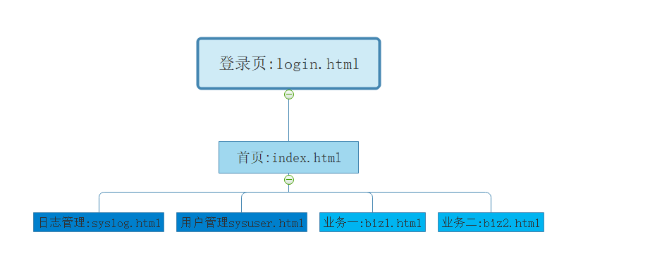

# 参考：

[Spring Security-JWT-OAuth2一本通(基于SpringBoot2.0)](https://www.kancloud.cn/hanxt/springsecurity)

[芋道 Spring Boot 安全框架 Spring Security 入门](http://www.iocoder.cn/Spring-Boot/Spring-Security/)

[芋道 Spring Security OAuth2 入门](http://www.iocoder.cn/Spring-Security/OAuth2-learning/)

https://blog.csdn.net/vbirdbest/category_8899577.html

[TOC]

# 一，Spring Security 基础篇

## 1、需求分析与基础环境准备

### 1.1、需求分析



- login.html登录页面，登录页面访问不受限制
- 在登录页面登录之后，进入index.html首页（登录验证Authentication）
- 首页可以看到syslog、sysuer、biz1、biz2四个页面选项
- 我们希望syslog（日志管理）和sysuser(用户管理)只有admin管理员可以访问（权限管理Authorization）
- biz1、biz2普通的操作用户auser就可以访问（权限管理Authorization）

**其中 login.html是html文件，其他文件是以.html为后缀的freemarker模板文件**

### 1.2、环境准备

1. 起一个新的spring boot2.0版本的web应用
2. 集成lombok、mybatis、log4j等
3. 集成一个前端模板，这里使用的是freemarker


> 注意login.html页面的存放位置和其他文件的存放位置不一样。public文件夹里面的html文件可以对外公开访问

**login.html**

```html
<!DOCTYPE html>
<html lang="en">
<head>
    <meta charset="UTF-8">
    <title>首页</title>
</head>
<body>
<h1>字母哥业务系统登录</h1>
<form action="/login" method="post">
    <span>用户名称</span><input type="text" name="username" /> <br>
    <span>用户密码</span><input type="password" name="password" /> <br>
    <input type="submit" value="登陆">
</form>

</body>
</html>
```

**index.html**

```html
<!DOCTYPE html>
<html>
<head lang="en">
    <meta charset="UTF-8" />
    <title>字母哥业务管理系统</title>
</head>
<body>

<h1>字母哥业务管理系统</h1>
<br>
<a href="/syslog">日志管理</a>
<br>
<a href="/sysuser">用户管理</a>
<br>
<a href="/biz1">具体业务一</a>
<br>
<a href="/biz2">具体业务二</a>

</body>
</html>
```

**BizpageController .java**

```java
@Controller
public class BizpageController {

    // 登录
    @PostMapping("/login")
    public String index(String username,String password) {
        return "index";
    }

    // 登录成功之后的首页
    @GetMapping("/index")
    public String index() {
        return "index";
    }

    // 日志管理
    @GetMapping("/syslog")
    public String showOrder() {
        return "syslog";
    }

    // 用户管理
    @GetMapping("/sysuser")
    public String addOrder() {
        return "sysuser";
    }

    // 具体业务一
    @GetMapping("/biz1")
    public String updateOrder() {
        return "biz1";
    }

    // 具体业务二
    @GetMapping("/biz2")
    public String deleteOrder() {
        return "biz2";
    }
}
```

## 2、formLogin模式登录认证

### 2.1、formLogin的应用场景

#### 准备工作

- 新建一个Spring Boot 的web应用，引入Spring Security Starter。
- 准备一个login.html登录页面，页面内容非常简单，一个from表单、用户名和密码输入框，一个提交按钮
- 准备一个首页index.html，在登录成功之后需要进入index.html首页
- 首页可以看到syslog（日志管理）、sysuer（用户管理）、biz1（业务一）、biz2（业务二）四个页面超文本链接选项。通过controller控制层跳转页面，并在对应页面写一些标志性文字即可，不需写具体业务。

#### 需求

- 我们希望biz1（业务一）、biz2（业务二）普通的操作用户user就可以访问
- 我们希望管理员可以访问包括syslog（日志管理）和sysuser(用户管理)在内的所有资源

以上就是本文介绍formLogin模式需要进行的准备工作及需求，下面我们就来实现其中的核心的登录验证逻辑，准备工作非常简单请自行实现。（新建spring boot应用，登录页面、首页、四个业务页面都写成非常简单的html即可，不用写实际业务和样式。）

### 2.2、说明

formLogin模式的三要素：

- 登录认证逻辑
- 资源访问控制规则，如：资源权限、角色权限
- 用户角色权限

### 2.3、登录认证及资源访问权限的控制

首先，我们要继承`WebSecurityConfigurerAdapter` ，重写`configure(HttpSecurity http)` 方法，**该方法用来配置登录验证逻辑**。请注意看下文代码中的注释信息。

```java
@Configuration
public class SecurityConfig extends WebSecurityConfigurerAdapter {

    /**
     * 配置URL的权限等
     * @param http URL配置对象
     * @return void
     * @title configure
     * @author Jjcc
     * @createTime 2020/3/21 22:13
     */
    @Override
    protected void configure(HttpSecurity http) throws Exception {
        // <Y> 设置form表单登录
        http.formLogin()
                // 用户未登录时，访问任何资源都转跳到该路径，即登录页面
                .loginPage("/login.html")
                // 处理登录请求的路径
                .loginProcessingUrl("/login")
                // 表单中的账号name
                .usernameParameter("username")
                // 表单中的密码name
                .passwordParameter("password")
                // 登录成功后跳转的页面
                .defaultSuccessUrl("/index")
            .and()
                // <X> 配置请求地址的权限
                .authorizeRequests()
                // 不需要权限即可访问的 URL；#permitAll()：允许访问的URL
                .antMatchers("/public/login.html", "/login").permitAll()
                // #hasAnyAuthority(...)：相关的URL必须要有其中一个权限才可以访问。
                .antMatchers("/biz1", "/biz2")
                    .hasAnyAuthority("ROLE_user", "ROLE_admin")
                // #hasAnyRole(...)：相关的URL必须要有其中一个角色才可以访问。
                .antMatchers("/syslog", "/sysuser")
                    .hasAnyRole("admin")
            	// 需要 NORMAL 角色
                .antMatchers("/test/normal").access("hasRole('ROLE_NORMAL')")
                // 任何请求，访问的用户都需要经过认证
                .anyRequest().authenticated();

        // <Z> 退出的URL
        http.logout().logoutUrl("/logout").logoutSuccessUrl("/login.html");

        // 禁用跨站csrf攻击防御
        http.csrf().disable();
    }
}
```

**上面的代码分为两部分：**

- 第一部分是`formLogin`配置段，用于配置登录验证逻辑相关的信息。如：登录页面、登录成功页面、登录请求处理路径等。
- 第二部分是`authorizeRequests`配置端，用于配置资源的访问权限。如：开发登录页面的permitAll开放访问，“/biz1”（业务一页面资源）需要有角色为user或admin的用户才可以访问。

**方法详解：**

- `X` 处，调用 `HttpSecurity#authorizeRequests()` 方法，开始配置 URL 的**权限控制**。下面，是配置权限控制会使用到的方法：
  - `#(String... antPatterns)` 方法，配置匹配的 URL 地址，基于 [Ant 风格路径表达式](https://blog.csdn.net/songdexv/article/details/7219686) ，可传入多个。
  - 【常用】`#permitAll()` 方法，所有用户可访问。
  - 【常用】`#denyAll()` 方法，所有用户不可访问。
  - 【常用】`#authenticated()` 方法，登陆用户可访问。
  - `#anonymous()` 方法，无需登陆，即匿名用户可访问。
  - `#rememberMe()` 方法，通过 [remember me](https://docs.spring.io/spring-security/site/docs/3.0.x/reference/remember-me.html) 登陆的用户可访问。
  - `#fullyAuthenticated()` 方法，非 [remember me](https://docs.spring.io/spring-security/site/docs/3.0.x/reference/remember-me.html) 登陆的用户可访问。
  - `#hasIpAddress(String ipaddressExpression)` 方法，来自指定 IP 表达式的用户可访问。
  - 【常用】`#hasRole(String role)` 方法， 拥有指定角色的用户可访问。
  - 【常用】`#hasAnyRole(String... roles)` 方法，拥有指定任一角色的用户可访问。
  - 【常用】`#hasAuthority(String authority)` 方法，拥有指定权限(`authority`)的用户可访问。
  - 【常用】`#hasAuthority(String... authorities)` 方法，拥有指定任一权限(`authority`)的用户可访问。
  - 【最牛】`#access(String attribute)` 方法，当 [Spring EL 表达式](https://docs.spring.io/spring/docs/4.3.10.RELEASE/spring-framework-reference/html/expressions.html)的执行结果为 `true` 时，可以访问。
- `Y` 处，调用 `HttpSecurity#formLogin()` 方法，设置 Form 表单**登陆**。
  - `#loginPage(String loginPage)` 方法，自定义登录页面。
- `Z` 处，调用 `HttpSecurity#logout()` 方法，配置**退出**相关。
  - `logoutUrl(String url)`方法，自定义退出系统的url。

这时候，我们通过浏览器访问，随便测试一个没有访问权限的资源，都会跳转到login.html页面。


### 2.4、用户及角色信息配置

在上文中，我们配置了登录验证及资源访问的权限规则，我们还没有具体的用户，下面我们就来配置具体的用户。重写`WebSecurityConfigurerAdapter`的 `configure(AuthenticationManagerBuilder auth)`方法

```java
    /**
     * 配置用户及对应的权限。
     * @title configure
     * @author Jjcc
     * @param auth 认证管理对象
     * @return void
     * @createTime 2020/3/21 22:24
     */
    @Override
    protected void configure(AuthenticationManagerBuilder auth) throws Exception {
        // <X>在内存里面存储用户的身份认证和授权信息
        auth.inMemoryAuthentication()
                // <Y> 配置 admin 用户
                .withUser("admin").password("123456").roles("admin")
                .and()
                // <Y> 配置 user 用户
                .withUser("user").password("123456").roles("user")
                .and()
                // <Z> 使用 BCrypt 给密码加密。
                .passwordEncoder(passwordEncoder());
    }

    /**
     * BCrypt加密
     * @title passwordEncoder
     * @author Jjcc
     * @return org.springframework.security.crypto.password.PasswordEncoder
     * @createTime 2020/3/21 22:32
     */
    @Bean
    public PasswordEncoder passwordEncoder() {
        return new BCryptPasswordEncoder();
    }
```

- `X` 处，调用 `AuthenticationManagerBuilder#inMemoryAuthentication()` 方法，使用**内存级别**的 [InMemoryUserDetailsManager](https://github.com/spring-projects/spring-security/blob/master/core/src/main/java/org/springframework/security/provisioning/InMemoryUserDetailsManager.java) Bean 对象，提供认证的用户信息。
  - Spring 内置了两种 [UserDetailsManager](https://github.com/spring-projects/spring-security/blob/master/core/src/main/java/org/springframework/security/provisioning/UserDetailsManager.java) 实现：
    - InMemoryUserDetailsManager
    - JdbcUserDetailsManager ，基于 **JDBC**的 [JdbcUserDetailsManager](https://github.com/spring-projects/spring-security/blob/master/core/src/main/java/org/springframework/security/provisioning/JdbcUserDetailsManager.java) 。
  - 实际项目中，我们更多采用调用 `AuthenticationManagerBuilder#userDetailsService(userDetailsService)` 方法，使用自定义实现的 [UserDetailsService](https://github.com/spring-projects/spring-security/blob/master/core/src/main/java/org/springframework/security/core/userdetails/UserDetailsService.java) 实现类，更加**灵活**且**自由**的实现认证的用户信息的读取。
- `Y`处，配置用户信息，包含账号、密码、角色、权限等信息。
- `Z` 处，调用 `AbstractDaoAuthenticationConfigurer#passwordEncoder(passwordEncoder)` 方法，设置 PasswordEncoder 密码编码器。
  - 生产环境下，使用 [BCryptPasswordEncoder](https://github.com/spring-projects/spring-security/blob/master/crypto/src/main/java/org/springframework/security/crypto/bcrypt/BCryptPasswordEncoder.java) 加密密码明文。

### 2.5、静态资源访问

在我们的实际开发中，登录页面login.html和控制层Controller登录验证'/login'都必须无条件的开放。除此之外，一些静态资源如css、js文件通常也都不需要验证权限，我们需要将它们的访问权限也开放出来。下面就是实现的方法：重写`WebSecurityConfigurerAdapter`类的`configure(WebSecurity web)` 方法

```java
   @Override
    public void configure(WebSecurity web) {
        //将项目中静态资源路径开放出来
        web.ignoring().antMatchers( "/css/**", "/fonts/**", "/img/**", "/js/**");
    }
```

## 3、源码解析登录认证流程

[源码解析登录认证流程](https://www.kancloud.cn/hanxt/springsecurity/1210164)

[Spring Security(一)：最简单的Spring Security程序](https://blog.csdn.net/vbirdbest/article/details/89600073)

[SpringBoot集成Spring Security（7）——认证流程](https://blog.csdn.net/yuanlaijike/article/details/84703690)

## 4、自定义登录验证结果处理

### 4.1、需要自定义登录结果的场景

在之前的文章中，做过登录验证流程的源码解析。其中比较重要的就是

- 当我们登录成功的时候，是由`AuthenticationSuccessHandler`进行登录结果处理，默认跳转到`defaultSuccessUrl`配置的路径对应的资源页面（一般是首页index.html）。
- 当我们登录失败的时候，是由`AuthenticationfailureHandler`进行登录结果处理，默认跳转到`failureUrl`配置的路径对应的资源页面（一般是登录页login.html）。

但是在web应用开发过程中需求是千变万化的，有时需要我们针对登录结果做个性化处理，比如：

- 我们希望不同的人登陆之后，看到不同的首页
- 我们应用是前后端分离的，验证响应结果是JSON格式数据，而不是页面跳转

### 4.2、自定义登陆成功的结果处理

`AuthenticationSuccessHandler`接口是`Security`提供的认证成功处理器接口，我们只需要去实现它即可。但是通常来说，我们不会直接去实现`AuthenticationSuccessHandler`接口，而是继承`SavedRequestAwareAuthenticationSuccessHandler` 类，**这个类会记住用户上一次请求的资源路径**，比如：用户请求books.html，没有登陆所以被拦截到了登录页，当你完成登陆之后会自动跳转到books.html，而不是主页面。

```java
/**
 * 登录成功的处理
 * @author Jjcc
 * @version 1.0.0
 * @className MyAuthenticationSuccessHandler.java
 * @createTime 2020年03月22日 13:26:00
 */
@Component
public class MyAuthenticationSuccessHandler extends SavedRequestAwareAuthenticationSuccessHandler {

    @Value("${spring.security.loginType}")
    private String loginType;

    private  static ObjectMapper objectMapper = new ObjectMapper();

    @Override
    public void onAuthenticationSuccess(HttpServletRequest request, HttpServletResponse response, Authentication authentication) throws ServletException, IOException {
        String type = "json";

        // 判断是需要跳转页面还是返回json。
        if (type.equalsIgnoreCase(loginType)) {
            response.setContentType("application/json;charset=UTF-8");
            response.getWriter().write(objectMapper.writeValueAsString(AjaxResponse.success()));
        } else {
            // 调用父类方法；指的是登录成功后，会跳转到上一次请求的页面中。
            super.onAuthenticationSuccess(request, response, authentication);
        }

    }
}
```

- 在上面的自定义登陆成功处理中，既适应JSON前后端分离的应用登录结果处理，也适用于模板页面跳转应用的登录结果处理
- ObjectMapper 是Spring Boot默认集成的JSON数据处理类库Jackson中的类。
- AjaxResponse是一个自定义的通用的JSON数据接口响应类。

### 4.3、自定义登录失败的结果处理

这里我们同样没有直接实现`AuthenticationFailureHandler`接口，而是继承`SimpleUrlAuthenticationFailureHandler` 类。**该类中默认实现了登录验证失败的跳转逻辑，即登陆失败之后回到登录页面**。我们可以利用这一点简化我们的代码。

```java
/**
 * 登录失败的处理
 * @author Jjcc
 * @version 1.0.0
 * @className MyAuthenticationFailureHandler.java
 * @createTime 2020年03月22日 13:38:00
 */
@Component
public class MyAuthenticationFailureHandler extends SimpleUrlAuthenticationFailureHandler {

    @Value("${spring.security.loginType}")
    private String loginType;

    private ObjectMapper objectMapper = new ObjectMapper();

    @Override
    public void onAuthenticationFailure(HttpServletRequest request, HttpServletResponse response, AuthenticationException exception) throws IOException, ServletException {

        // 判断是需要跳转页面还是返回json。
        String type = "json";
        if (type.equalsIgnoreCase(loginType)) {
            response.setContentType("application/json;charset=UTF-8");
            objectMapper.writeValueAsString(AjaxResponse.error(
                    new CustomException(CustomExceptionType.USER_INPUT_ERROR, "用户名或密码存在错误，请检查后再次登录")
                    )
            );
        } else {
            // 登录事变，跳转到默认的failureUrl
            response.setContentType("text/html;charset=UTF-8");
            super.onAuthenticationFailure(request, response, exception);
        }


    }
}
```

- 在上面的自定义登陆失败处理中，既适应JSON前后端分离的应用登录失败结果处理，也适用于模板页面跳转应用的登录失败结果处理
- 登陆失败之后，将默认跳转到默认的failureUrl，即登录界面。

### 4.4、SecurityConfig 变更

```java
@Configuration
public class SecurityConfig extends WebSecurityConfigurerAdapter {

    @Resource
    private MyAuthenticationSuccessHandler myAuthenticationSuccessHandler;

    @Resource
    private MyAuthenticationFailureHandler myAuthenticationFailureHandler;

   @Override
   protected void configure(HttpSecurity http) throws Exception {
       http.csrf().disable() //禁用跨站csrf攻击防御，后面的章节会专门讲解
           .formLogin()
           .successHandler(myAuthenticationSuccessHandler)
           .failureHandler(myAuthenticationFailureHandler)
           //.defaultSuccessUrl("/index")//登录认证成功后默认转跳的路径
           //.failureUrl("/login.html") //登录认证是被跳转页面
}
```

- 将自定义的`AuthenticationSuccessHandler`和`AuthenticationFailureHandler`注入到Spring Security配置类中
- 使用fromlogin模式，配置`successHandler`和`failureHandler`。
- 不要配置`defaultSuccessUrl`和`failureUrl`，否则自定义`handler`将失效。**handler配置与URL配置只能二选一**。

## 5、session会话的管理

### 5.1、Spring Security创建使用session的方法

Spring Security提供4种方式精确的控制会话的创建：

- **always**：如果当前请求没有session存在，Spring Security创建一个session。
- **ifRequired（默认）**： Spring Security在需要时才创建session
- **never**： Spring Security将永远不会主动创建session，但是如果session已经存在，它将使用该session
- **stateless**：Spring Security不会创建或使用任何session。适合于接口型的无状态应用，该方式节省资源。

在Spring Security配置中加入session创建的策略。继承`WebSecurityConfigurerAdapter` ，重写`configure(HttpSecurity http)` 方法

```java
@Override
protected void configure(HttpSecurity http) throws Exception {
    // Spring Security创建session策略；默认使用 IF_REQUIRED，指在需要时才创建 Session，
    http.sessionManagement()
        .sessionCreationPolicy(SessionCreationPolicy.IF_REQUIRED);
}
```

### 5.2、会话超时管理

#### 5.2.1、会话超时时间配置

在Spring boot应用中有两种设置会话超时时间的方式，Spring Security对这两种方式完全兼容，即：当会话超时之后用户需要重新登录才能访问应用：

- `server.servlet.session.timeout`=15m
- `spring.session.timeout` = 15m

第一种方式是springBoot应用自带的session超时配置，第二种方式是我们使用Spring Session之后，提供的session超时配置。第二种方式的优先级更高。

> 注意：在Spring Boot中Session超时最短的时间是一分钟，当你的设置小于一分钟的时候，默认为一分钟。

#### 5.2.2、会话超时处理

会话超时之后，我们通常希望应用跳转到一个指定的URL，显示会话超时信息。可以使用如下的配置的代码实现。

```java
  http.sessionManagement()
          .invalidSessionUrl("/invalidSession.html");    //非法超时session跳转页面
```

> 以上路径需要配置permitAll()权限，即无需授权即可访问。

### 5.3、Spring Security的会话固化保护

`session-fixation-protection` 即session的固化保护功能，该功能的目的是一定程度上防止非法用户窃取用户session及cookies信息，进而模拟session的行为。
默认情况下，Spring Security启用了`migrationSession`保护方式。即对于同一个cookies的SESSIONID用户，每次登录验证将创建一个新的HTTP会话，旧的HTTP会话将无效，并且旧会话的属性将被复制。

```java
http.sessionManagement() .sessionFixation().migrateSession()
```

### 5.4、Cookie的安全

熟悉Session实现原理的朋友一定都知道，提高Cookies的安全性，实际上就是提高session的安全性。在Spring Boot中可以通过配置方式来实现：

```properties
server.servlet.session.cookie.http-only=true
server.servlet.session.cookie.secure=true
```

- httpOnly：如果为true，则浏览器脚本将无法访问cookie
- secure：如果为true，则仅通过HTTPS连接发送cookie，HTTP无法携带cookie。

### 5.5、限制最大用户登录数量

虽然固化保护的策略可以一定程度保护session复制、窃取，但是在我们绝大部分的应用需求中，都会限制一个用户只能占用一个session。就像我们经常使用QQ，用户在别的地方登录，之前的登陆就会下线。使用Spring Security的配置我们可以轻松的实现这个功能。

```java
// maximumSessions()：同一个用户最大的登录数量
// maxSessionsPreventsLogin()：true：表示已登录就不再允许再次登录；false：表示允许再次登录，但之前的登录会下线
// expiredSessionStrategy()：自定义session被下线后或者超时的处理策略
http.sessionManagement().maximumSessions(1).maxSessionsPreventsLogin(false)
     .expiredSessionStrategy(new CustomExpiredSessionStrategy());
```

- maximumSessions表示同一个用户最大的登录数量
- maxSessionsPreventsLogin提供两种session保护策略：true表示已经登录就不予许再次登录，false表示允许再次登录但是之前的登录会下线。
- expiredSessionStrategy表示自定义一个session被下线(超时)之后的处理策略。

通过实现`SessionInformationExpiredStrategy` 接口来自定义session被下线(超时)之后的处理策略。

```java
    public static class CustomExpiredSessionStrategy implements SessionInformationExpiredStrategy {

        //jackson的JSON处理对象
        private ObjectMapper objectMapper = new ObjectMapper();

        @Override
        public void onExpiredSessionDetected(SessionInformationExpiredEvent event) throws IOException {
            HashMap<String, Object> map = new HashMap<>(4);

            map.put("code", 0);
            map.put("msg", "您的登录已经超时或者已经在另一台机器登录，您被迫下线。" +
                    event.getSessionInformation().getLastRequest());

            String json = objectMapper.writeValueAsString(map);
            HttpServletResponse response = event.getResponse();

            // 输出json信息的数据。
            response.setContentType("application/json;charset=UTF-8");
            response.getWriter().write(json);

            // 或者是页面跳转
//            response.sendRedirect("/login.html");
        }
    }
```

**测试方法：**

- 打开两个浏览器、一个先登录、一个后登录。完成之后，刷新先登录的页面，显示：“您的登录已经超时或者已经在另一台机器登录，您被迫下线”。表示我们的配置正确。
- 然后关闭浏览器再次测试，我们设置`maxSessionsPreventsLogin`为true。先登录的用户可以登陆，但是再次登陆就无法登陆。

# 二、认证授权鉴权功能深入

## 1、RBAC权限管理模型

我们开发一个系统，必然面临权限控制的问题，即不同的用户具有不同的访问、操作、数据权限。形成理论的权限控制模型有：**自主访问控制**（DAC: Discretionary Access Control）、**强制访问控制**（MAC: Mandatory Access Control）、**基于属性的权限验证**（ABAC: Attribute-Based Access Control）等。**最常被开发者使用也是相对易用、通用的就是RBAC权限模型**（Role-Based Access Control）

### 1.1、RBAC权限模型简介

RBAC权限模型（Role-Based Access Control）即：基于角色的权限控制。模型中有几个关键的术语：

- 用户：系统接口及访问的操作者
- 权限：能够访问某接口或者做某操作的授权资格
- 角色：具有一类相同操作权限的用户的总称

RBAC权限模型核心授权逻辑如下：

- 某用户是什么角色？
- 某角色具有什么权限？
- 通过角色的权限推导用户的权限

### 1.2、RBAC的演化进程

#### 1.2.1、用户与权限直接关联


想到权限控制，人们最先想到的一定是用户与权限直接关联的模式，简单地说就是：某个用户具有某些权限。如图：

- 张三具有创建用户和删除用户的权限，所以他可能系统维护人员
- 李四具有产品记录管理和销售记录管理权限，所以他可能是一个业务销售人员

这种模型能够清晰的表达用户与权限之间的关系，足够简单。但同时也存在问题：

- 现在用户是张三、李四，以后随着人员增加，每一个用户都需要重新授权
- 或者张三、李四离职，需要针对每一个用户进行多种权限的回收

#### 1.2.2、一个用户拥有一个角色

在实际的团体业务中，都可以将用户分类。比如对于薪水管理系统，通常按照级别分类：经理、高级工程师、中级工程师、初级工程师。也就是按照一定的角色分类，通常具有同一角色的用户具有相同的权限。这样改变之后，就可以将针对用户赋权转换为针对角色赋权。


- 一个用户有一个角色
- 一个角色有多个操作（菜单）权限
- 一个操作权限可以属于多个角色

我们可以用下图中的数据库设计模型，描述这样的关系。


#### 1.2.3、一个用户一个或多个角色

但是在实际的应用系统中，一个用户一个角色远远满足不了需求。如果我们希望一个用户既担任销售角色、又暂时担任副总角色。该怎么做呢？为了增加系统设计的适用性，我们通常设计：

- 一个用户有一个或多个角色
- 一个角色包含多个用户
- 一个角色有多种权限
- 一个权限属于多个角色

我们可以用下图中的数据库设计模型，描述这样的关系。


- sys_user是用户信息表，用于存储用户的基本信息，如：用户名、密码
- sys_role是角色信息表，用于存储系统内所有的角色
- sys_menu是系统的菜单信息表，用于存储系统内所有的菜单。用id与父id的字段关系维护一个菜单树形结构。
- sys_user_role是用户角色多对多关系表，一条userid与roleid的关系记录表示该用户具有该角色，该角色包含该用户。
- sys_role_menu是角色菜单(权限)关系表，一条roleid与menuid的关系记录表示该角色由某菜单权限，该菜单权限可以被某角色访问。

### 1.3、页面访问权限与操作权限

- **页面访问权限:** 所有系统都是由一个个的页面组成，页面再组成模块，用户是否能看到这个页面的菜单、是否能进入这个页面就称为页面访问权限。
- **操作权限：** 用户在操作系统中的任何动作、交互都需要有操作权限，如增删改查等。比如：某个按钮，某个超链接用户是否可以点击，是否应该看见的权限。


为了适应这种需求，我们**可以把页面资源(菜单)和操作资源(按钮)分表存放，如上图。也可以把二者放到一个表里面存放，用一个字段进行标志区分**。

### 1.4、数据权限

数据权限比较好理解，就是某个用户能够访问和操作哪些数据。

- 通常来说，数据权限由用户所属的组织来确定。比如：生产一部只能看自己部门的生产数据，生产二部只能看自己部门的生产数据；销售部门只能看销售数据，不能看财务部门的数据。而公司的总经理可以看所有的数据。
- 在实际的业务系统中，数据权限往往更加复杂。非常有可能销售部门可以看生产部门的数据，以确定销售策略、安排计划等。

所以为了面对复杂的需求，数据权限的控制通常是由程序员书写个性化的SQL来限制数据范围的，而不是交给权限模型或者Spring Security或shiro来控制。当然也可以从权限模型或者权限框架的角度去解决这个问题，但适用性有限。

## 2、加载动态数据进行登录与授权

Spring Security 不用你自己去写`login Controller`。你只需要告诉Spring Security用户信息、角色信息、权限信息、登录页是什么？登陆成功页是什么？或者其他有关登录的一切信息。具体的登录验证逻辑它来帮你实现。

### 2.1、动态数据登录验证的基础知识

前文中我们所有的用户、角色、权限信息都是在配置文件里面写死的，然而在实际的业务系统中，这些信息通常是存放在RBAC权限模型的数据库表中的。下面我们来回顾一下其中的核心概念：

- RBAC的权限模型可以从用户获取为用户分配的一个或多个角色，从用户的角色又可以获取该角色的多种权限。通过关联查询可以获取某个用户的角色信息和权限信息。
- 在源码解析的文章中，我们知道如果我们不希望用户、角色、权限信息写死在配置里面。我们应该实现`UserDetails`与`UserDetailsService`接口，从而从数据库或者其他的存储上动态的加载这些信息。

### 2.2、UserDetails 与 UserDetailsService 接口

- `UserDetailsService`接口有一个方法叫做`loadUserByUsername`，我们实现动态加载用户、角色、权限信息就是通过实现该方法。函数见名知义：通过用户名加载用户。该方法的返回值就是`UserDetails`。
- `UserDetails`就是用户信息，即：用户名、密码、该用户所具有的权限。

下面我们来看一下`UserDetails`接口都有哪些方法。

```java
public interface UserDetails extends Serializable {
    //获取用户的权限集合
    Collection<? extends GrantedAuthority> getAuthorities();

    //获取密码
    String getPassword();

    //获取用户名
    String getUsername();

    //账号是否没过期
    boolean isAccountNonExpired();

    //账号是否没被锁定
    boolean isAccountNonLocked();

    //密码是否没过期
    boolean isCredentialsNonExpired();

    //账户是否可用
    boolean isEnabled();
}
```

> 现在，我们明白了，**只要我们把这些信息提供给Spring Security，Spring Security就知道怎么做登录验证了，根本不需要我们自己写`Controller`实现登录验证逻辑**。

### 2.3、表结构

五个表，包含用户表 `user`、角色表 `role`、用户与角色关联表 `user_role`、权限表 `permission`、角色与权限关联表 `role_permission`。

```sql
DROP TABLE IF EXISTS `permission`;
CREATE TABLE `permission` (
  `id` int(11) NOT NULL AUTO_INCREMENT,
  `perm_name` varchar(30) NOT NULL,
  `perm_resource` varchar(30) NOT NULL,
  PRIMARY KEY (`id`)
) ENGINE=InnoDB AUTO_INCREMENT=8 DEFAULT CHARSET=utf8;

-- ----------------------------
-- Table structure for role
-- ----------------------------
DROP TABLE IF EXISTS `role`;
CREATE TABLE `role` (
  `id` int(11) NOT NULL AUTO_INCREMENT,
  `role_name` varchar(30) NOT NULL,
  `role_sn` varchar(15) DEFAULT NULL,
  PRIMARY KEY (`id`)
) ENGINE=InnoDB AUTO_INCREMENT=3 DEFAULT CHARSET=utf8;

-- ----------------------------
-- Table structure for role_permission
-- ----------------------------
DROP TABLE IF EXISTS `role_permission`;
CREATE TABLE `role_permission` (
  `role_id` int(11) NOT NULL,
  `permission_id` int(11) NOT NULL
) ENGINE=InnoDB DEFAULT CHARSET=utf8;

-- ----------------------------
-- Table structure for t_sys_account_role
-- ----------------------------
DROP TABLE IF EXISTS `t_sys_account_role`;
CREATE TABLE `t_sys_account_role` (
  `id` int(11) NOT NULL AUTO_INCREMENT,
  `account_id` int(11) NOT NULL COMMENT '用户id',
  `role_id` int(11) NOT NULL COMMENT '角色id',
  PRIMARY KEY (`id`)
) ENGINE=InnoDB AUTO_INCREMENT=137 DEFAULT CHARSET=utf8 COMMENT='用户角色表';

-- ----------------------------
-- Table structure for table_student
-- ----------------------------
DROP TABLE IF EXISTS `table_student`;
CREATE TABLE `table_student` (
  `id` int(11) NOT NULL AUTO_INCREMENT,
  `name` varchar(20) NOT NULL,
  `sex` char(2) DEFAULT NULL,
  `age` int(11) DEFAULT NULL,
  `class_ids` int(11) DEFAULT '12',
  PRIMARY KEY (`id`),
  KEY `common_index` (`id`) USING BTREE,
  KEY `fk_constraint` (`class_ids`) USING BTREE
) ENGINE=InnoDB AUTO_INCREMENT=12 DEFAULT CHARSET=utf8;

-- ----------------------------
-- Table structure for user
-- ----------------------------
DROP TABLE IF EXISTS `user`;
CREATE TABLE `user` (
  `id` int(11) NOT NULL AUTO_INCREMENT,
  `username` varchar(20) NOT NULL,
  `password` varchar(100) CHARACTER SET utf8mb4 NOT NULL DEFAULT '',
  `enabled` int(11) NOT NULL DEFAULT '0' COMMENT '0：可用；1：不可用；',
  PRIMARY KEY (`id`)
) ENGINE=InnoDB AUTO_INCREMENT=3 DEFAULT CHARSET=utf8;

-- ----------------------------
-- Table structure for user_role
-- ----------------------------
DROP TABLE IF EXISTS `user_role`;
CREATE TABLE `user_role` (
  `user_id` int(11) NOT NULL,
  `role_id` int(11) NOT NULL
) ENGINE=InnoDB DEFAULT CHARSET=utf8;
```

### 2.4、实现UserDetails 接口

```java
@Data
@EqualsAndHashCode(callSuper = false)
@Accessors(chain = true)
@TableName(value = "user")
public class User extends Model<User> implements UserDetails {

    private static final long serialVersionUID = 1L;

    @TableId(value = "id", type = IdType.AUTO)
    private Integer id;

    private String username;

    private String password;

    /**
     * 是否没过期
     */
    @TableField(exist = false)
    boolean accountNonExpired;
    /**
     * 是否没被锁定
     */
    @TableField(exist = false)
    boolean accountNonLocked;

    /**
     * 是否没过期
     */
    @TableField(exist = false)
    boolean credentialsNonExpired;
    /**
     * 账号是否可用; 0：可用；1：不可用；
     */
    boolean enabled;
    /**
     * 用户的权限集合
     */
    @TableField(exist = false)
    Collection<? extends GrantedAuthority> authorities;

    @Override
    protected Serializable pkVal() {
        return this.id;
    }

    @Override
    public String getPassword() {
        return password;
    }

    public void setPassword(String password) {
        this.password = password;
    }

    @Override
    public String getUsername() {
        return username;
    }

    public void setUsername(String username) {
        this.username = username;
    }

    @Override
    public boolean isAccountNonExpired() {
        return true;
    }

    public void setAccountNonExpired(boolean accountNonExpired) {
        this.accountNonExpired = accountNonExpired;
    }

    @Override
    public boolean isAccountNonLocked() {
        return true;
    }

    public void setAccountNonLocked(boolean accountNonLocked) {
        this.accountNonLocked = accountNonLocked;
    }

    @Override
    public boolean isCredentialsNonExpired() {
        return true;
    }

    public void setCredentialsNonExpired(boolean credentialsNonExpired) {
        this.credentialsNonExpired = credentialsNonExpired;
    }

    @Override
    public boolean isEnabled() {
        return true;
    }

    public void setEnabled(boolean enabled) {
        this.enabled = enabled;
    }

    @Override
    public Collection<? extends GrantedAuthority> getAuthorities() {
        return authorities;
    }

    public void setAuthorities(Collection<? extends GrantedAuthority> authorities) {
        this.authorities = authorities;
    }


}
```

写了一个适应于`UserDetails`的java POJO类，所谓的 `UserDetails`接口实现就是一些get方法。get方法由Spring Security调用，我们通过set方法或构造函数为 Spring Security提供UserDetails数据（从数据库查询）。

> 目前数据库表里面没有定义accountNonExpired、accountNonLocked、credentialsNonExpired这三个字段，所以其get方法，先直接返回true即可。
>

### 2.5、实现UserDetailsService接口

```java
/**
 * 从数据库中获取用户信息需要实现 UserDetailsService 类
 * @author Jjcc
 * @version 1.0.0
 * @className MyUserDetailsService.java
 * @createTime 2020年03月25日 14:23:00
 */
@Component
public class MyUserDetailsServiceImpl implements UserDetailsService {

    private UserService userService;

    @Autowired
    public MyUserDetailsServiceImpl(UserService userService) {
        this.userService = userService;
    }

    @Override
    public UserDetails loadUserByUsername(String username) throws UsernameNotFoundException {
        QueryWrapper<User> userQueryWrapper = new QueryWrapper<>();
        QueryWrapper<User> name = userQueryWrapper.eq("username", username);

        User user = userService.getOne(name);

        Optional<User> userOpt = Optional.ofNullable(user);
        System.out.println("!!!!!!!!!!!!!!!");
        userOpt.orElseThrow( () -> {
                System.out.println("11111111111");
                return new UsernameNotFoundException("用户名不存在");
        });

        // 登录用户的角色
        List<String> roleByUserName = userService.findRoleByUserName(userOpt.get().getId());

        // 如果该用户没有对应的角色，直接返回
        if (null == roleByUserName || roleByUserName.size() == 0) {
            return userOpt.get();
        }

        // 角色对应的所有权限
        List<String> authorityByRoleCode = userService.findAuthorityByRoleCode(roleByUserName);

        // 为角色加上 ROLE_ 前缀， spring security 规范
        roleByUserName = roleByUserName.stream().map(rc -> "ROLE_" + rc).collect(Collectors.toList());

        // 在spring security中，角色是一种特殊的权限，需要与权限放置在一起
        authorityByRoleCode.addAll(roleByUserName);

        // 转成用逗号分隔的字符串，为用户设置权限标识
        userOpt.get().setAuthorities(
                AuthorityUtils.commaSeparatedStringToAuthorityList(
                        String.join(",", authorityByRoleCode)
                )
        );

        return userOpt.get();
    }
}
```

- 通常数据库表sys_user字段要和SysUser属性一一对应，比如username、password、enabled。但是比如`accountNonLocked`字段用于登录多次错误锁定，但我们一般不会在表里存是否锁定，而是存一个锁定时间字段。通过锁定时间是否大于当前时间判断账号是否锁定，所以实现过程中可以灵活做判断并用好set方法，不必拘泥于一一对应的形式。
- 角色是一种特殊的权限，在Spring Security我们可以使用`hasRole(角色标识)`表达式判断用户是否具有某个角色，决定他是否可以做某个操作;通过`hasAuthority(权限标识)`表达式判断是否具有某个操作权限。
- 上述实现中用到的`UserService`是Mybatis操作数据库的接口实现，看文末代码。

### 2.5、注册UserDetailsService

重写`WebSecurityConfigurerAdapter`的 `configure(AuthenticationManagerBuilder auth)`方法

```java
private MyUserDetailsServiceImpl myUserDetailsService;

@Autowired
public SecurityConfig(MyUserDetailsServiceImpl myUserDetailsService) {
    this.myUserDetailsService = myUserDetailsService;
}

@Bean("passwordEncoder")
public PasswordEncoder passwordEncoder(){
    return new BCryptPasswordEncoder();
}

    /**
     * 配置用户及对应的权限。
     * @title configure
     * @author Jjcc
     * @param auth 认证管理对象
     * @return void
     * @createTime 2020/3/21 22:24
     */
    @Override
    protected void configure(AuthenticationManagerBuilder auth) throws Exception {
        // 在内存里面存储用户的身份认证和授权信息
//        auth.inMemoryAuthentication()
//                // 配置 admin 用户
//                .withUser("admin").password("$2a$10$uGBy3Ld7nSgjH0rspAlOz.Fe0jQx50J5Nz0DGdu0LLZEK8/lCE/uu").roles("admin")
//                .and()
//                // 配置 user 用户
//                .withUser("user").password("$2a$10$uGBy3Ld7nSgjH0rspAlOz.Fe0jQx50J5Nz0DGdu0LLZEK8/lCE/uu").roles("user")
//                .and()
//                // 使用 BCrypt 给密码加密。
//                .passwordEncoder(passwordEncoder());
        // 使用用户自定义的 userDetailsService，从数据库中拿取相关信息。
        auth.userDetailsService(myUserDetailsService).passwordEncoder(passwordEncoder());
    }
```

使用`BCryptPasswordEncoder`，表示存储中（数据库）取出的密码必须是经过BCrypt加密算法加密的。
这里需要注意的是，因为我们使用了`BCryptPasswordEncoder`加密解密，所以**数据库表里面存的密码应该是加密之后的密码**（造数据的过程），可以使用如下代码加密（如密码是：123456）。将打印结果保存保存到密码字段。

```java
@Resource
PasswordEncoder passwordEncoder;

@Test
public void contextLoads() {
    System.out.println(passwordEncoder.encode("123456"));
}
```

### 2.6、Mybatis持久层数据接口

- 需要在系统内集成持久层框架，用于访问数据库。
- 实现三个接口：一是通过userId（用户名）查询用户信息;二是根据用户名查询用户角色列表；三是通过角色列表查询权限列表。

```java
public interface UserMapper extends BaseMapper<User> {

    /**
     * 相关角色
     * @title findRoleByUserName
     * @author Jjcc
     * @param id 账号Id
     * @return java.util.List<java.lang.String>
     * @createTime 2020/3/25 15:41
     */
    @Select("select role.role_sn from user_role " +
            "left join user on `user`.id=user_role.user_id " +
            "left JOIN role on user_role.role_id=role.id " +
            "where user_id = #{id}")
    List<String> findRoleByUserName(@Param("id") Integer id);

    /**
     * 角色对应的权限
     * @title findAuthorityByRoleCode
     * @author Jjcc
     * @param roleCode 角色集合
     * @return java.util.List<java.lang.String>
     * @createTime 2020/3/25 15:56
     */
    List<String> findAuthorityByRoleCode(@Param("roleCode") List<String> roleCode);

}
```

**DAO层对应的 mapping文件**

```xml
<?xml version="1.0" encoding="UTF-8"?>
<!DOCTYPE mapper PUBLIC "-//mybatis.org//DTD Mapper 3.0//EN" "http://mybatis.org/dtd/mybatis-3-mapper.dtd">
<mapper namespace="com.security.springsecuritystudy.dao.mysqldao.UserMapper">

    <!-- 通用查询映射结果 -->
    <resultMap id="BaseResultMap" type="com.security.springsecuritystudy.entity.User">
        <id column="id" property="id" />
        <result column="username" property="username" />
        <result column="password" property="password" />
        <result column="enabled" property="enabled" />
    </resultMap>


    <select id="findAuthorityByRoleCode" resultType="java.lang.String">
        select perm_resource from permission LEFT JOIN role_permission on permission.id = role_permission.permission_id
        LEFT JOIN role on role.id = role_permission.role_id
        <where>
            role_sn in
            <foreach collection="roleCode" item="item" open="(" close=")" separator=",">
                #{item}
            </foreach>
        </where>
    </select>

</mapper>

```

### 2.7、最后说明

至此，我们将系统里面的所有的用户、角色、权限信息都通过`UserDetailsService`和`UserDetails`告知了Spring Security。剩下的事情很简单了：

- 写一个登录界面，写一个登录表单，表单使用post方法提交到默认的/login路径
- 表单的用户名、密码字段名称默认是username、password。
- 写一个登录成功之后的跳转页面，比如index.html

## 3、登录时的异常处理

不知道你有没有注意到，当我们登陆失败时候，Spring security 帮我们跳转到了 `/login?error` Url，奇怪的是不管是控制台还是网页上都没有打印错误信息。


这是因为首先 `/login?error` 是 Spring security 默认的失败 Url，其次**如果你不手动处理这个异常，这个异常是不会被处理的**。

### 3.1、常见的异常

**Spring Security 中常见的异常：**

- `UsernameNotFoundException`（用户不存在）
- `DisabledException`（用户已被禁用）
- `BadCredentialsException`（坏的凭据）
- `LockedException`（账户锁定）
- `AccountExpiredException` （账户过期）
- `CredentialsExpiredException`（证书过期）

以上列出的这些异常都是 `AuthenticationException` 的子类，然后我们来看看 Spring security 如何处理 `AuthenticationException` 异常的。

### 3.2、源码分析

我们知道异常处理一般在过滤器中处理，我们在 `AbstractAuthenticationProcessingFilter` 中找到了对 `AuthenticationException` 的处理：

（1）在 `doFilter()` 中，捕捉了 `AuthenticationException` 异常，并交给了 `unsuccessfulAuthentication()` 处理。


（2）在 `unsuccessfulAuthentication()` 中，转交给了 `SimpleUrlAuthenticationFailureHandler` 类的 `onAuthenticationFailure()` 处理。


（3）在`onAuthenticationFailure()`中，首先判断有没有设置`defaultFailureUrl`。

如果没有设置，直接返回 401 错误，即 HttpStatus.UNAUTHORIZED 的值。

如果设置了，首先执行 saveException() 方法。然后判断 forwardToDestination ，即是否是服务器跳转，默认使用重定向即客户端跳转。


（4）在 `saveException()` 方法中，首先判断`forwardToDestination`，如果使用服务器跳转则写入 Request，客户端跳转则写入 `Session`。写入名为 `SPRING_SECURITY_LAST_EXCEPTION` ，值为 `AuthenticationException`。


**至此 Spring security 完成了异常处理，总结一下流程：**

1. `AbstractAuthenticationProcessingFilter.doFilter()`
2. `AbstractAuthenticationProcessingFilter.unsuccessfulAuthentication()`
3. `SimpleUrlAuthenticationFailureHandler.onAuthenticationFailure()`
4. `SimpleUrlAuthenticationFailureHandler.saveException()`

### 3.3、处理异常

处理非常简单，只要修改下前面我们所自定义的 `MyAuthenticationFailureHandler` 登录失败处理器。

```java
/**
 * 登录失败的处理
 * @author Jjcc
 * @version 1.0.0
 * @className MyAuthenticationFailureHandler.java
 * @createTime 2020年03月22日 13:38:00
 */
@Component
public class MyAuthenticationFailureHandler extends SimpleUrlAuthenticationFailureHandler {
	
    /**
     * 是响应 json 还是 跳转页面
     */
    @Value("${spring.security.loginType}")
    private String loginType;

    private ObjectMapper objectMapper = new ObjectMapper();

    private static Map<Class<? extends AuthenticationException>, String> map = new HashMap<>();

    static {
        map.put(UsernameNotFoundException.class, "用户不存在");
        map.put(DisabledException.class, "用户已被禁止");
        map.put(BadCredentialsException.class, "用户名或密码存在错误，请检查后再次登录");
        map.put(LockedException.class, "账号锁定");
        map.put(AccountExpiredException.class, "账户过期");
        map.put(CredentialsExpiredException.class, "证书过期");
    }

    @Override
    public void onAuthenticationFailure(HttpServletRequest request, HttpServletResponse response, AuthenticationException exception) throws IOException, ServletException {

        Class<? extends AuthenticationException> exceptionClass = exception.getClass();

        // 判断是需要跳转页面还是返回json。
        String type = "json";
        if (type.equalsIgnoreCase(loginType)) {
            response.setContentType("application/json;charset=UTF-8");
            response.getWriter().write(
                    objectMapper.writeValueAsString(AjaxResponse.error(
                        new CustomException(CustomExceptionType.USER_INPUT_ERROR, map.getOrDefault(exceptionClass, "未知异常"))
                    )
            ));
        } else {
            // 登录失败，跳转到默认的failureUrl
            response.setContentType("text/html;charset=UTF-8");
            super.onAuthenticationFailure(request, response, exception);
        }

    }
}
```

- 定义了一个 `hashMap`，key必须是 `AuthenticationException`的子Class，value则是返回文本。
- 在静态块中初始化`map`的所有值。
- 通过`map.getOrDefault(exceptionClass, "未知异常")`方法来获取对应的响应结果。

**登录页面：**

```html
<!DOCTYPE html>
<html lang="en">
<head>
    <meta charset="UTF-8">
    <title>首页</title>
    <script src="https://cdn.staticfile.org/jquery/1.12.3/jquery.min.js"></script>
</head>
<body>
<h1>字母哥业务系统登录</h1>
<form action="/login" method="post">
    <span>用户名称</span><input type="text" name="username" id="username"/> <br>
    <span>用户密码</span><input type="password" name="password" id="password" /> <br>
    <input type="button" onclick="login()" value="登陆">
</form>


<script>
    function login() {
        var username = $("#username").val();
        var password = $("#password").val();
        if (username === "" || password === "") {
            alert('用户名或密码不能为空');
            return;
        }

        $.ajax({
            type: "POST",
            url: "/login",
            data: {
                "username": username,
                "password": password
            },
            success: function (json) {
                if(json.isok){
                    location.href = json.data;
                }else{
                    alert(json.message)
                }
            },
            error: function (e) {
                console.log(e.responseText);
            }
        });
    }
</script>

</body>
</html>
```

为了掩饰，这里我将 `user` 账号禁止登录。


> 注意：`UsernameNotFoundException`（用户不存在异常）不会被抛出。转而是抛出 `BadCredentialsException`（坏的凭据）异常，通常该异常表示 账号或密码错误。
>
> 具体请见 [解决 UserNotFoundException 不抛出问题](https://blog.csdn.net/yuanlaijike/article/details/95104553)

## 4、权限表达式使用方法总结

### 4.1、SPEL表达式权限控制

从`spring security 3.0`开始已经可以使用`spring Expression`表达式来控制授权，允许在表达式中使用复杂的布尔逻辑来控制访问的权限。Spring Security可用表达式对象的基类是SecurityExpressionRoot。

| 表达式函数                       | 描述                                                         |
| :------------------------------- | :----------------------------------------------------------- |
| `hasRole([role]`)                | 用户拥有指定的角色时返回true （`Spring security`默认会带有`ROLE_`前缀）,去除前缀参考[Remove the ROLE_](https://github.com/spring-projects/spring-security/issues/4134) |
| `hasAnyRole([role1,role2])`      | 用户拥有任意一个指定的角色时返回true                         |
| `hasAuthority([authority])`      | 拥有某资源的访问权限时返回true                               |
| `hasAnyAuthority([auth1,auth2])` | 拥有某些资源其中部分资源的访问权限时返回true                 |
| `permitAll`                      | 永远返回true                                                 |
| `denyAll`                        | 永远返回false                                                |
| `anonymous`                      | 当前用户是`anonymous`时返回true                              |
| `rememberMe`                     | 当前用户是`rememberMe`用户返回true                           |
| `authentication`                 | 当前登录用户的`authentication`对象                           |
| `fullAuthenticated`              | 当前用户既不是`anonymous`也不是`rememberMe`用户时返回true    |
| `hasIpAddress('192.168.1.0/24')` | 请求发送的IP匹配时返回true                                   |

> 部分朋友可能会对Authority和Role有些混淆。Authority作为资源访问权限可大可小，可以是某按钮的访问权限（如资源ID：biz1），也可以是某类用户角色的访问权限（如资源ID：ADMIN）。当Authority作为角色资源权限时，hasAuthority（'ROLE_ADMIN'）与hasRole（'ADMIN'）是一样的效果。

### 4.2、SPEL在全局配置中的使用

我们可以通过继承`WebSecurityConfigurerAdapter`，实现相关的配置方法，进行全局的安全配置（之前的章节已经讲过） 。下面就为大家介绍一些如何在全局配置中使用SPEL表达式。

#### 4.2.1、URL安全表达式

```java
config.antMatchers("/system/*").access("hasAuthority('ADMIN') or hasAuthority('USER')")
      .anyRequest().authenticated();
```

这里我们定义了应用`/person/*`URL的范围，只有拥有`ADMIN`或者`USER`权限的用户才能访问这些person资源。

#### 4.2.2、安全表达式中引用bean

这种方式，比较适合有复杂权限验证逻辑的情况，当Spring Security提供的默认表达式方法无法满足我们的需求的时候。**当然，在分布式系统中，在网关层面进行认证、授权等也许只能通过访问的URL来进行权限判断**。

**首先定义一个权限验证的RbacService。**

```java
@Component("rabcService")
public class MyRBACService {

    /**
     * 判断某用户是否具有该request资源的访问权限
     * @title hasPermission
     * @author Jjcc
     * @param request 请求体对象
     * @param authentication 认证对象
     * @return boolean
     * @createTime 2020/3/27 13:49
     */
    public boolean hasPermission(HttpServletRequest request, Authentication authentication) {

        Object principal = authentication.getPrincipal();

        if (principal instanceof UserDetails) {
            UserDetails userDetails = (UserDetails) principal;

            // 将 请求地址转化为权限集合中的元素
            List<GrantedAuthority> grantedAuthorities = AuthorityUtils.commaSeparatedStringToAuthorityList(request.getRequestURI());

            // 当前登录账号拥有的权限
            Collection<? extends GrantedAuthority> authorities = userDetails.getAuthorities();

            // 如果urls列表中任何一个元素，能够和request.getRequestURI()请求资源路径相匹配，则表示该用户具有访问该资源的权限。
            return authorities.contains(grantedAuthorities.get(0));
        }

        return false;
    }
}
```

上述代码逻辑很简单：

- 首先通过登录用户名加载用户的urls（即资源访问路径、资源唯一标识）。
- 如果urls列表中任何一个元素，能够和request.getRequestURI()请求资源路径相匹配，则表示该用户具有访问该资源的权限。
- hasPermission有两个参数，第一个参数是HttpServletRequest ,第二个参数是Authentication认证主体
- 用户每一次访问系统资源的时候，都会执行这个方法，判断该用户是否具有访问该资源的权限。

**修改`SecurityConfig`中的 configure(HttpSecurity http)方法，将定义的权限方法全部注释**

```java
        // <Y> 设置form表单登录
        http.formLogin()
                // 用户未登录时，访问任何资源都转跳到该路径，即登录页面
                .loginPage("/login.html")
//                // 处理登录请求的路径
                .loginProcessingUrl("/login")
                // 表单中的账号name
                .usernameParameter("username")
                // 表单中的密码name
                .passwordParameter("password")
                // 登录成功后跳转的页面
//                .defaultSuccessUrl("/index")
                // 登录成功的处理器，不能同时设置登录成功处理器和登陆成功跳转页面
                .successHandler(myAuthenticationSuccessHandler)
//                // 登录失败的处理器，不能同时设置登陆失败处理器和登录失败跳转页面
                .failureHandler(myAuthenticationFailureHandler)
            .and()
                // <X> 配置请求地址的权限
                .authorizeRequests()
                // 不需要权限即可访问的 URL；#permitAll()：允许访问的URL
                .antMatchers("/login.html", "/login", "invalidSession.html").permitAll()
//                // #hasAnyAuthority(...)：相关的URL必须要有其中一个权限才可以访问。
//                .antMatchers("/biz1", "/biz2")
//                    .hasAnyAuthority("ROLE_user", "ROLE_admin")
//                // #hasAnyRole(...)：相关的URL必须要有其中一个角色才可以访问。
//                .antMatchers("/syslog", "/sysuser")
//                    .hasAnyRole("admin")
                // 需要 NORMAL 角色
//                .antMatchers("/test/normal").access("hasRole('ROLE_NORMAL')")
                // 任何请求，访问的用户都需要经过认证
//                .anyRequest().authenticated()
                // 首页无需权限验证，只要登录即可
                .antMatchers("/index", "/").authenticated()
                .anyRequest().access("@rabcService.hasPermission(request, authentication)");
```

上图是资源鉴权规则完成之后的效果：

- 首先将静态规则去掉（注释掉的部分内容），这部分内容我们将替换为动态从数据库加载
- 登录页面“login.html”和登录认证处理路径“/login”需完全对外开发，不需任何鉴权就可以访问
- 首页"/index"必须`authenticated`，即：登陆之后才能访问。不做其他额外鉴权规则控制。
- 最后，其他的资源的访问我们通过权限规则表达式实现，表达式规则中使用了`rbacService`，这个类我们自定义实现。该类服务`hasPermission`从内存(或数据库)动态加载资源匹配规则，进行资源访问鉴权。

### 4.3、Method表达式安全控制

如果我们想实现方法级别的安全配置，`Spring Security`提供了四种注解，分别是`@PreAuthorize` , `@PreFilter` , `@PostAuthorize` 和 `@PostFilter`

#### 4.3.1、开启方法级别注解的配置

在Spring安全配置代码中，加上EnableGlobalMethodSecurity注解，开启方法级别安全配置功能。

```java
@Configuration
@EnableGlobalMethodSecurity(prePostEnabled = true)
public class MySecurityConfig extends WebSecurityConfigurerAdapter {
```

#### 4.3.2、使用PreAuthorize注解

`@PreAuthorize` 注解适合进入方法前的权限验证。只有拥有ADMIN角色才能访问findAll方法。**最常用的**

```java
@PreAuthorize("hasRole('admin')")
public List<PersonDemo> findAll(){
    return null;
}
```

如果当前登录用户没有PreAuthorize需要的权限，将抛出`org.springframework.security.access.AccessDeniedException`异常！

#### 4.3.3、使用PostAuthorize注解

`@PostAuthorize` 在方法执行后再进行权限验证,适合根据返回值结果进行权限验证。`Spring EL` 提供返回对象能够在表达式语言中获取返回的对象`returnObject`。下文代码只有返回值的name等于authentication对象的name（当前登录用户名）才能正确返回，否则抛出异常。

```java
@PostAuthorize("returnObject.name == authentication.name")
public PersonDemo findOne(){
    String authName =
            SecurityContextHolder.getContext().getAuthentication().getName();
    System.out.println(authName);
    return new PersonDemo("admin");
}
```

#### 4.3.4、使用PreFilter注解

`@PreFilter` 针对参数进行过滤,下文代码表示针对ids参数进行过滤，只有id为偶数的元素才被作为参数传入函数。

```java
//当有多个对象是使用filterTarget进行标注
@PreFilter(filterTarget="ids", value="filterObject%2==0")
public void delete(List<Integer> ids, List<String> usernames) {

}
```

#### 4.3.5、使用PostFilter 注解

`@PostFilter` 针对返回结果进行过滤，特别适用于集合类返回值，过滤集合中不符合表达式的对象。

```java
@PostFilter("filterObject.name == authentication.name")
public List<PersonDemo> findAllPD(){

    List<PersonDemo> list = new ArrayList<>();
    list.add(new PersonDemo("kobe"));
    list.add(new PersonDemo("admin"));

    return list;
}
```

如果使用admin登录系统，上面的函数返回值list中kobe将被过滤掉，只剩下admin。

## 5、RememberMe记住我功能

### 5.1、修改login.html

```html
<!DOCTYPE html>
<html lang="en">
<head>
    <meta charset="UTF-8">
    <title>首页</title>
    <script src="https://cdn.staticfile.org/jquery/1.12.3/jquery.min.js"></script>
</head>
<body>
<h1>字母哥业务系统登录</h1>
<form action="/login" method="post">
    <span>用户名称</span><input type="text" name="username" id="username"/> <br>
    <span>用户密码</span><input type="password" name="password" id="password" /> <br>
    <span>用户密码</span><input type="checkbox" name="remember-me" id="remember-me"/> <br>
    <input type="button" onclick="login()" value="登陆">
</form>


<script>
    function login() {
        var username = $("#username").val();
        var password = $("#password").val();
        var rememberMe = $("#remember-me").is(':checked');
        console.log("rememberMe: " + rememberMe);
        if (username === "" || password === "") {
            alert('用户名或密码不能为空');
            return;
        }

        $.ajax({
            type: "POST",
            url: "/login",
            data: {
                "username": username,
                "password": password,
                "remember-me": rememberMe
            },
            success: function (json) {
                if(json.isok){
                    location.href = json.data;
                }else{
                    alert(json.message)
                }
            },
            error: function (e) {
                console.log(e.responseText);
            }
        });
    }
</script>

</body>
</html>
```

在登录表单中加入一个`checkbox`勾选框，name属性的值目前必须是“`remember-me`”（默认`name` 是 `remember-me`）。

```html
<span>用户密码</span><input type="checkbox" name="remember-me" id="remember-me"/> <br>
```

### 5.2、两种实现方式

#### 5.2.1、 Cookie 存储

重写`WebSecurityConfigurerAdapter` 方法配置`HttpSecurity` 的时候增加`rememberMe()`方法。

```java
@Override
protected void configure(HttpSecurity http) throws Exception {
    http.authorizeRequests()
            // 如果有允许匿名的url，填在下面
//                .antMatchers().permitAll()
            .anyRequest().authenticated()
            .and()
            // 设置登陆页
            .formLogin().loginPage("/login")
            // 设置登陆成功页
            .defaultSuccessUrl("/").permitAll()
            // 自定义登陆用户名和密码参数，默认为username和password
//                .usernameParameter("username")
//                .passwordParameter("password")
            .and()
            .logout().permitAll()
            // 自动登录
            .and().rememberMe()
                    .rememberMeParameter("remember-me")
                    .rememberMeCookieName("remember-me-cookie")
                    .tokenValiditySeconds(2 * 24 * 60 * 60);  

    // 关闭CSRF跨域
    http.csrf().disable();
}

```

- `tokenValiditySeconds`用于设置`token`的有效期，即多长时间内可以免除重复登录，单位是秒。不修改配置情况下默认是2周。
- 通过`rememberMeParameter`设置`from`表单“自动登录”勾选框的参数名称。如果这里改了，from表单中checkbox的`name`属性要对应的更改。如果不设置默认是`remember-me`。
- `rememberMeCookieName`设置了保存在浏览器端的cookie的名称，如果不设置默认也是`remember-me`。如下图中查看浏览器的cookie。

当我们登陆时勾选自动登录时，会自动在 Cookie 中保存一个名为 `remember-me` 的cookie，默认有效期为2周，其值是一个加密字符串：


##### 5.2.1.1、实现原理

- 当我们登陆的时候，除了用户名、密码，我们还可以勾选remember-me。
- 如果我们勾选了remember-me，当我们登录成功之后服务端会生成一个Cookie返回给浏览器，这个Cookie的名字默认是remember-me；值是一个token令牌。
- 当我们在有效期内再次访问应用时，经过`RememberMeAuthenticationFilter`,读取`Cookie`中的`token`进行验证。验正通过不需要再次登录就可以进行应用访问。

###### **`RememberMeToken` 的组成**

`RememberMeToken` = `username, expiryTime, signatureValue`的Base64加密
`signatureValue` = `username、expirationTime`和`passwod`和一个预定义的key，并将他们经过MD5进行签名。
下图是`TokenBasedRememberMeService`中的源码


可能有的朋友会问：这样安全么？如果cookie被劫持，一定是不安全的，别人拿到了这个字符串在有效期内就可以访问你的应用。**这就和你的钥匙token被盗了，你家肯定不安全是一个道理。** 但是不存在密码被破解为明文的可能性，MD5 hash是不可逆的。

###### 过滤器执行流程


`RememberMeAuthenticationFilter`在Spring Security过滤器链中处于整体偏后的位置，所以只有当各种传统的登录方式都无法完成验证的情况下，才走`RememberMeAuthenticationFilter`，这也是符合实际需求的。

#### 5.2.2、数据库存储

使用 Cookie 存储虽然很方便，但是大家都知道 Cookie 毕竟是保存在客户端的，而且 **`Cookie` 的值还与用户名、密码这些敏感数据相关**，虽然加密了，但是将敏感信息存在客户端，毕竟不太安全。

Spring security 还提供了另一种相对更安全的实现机制：在客户端的 Cookie 中，**仅保存一个无意义的加密串**（与用户名、密码等敏感数据无关），然后**在数据库中保存该加密串-用户信息的对应关系**，自动登录时，用 Cookie 中的加密串，到数据库中验证，如果通过，自动登录才算通过。

> 但是一旦你的随机序列号cookie被劫持，效果是一样的。好比你家有把密码锁：你把钥匙丢了和你把密码丢了，危害性是一样的。

首先需要创建一张表来存储 token 信息：

```sql
CREATE TABLE `persistent_logins` (
  `username` varchar(64) NOT NULL,
  `series` varchar(64) NOT NULL,
  `token` varchar(64) NOT NULL,
  `last_used` timestamp NOT NULL DEFAULT CURRENT_TIMESTAMP ON UPDATE CURRENT_TIMESTAMP,
  PRIMARY KEY (`series`)
) ENGINE=InnoDB DEFAULT CHARSET=utf8;
```

在 `WebSecurityConfig` 中注入 `dataSource` ，创建一个 `PersistentTokenRepository` 的Bean：

```java
@Autowired
private DataSource dataSource;

 @Bean
 public PersistentTokenRepository persistentTokenRepository(){
     JdbcTokenRepositoryImpl tokenRepository = new JdbcTokenRepositoryImpl();
     tokenRepository.setDataSource(dataSource);
     // 如果token表不存在，使用下面语句可以初始化该表；若存在，请注释掉这条语句，否则会报错。
//        tokenRepository.setCreateTableOnStartup(true);
     return tokenRepository;
 }

```

在 `config()` 中按如下所示配置自动登陆：

```java
@Override
protected void configure(HttpSecurity http) throws Exception {
	// remember-me 功能
    http.rememberMe()
        // form 表单 记住我 name
        .rememberMeParameter("remember-me")
        // cookie name
        .rememberMeCookieName("remember-me-cookie")
        // 单位 秒
        .tokenValiditySeconds(2 * 24 * 60 * 60)
        // 令牌仓库
        .tokenRepository(persistentTokenRepository())
        // 令牌认证成功后执行的 自定义方法
        .userDetailsService(myUserDetailsService);
}
```

**勾选自动登录后，Cookie 和数据库中均存储了 token 信息：**


##### 5.2.2.1、实现原理


当浏览器发起表单登录请求时，当通过 `UsernamePasswordAuthenticationFilter` 认证成功后，会经过 `RememberMeService`，在其中有个 `TokenRepository`，它会生成一个 `token`，首先将 token 写入到浏览器的 Cookie 中，然后将 token、认证成功的用户名写入到数据库中。

当浏览器下次请求时，会经过 `RememberMeAuthenticationFilter`，它会读取 Cookie 中的 token，交给 `RememberMeService` 从数据库中查询记录。如果存在记录，会读取用户名并去调用 `UserDetailsService`，获取用户信息，并将用户信息放入Spring Security 中，实现自动登陆。

`RememberMeAuthenticationFilter` 在整个过滤器链中是比较靠后的位置，也就是说在传统登录方式都无法登录的情况下才会使用自动登陆。


## 6、退出登录功能的实现

### 6.1、logout最简及最佳实践

其实使用Spring Security进行logout非常简单，只需要在spring Security配置类配置项上加上这样一行代码:http.logout()。关于spring Security配置类的其他很多实现、如：HttpBasic模式、formLogin模式、自定义登录验证结果、使用权限表达式、session会话管理，在本号的之前的文章已经都写过了。本节的核心内容就是在原有配置的基础上，加上这样一行代码:http.logout()。

```java
@Configuration
@EnableWebSecurity
public class SecSecurityConfig extends WebSecurityConfigurerAdapter {
 
    @Override
    protected void configure(final HttpSecurity http) throws Exception {
        http.logout();
   }

}
```

加上logout配置之后，在你的“退出”按钮上使用/logtou作为请求登出的路径。

```java
<a href="/logout" >退出</a>
```

logout功能我们就完成了。实际上的核心代码只有两行。

### 6.2、默认的logout做了什么？

虽然我们简简单单的实现了logout功能，是不是还不足够放心？我们下面就来看一下Spring Security默认在logout过程中帮我们做了哪些动作。

- 当前session失效，即：logout的核心需求，session失效就是访问权限的回收。
- 删除当前用户的 remember-me“记住我”功能信息
- clear清除当前的 SecurityContext
- 重定向到登录页面，loginPage配置项指定的页面

通常对于一个应用来讲，以上动作就是logout功能所需要具备的功能了。

### 6.3、个性化配置

虽然Spring Security默认使用了/logout作为退出处理请求路径，登录页面作为退出之后的跳转页面。这符合绝大多数的应用的开发逻辑，但有的时候我们需要一些个性化设置，如下：

```java
 http.logout()
     .logoutUrl("/signout")
     .logoutSuccessUrl("/aftersignout.html")
     .deleteCookies("JSESSIONID")
```

- 通过指定logoutUrl配置改变退出请求的默认路径，当然html退出按钮的请求url也要修改
- 通过指定logoutSuccessUrl配置，来显式指定退出之后的跳转页面
- 还可以使用deleteCookies删除指定的cookie，参数为cookie的名称

### 6.4、LogoutSuccessHandler

如果上面的个性化配置，仍然满足不了您的应用需求。可能您的应用需要在logout的时候，做一些特殊动作，比如登录时长计算，清理业务相关的数据等等。你可以通过实现LogoutSuccessHandler 接口来实现你的业务逻辑。

```java
@Component
public class MyLogoutSuccessHandler implements LogoutSuccessHandler {
    
    @Override
    public void onLogoutSuccess(HttpServletRequest request, 
                                HttpServletResponse response, 
                                Authentication authentication) 
                                throws IOException, ServletException {
        //这里书写你自己的退出业务逻辑
        
        // 重定向到登录页
        response.sendRedirect("/login.html");
    }
}
```

然后进行配置使其生效，核心代码就是一行logoutSuccessHandler。注意logoutSuccessUrl不要与logoutSuccessHandler一起使用，否则logoutSuccessHandler将失效。

```java
@Configuration
@EnableWebSecurity
public class SecSecurityConfig extends WebSecurityConfigurerAdapter {
    
@Autowired
    private MyLogoutSuccessHandler myLogoutSuccessHandler;

    @Override
    protected void configure(final HttpSecurity http) throws Exception {
         http.logout()
             .logoutUrl("/signout")
             //.logoutSuccessUrl(``"/aftersignout.html"``)
             .deleteCookies("JSESSIONID")
              //自定义logoutSuccessHandler
             .logoutSuccessHandler(myLogoutSuccessHandler);   
   }
}
```

## 7、图片验证码实现

### 7.1、多种图片验证码实现方案

- session存储验证码，不适用于集群应用
- 共享session存储验证码，适用于集群应用
- 基于对称算法的验证码，适用于集群应用

#### 7.1.1、验证码的组成部分

验证码实际上和谜语有点像，分为谜面和谜底。谜面通常是图片，谜底通常为文字。谜面用于展现，谜底用于校验。

- 对于字符型验证码。比如：谜面是显示字符串"ABGH"的图片，谜底是字符串"ABGH"
- 对于计算类验证码。比如：谜面是“1+1=”的图片，谜底是“2”
- 对于拖拽类的验证码。比如：谜面是一个拖拽式的拼图，谜底是拼图位置的坐标

总之，不管什么形式的谜面，最后用户的输入内容要和谜底进行验证。

#### 7.1.2、session存储验证码

图中蓝色为服务端、澄粉色为客户端。

这是一种最典型的验证码实现方式，实现方式也比较简单。

- 应用服务端随机的生成验证码文字
- 将验证码文字存到session里面
- 根据验证码文字生成验证码图片，响应给客户端
- 检查用户输入的内容与验证码谜底是否一致

这种实现方式的优点就是比较简单，缺点就是：因为一套应用部署一个session，当我们把应用部署多套如：A、B、C，他们各自有一个session并且不共享。导致的结果就是验证码和图片由A生成，但是验证请求发送到了B，这样就不可能验证通过。

#### 7.1.3、共享session存储验证码

如何保证session唯一性或共享性的问题。主要的解决方案有两种：


- 通常我们实现负载均衡应用的前端都是使用nginx或者haproxy，二者都可以配置负载均衡策略。其中一种策略就是：你的客户端ip上一次请求的是A应用，你的下一次请求还转发给A应用。这样就保证了session的唯一性。但是这种方式有可能会导致A、B、C应用其中一个或两个分配了大量的请求，而另外一个处理很少的请求，导致负载并不均衡。
- 另外一种非常通用的方式就是将分布式应用的session统一管理，也就是说原来A、B、C各自的session都存在自己的内存中，现在更改为统一存储到一个地方，大家一起用。这样就实现了session的唯一和共享，是实现分布式应用session管理的有效途径。在Spring框架内，**最成熟的解决方案就是`spring session + redis`** 。可自行参考实现。

可能出于主机资源的考虑，可能出于系统架构的考量，有些应用是无状态的。

- 什么是无状态应用：就是不保存用户状态的应用。
- 什么是用户状态：比如当你登陆之后，在session中保存的用户的名称、组织等等信息。
- 所以可以简单的理解，无状态应用就是无session应用。当然这并不完全准确。

那么对于这些无状态的应用，我们就无法使用session，或者换个说法从团队开发规范上就不让使用session。那么我们的验证码该怎么做？


- 同样，首先要生成随机的验证码（谜底），但是不做任何存储操作
- 将谜底（验证码文字）加上时间串、应用信息等组成一个字符串进行加密。必须是对称加密，也就是说可以解密的加密算法。
- 生成验证码图片，并与加密后的密文，通过cookies一并返回给客户端。
- 当用户输入验证码提交登录之后，服务端解密cookies中的密文（主要是验证码文字），与用户的输入进行验证比对。

这种做法的缺陷是显而易见的：实际上就是将验证码文字在客户端服务端之间走了一遍。虽然是加密后的验证码文字，但是有加密就必须有解密，否则无法验证。所以更为稳妥的做法是为每一个用户生成密钥，并将密钥保存到数据库里面，在对应的阶段内调用密钥进行加密或者解密。

> 从密码学的角度讲，没有一种对称的加密算法是绝对安全的。所以更重要的是保护好你的密钥。正如没有一把锁头是绝对安全的，更重要的是保护好你的钥匙。

### 7.2、基于session的图片验证码实现

本节基于google开源的验证码实现类库kaptcha，作为验证码工具实现验证码功能开发。验证码工具类通常要具有以下三种功能方法：

- 生成验证码文字或其他用于校验的数据形式（即谜底）
- 生成验证码前端显示图片或拼图等（即谜面）
- 用于校验用户输入与谜底的校验方法（如果是纯文字，就自己比对以下就可以。如果是基于物理图形拖拽、旋转等方式，需要专用的校验方法）

这种验证码类库有很多，但是都是基于以上逻辑。我们本节使用kaptcha。

> 我们只需要把kaptcha当做工具类，其实它并不是学习的重点。你可以使用其他的验证码工具类，基于session的验证码实现原理是一致的。

#### 7.2.1、验证码生成之配置使用kaptcha

通过maven坐标引入kaptcha

```xml
<dependency>
   <groupId>com.github.penggle</groupId>
   <artifactId>kaptcha</artifactId>
   <version>2.3.2</version>
   <exclusions>
      <exclusion>
         <artifactId>javax.servlet-api</artifactId>
         <groupId>javax.servlet</groupId>
      </exclusion>
   </exclusions>
</dependency>
```

- 假设我们的配置文件是application.yml，新建一个单独的文件叫做kaptcha.properties。因为kaptcha的配置不符合yaml的规范格式,所以只能采用properties。需配合注解PropertySourc使用。
- 假设我们的配置文件是application.properties，将下面这段代码加入进去即可，不用单独建立文件。
- 下面的验证码配置，从英文单词的角度很容易理解，当我们需要调整验证码的边框、颜色、大小、字体等属性的时候，可以修改这些配置。

```properties
kaptcha.border=no
kaptcha.border.color=105,179,90
kaptcha.image.width=100
kaptcha.image.height=45
kaptcha.session.key=code
kaptcha.textproducer.font.color=blue
kaptcha.textproducer.font.size=35
kaptcha.textproducer.char.length=4
kaptcha.textproducer.font.names=宋体,楷体,微软雅黑
```

下面的代码加载了配置文件中的kaptcha配置（参考Spring Boot的配置加载），如果是独立的properties文件，需加上PropertySource注解说明。
另外，我们通过加载完成的配置，初始化captchaProducer的Spring Bean，用于生成验证码。

```java
@Component
@PropertySource(value = {"classpath:kaptcha.properties"})
public class CaptchaConfig {

    @Value("${kaptcha.border}")
    private String border;
    @Value("${kaptcha.border.color}")
    private String borderColor;
    @Value("${kaptcha.textproducer.font.color}")
    private String fontColor;
    @Value("${kaptcha.image.width}")
    private String imageWidth;
    @Value("${kaptcha.image.height}")
    private String imageHeight;
    @Value("${kaptcha.session.key}")
    private String sessionKey;
    @Value("${kaptcha.textproducer.char.length}")
    private String charLength;
    @Value("${kaptcha.textproducer.font.names}")
    private String fontNames;
    @Value("${kaptcha.textproducer.font.size}")
    private String fontSize;

    @Bean(name = "captchaProducer")
    public DefaultKaptcha getKaptchaBean() {
        DefaultKaptcha defaultKaptcha = new DefaultKaptcha();
        Properties properties = new Properties();
        properties.setProperty("kaptcha.border", border);
        properties.setProperty("kaptcha.border.color", borderColor);
        properties.setProperty("kaptcha.textproducer.font.color", fontColor);
        properties.setProperty("kaptcha.image.width", imageWidth);
        properties.setProperty("kaptcha.image.height", imageHeight);
        properties.setProperty("kaptcha.session.key", sessionKey);
        properties.setProperty("kaptcha.textproducer.char.length", charLength);
        properties.setProperty("kaptcha.textproducer.font.names", fontNames);
        properties.setProperty("kaptcha.textproducer.font.size",fontSize);
        Config config = new Config(properties);
        defaultKaptcha.setConfig(config);
        return defaultKaptcha;
    }

}
```

#### 7.2.2、验证码生成之session保存

生成验证码的`Controller`。同时需要开放路径"`/kaptcha`"的访问权限，配置成不需登录也无需任何权限即可访问的路径。如何进行配置，笔者之前的文章已经讲过了。

- 通过`captchaProducer.createText()`生成验证码文字，并和失效时间一起保存到`CaptchaImageVO`中。
- 将`CaptchaImageVO`验证码信息类对象，保存到`session`中。（这个类的代码后文有介绍）
- 通过`captchaProducer.createImage(capText)`生成验证码图片，并通过`ServletOutputStream`返回给前端

```java
@RestController
public class CaptchaController {

    @Resource
    DefaultKaptcha captchaProducer;

    /**
     * 获取验证码
     */
    @RequestMapping(value = "/kaptcha", method = RequestMethod.GET)
    public void kaptcha(HttpSession session, HttpServletResponse response) throws Exception {

        response.setDateHeader("Expires", 0);
        response.setHeader("Cache-Control", "no-store, no-cache, must-revalidate");
        response.addHeader("Cache-Control", "post-check=0, pre-check=0");
        response.setHeader("Pragma", "no-cache");
        response.setContentType("image/jpeg");

        String capText = captchaProducer.createText();
        CaptchaImageVO captchaImageVO = new CaptchaImageVO(capText,2 * 60);
        //将验证码存到session
        session.setAttribute(Constants.KAPTCHA_SESSION_KEY, captchaImageVO);

        //将图片返回给前端
        try(ServletOutputStream out = response.getOutputStream();) {
            BufferedImage bi = captchaProducer.createImage(capText);
            ImageIO.write(bi, "jpg", out);
            out.flush();
        }//使用try-with-resources不用手动关闭流
    }

}
```

我们要把`CaptchaImageVO`保存到`session`里面。所以该类中不要加图片，只保存验证码文字和失效时间，用于后续验证即可。把验证码图片保存起来既没有用处，又浪费内存。

```java
@Data
public class CaptchaImageVO {

    //验证码文字
    private String code;
    //验证码失效时间
    private LocalDateTime expireTime;
 
    public CaptchaImageVO(String code, int expireAfterSeconds){
        this.code = code;
        this.expireTime = LocalDateTime.now().plusSeconds(expireAfterSeconds);
    }
 
    //验证码是否失效
    public boolean isExpried() {
        return LocalDateTime.now().isAfter(expireTime);
    }
 
}
```

#### 7.2.3、验证码用户访问

把如下代码加入到登录页面合适的位置，注意图片img标签放到登录表单中。

```html
<span>验证码</span><input type="text" name="captchaCode" id="captchaCode"/>
 <br>

<script>
    window.onload=function(){
        var kaptchaImg = document.getElementById("kaptcha");
        kaptchaImg.onclick = function(){
            kaptchaImg.src = "/kaptcha?" + Math.floor(Math.random() * 100)
        }
    }

    function login() {
        var username = $("#username").val();
        var password = $("#password").val();
        var captchaCode = $("#captchaCode").val();
        var rememberMe = $("#remember-me").is(':checked');
        console.log("rememberMe: " + rememberMe);
        if (username === "" || password === "") {
            alert('用户名或密码不能为空');
            return;
        } else if (captchaCode === '') {
            alert('验证码不能为空');
            return;
        }

        $.ajax({
            type: "POST",
            url: "/login",
            data: {
                "username": username,
                "password": password,
                "remember-me": rememberMe,
                "captchaCode": captchaCode
            },
            success: function (json) {
                if(json.isok){
                    location.href = json.data;
                }else{
                    if (json.code == 401) {
                        console.log(json.code);
                        $("#kaptcha").click();
                    }
                    alert(json.message)
                }
            },
            error: function (e) {
                console.log(e.responseText);
            }
        });
    }
</script>
```

- 实现的效果是，页面初始化即加载验证码。以后每一次点击，都会更新验证码。
- 注意：一定设置width和height，否则图片无法显示。
- 需要为“/kaptcha”配置permitAll公开访问权限，否则无法访问到

#### 7.2.4、验证码之安全校验


- 编写我们的自定义图片验证码过滤器`CaptchaCodeFilter`，过滤器中拦截登录请求
- `CaptchaCodeFilter`过滤器中从seesion获取验证码文字与用户输入比对，比对通过执行其他过滤器链
- 比对不通过，抛出`SessionAuthenticationException`异常，交给`AuthenticationFailureHandler`处理
- 最后将`CaptchaCodeFilter`放在`UsernamePasswordAuthenticationFilter`表单过滤器之前执行。

```java
/**
 * 验证验证码 filter
 * @author Jjcc
 * @version 1.0.0
 * @className CaptchaCodeFilter.java
 * @createTime 2020年03月29日 16:43:00
 */
@Component
public class CaptchaCodeFilter extends OncePerRequestFilter {

    private MyAuthenticationFailureHandler myAuthenticationFailureHandler;

    @Autowired
    public CaptchaCodeFilter(MyAuthenticationFailureHandler myAuthenticationFailureHandler) {
        this.myAuthenticationFailureHandler = myAuthenticationFailureHandler;
    }

    @Override
    protected void doFilterInternal(HttpServletRequest request, HttpServletResponse response, FilterChain filterChain) throws ServletException, IOException {
        String url = "/login";
        String method = "post";

        // 必须是登录的post请求才能进行验证，其他的直接放行
        if (StringUtils.equals(url, request.getRequestURI())
                && StringUtils.equalsIgnoreCase(method, request.getMethod())) {
            try {
                // 1. 进行验证码的校验
                validate(new ServletWebRequest(request));
            } catch (AuthenticationException e) {

                // 2. 捕获步骤1中校验出现异常，交给失败处理类进行进行处理
                myAuthenticationFailureHandler.onAuthenticationFailure(request, response, e );
                return;
            }
        }

        // 进入下一个 filter
        filterChain.doFilter(request, response);
    }

    private void validate(ServletWebRequest request) throws ServletRequestBindingException {
        HttpSession httpSession = request.getRequest().getSession();

        // 1.获取请求中的验证码
        String captchaCode = ServletRequestUtils.getStringParameter(request.getRequest(), "captchaCode");

        // 2.验证空值
        if (StringUtils.isEmpty(captchaCode)) {
            throw new SessionAuthenticationException("验证码不能为空");
        }

        // 3.获取服务器session池中的验证码
        CaptchaImageVO codeSession = (CaptchaImageVO) httpSession.getAttribute(Constants.KAPTCHA_SESSION_KEY);
        if (Objects.isNull(codeSession)) {
            throw new SessionAuthenticationException("验证码不存在");
        }

        // 4.校验服务器session池中的验证码是否过期
        if (codeSession.isExpried()) {
            httpSession.removeAttribute("Constants.KAPTCHA_SESSION_KEY");
            throw new SessionAuthenticationException("验证码已经过期");
        }

        // 5. 验证码校验

        if (!StringUtils.equalsIgnoreCase(captchaCode, codeSession.getCode())) {
            throw new SessionAuthenticationException("验证码不匹配");
        }

        // 至此，验证码效验完成，移除验证码
        httpSession.removeAttribute(Constants.KAPTCHA_SESSION_KEY);
    }

}
```

- 上面代码中之所以抛出`SessionAuthenticationException`异常，因为该异常是`AuthenticationException`的子类，同时也是针对Session数据校验的异常。可以在`doFilterInternal`中被捕获，交给`MyAuthenticationFailureHandler`处理。`MyAuthenticationFailureHandler` 只认识`AuthenticationException`及其子类。
- `codeInRequest`是用户请求输入的验证码
- `codeInSession`是用户请求验证码图片时，保存在session中的验证码谜底。

```java
/**
 * 登录失败的处理
 * @author Jjcc
 * @version 1.0.0
 * @className MyAuthenticationFailureHandler.java
 * @createTime 2020年03月22日 13:38:00
 */
@Component
public class MyAuthenticationFailureHandler extends SimpleUrlAuthenticationFailureHandler {

    @Value("${spring.security.loginType}")
    private String loginType;

    private ObjectMapper objectMapper = new ObjectMapper();

    private static Map<Class<? extends AuthenticationException>, CustomException> map = new HashMap<>();

    /**
     *  未知异常
     */
    private static CustomException defaultException = new CustomException(CustomExceptionType.OTHER_ERROR, CustomExceptionType.OTHER_ERROR.getTypeDesc());

    static {
        map.put(UsernameNotFoundException.class, new CustomException(CustomExceptionType.USER_INPUT_ERROR, "用户不存在"));
        map.put(DisabledException.class, new CustomException(CustomExceptionType.AUTHORIZATION_ERROR, "用户已被禁止"));
        map.put(BadCredentialsException.class, new CustomException(CustomExceptionType.USER_INPUT_ERROR, "用户名或密码存在错误，请检查后再次登录"));
        map.put(LockedException.class, new CustomException(CustomExceptionType.AUTHORIZATION_ERROR, "账号锁定"));
        map.put(AccountExpiredException.class, new CustomException(CustomExceptionType.AUTHORIZATION_ERROR, "账户过期"));
        map.put(CredentialsExpiredException.class, new CustomException(CustomExceptionType.AUTHORIZATION_ERROR, "证书过期"));
    }

    @Override
    public void onAuthenticationFailure(HttpServletRequest request, HttpServletResponse response, AuthenticationException exception) throws IOException, ServletException {

        Class<? extends AuthenticationException> exceptionClass = exception.getClass();

        CustomException orDefault = map.getOrDefault(exceptionClass, defaultException);

        // 这里异常类型如果是 SessionAuthenticationException，表示是验证码效验异常
        // message 取异常中自带的
        if (exception instanceof SessionAuthenticationException) {
            orDefault = new CustomException(CustomExceptionType.CAPTCHACODE_ERROR, exception.getMessage());
        }

        // 判断是需要跳转页面还是返回json。
        String type = "json";
        if (type.equalsIgnoreCase(loginType)) {
            response.setContentType("application/json;charset=UTF-8");
            response.getWriter().write(
                    objectMapper.writeValueAsString(AjaxResponse.error(orDefault)
            ));
        } else {
            // 登录失败，跳转到默认的failureUrl
            response.setContentType("text/html;charset=UTF-8");
            super.onAuthenticationFailure(request, response, exception);
        }

    }
}
```

在`MyAuthenticationFailureHandler`将异常的`message`转换为：用户响应的`message`。即上文异常中定义的：

- 验证码不能为空
- 验证码不存在
- 验证码已经过期
- 验证码不匹配

最后将`CaptchaCodeFilter`过滤器**放到用户名密码登录过滤器之前执行**。`login.html`登录请求中要传递参数：`captchaCode`

```java
// 添加自定义的验证码效验 filter，在 UsernamePasswordAuthenticationFilter 之前执行
http.addFilterBefore(captchaCodeFilter, UsernamePasswordAuthenticationFilter.class);
```

## 8、短信验证码登录

### 8.1、需求说明


- 输入手机号码，点击获取按钮，服务端接受请求发送短信
- 用户输入验证码点击登录
- 手机号码必须属于系统的注册用户，并且唯一
- 手机号与验证码正确性及其关系必须经过校验
- 登录后用户具有手机号对应的用户的角色及权限

### 8.2、实现步骤

- 获取短信验证码
- 短信验证码校验过滤器
- 短信验证码登录认证过滤器
- 综合配置

### 8.3、理论说明

#### 8.3.1、 用户名密码登录逻辑

以标准的用户名密码登录为例，讲解了整个认证流程。大致流程如下：

1. 先进入 `UsernamePasswordAuthenticationFilter` 中，根据输入的用户名和密码信息，构造出一个暂时没有鉴权的 `UsernamePasswordAuthenticationToken`，并将 `UsernamePasswordAuthenticationToken` 交给 `AuthenticationManager` 处理。
2. `AuthenticationManager` 本身并不做验证处理，他通过 `for-each` 遍历找到符合当前登录方式的一个 `AuthenticationProvider`，并交给它进行验证处理，对于用户名密码登录方式，这个 `Provider` 就是 `DaoAuthenticationProvider`。
3. 在这个 `Provider` 中进行一系列的验证处理，如果验证通过，就会重新构造一个添加了鉴权的 `UsernamePasswordAuthenticationToken`，并将这个 token 传回到 `UsernamePasswordAuthenticationFilter` 中。
4. 在该 `Filter` 的父类 `AbstractAuthenticationProcessingFilter` 中，会根据上一步验证的结果，跳转到 `successHandler` 或者是 `failureHandler`。


#### 8.3.2、短信验证码登录逻辑

我们可以仿照用户名密码登录的逻辑，来实现短信验证码的登陆逻辑。

1. 用户名密码登录有个 `UsernamePasswordAuthenticationFilter` ，我们搞一个 `SmsAuthenticationFilter`，代码粘过来改一改。
2. 用户名密码登录需要 `UsernamePasswordAuthenticationToken`，我们搞一个 `SmsAuthenticationToken`，代码粘过来改一改。
3. 用户名密码登录需要 `DaoAuthenticationProvider`，我们模仿它也 `implenments AuthenticationProvider` ，叫做 `SmsAuthenticationProvider`。


我们自己搞了上面三个类以后，想要实现的效果如上图所示。当我们使用短信验证码登录的时候：

1. 先经过 `SmsAuthenticationFilter`，构造一个没有鉴权的 `SmsAuthenticationToken`，然后交给 `AuthenticationManager` 处理。
2. `AuthenticationManager` 通过 `for-each` 挑选出一个合适的 `provider` 进行处理，当然我们希望这个 `provider` 要是 `SmsAuthenticationProvider`。
3. 验证通过后，重新构造一个有鉴权的 `SmsAuthenticationToken`，并返回给 `SmsAuthenticationFilter`。
4. `filter` 根据上一步的验证结果，跳转到成功或者失败的处理逻辑。

### 8.4、代码实战

#### 8.4.1、SmsAuthenticationToken

首先我们编写 `SmsAuthenticationToken`，这里直接参考 `UsernamePasswordAuthenticationToken` 源码，直接粘过来，改一改。

**步骤**：

1. `principal`原本代表用户名，这里保留，代表手机号码。
2. `credentials`原本代表密码，短信登录用不到，直接删掉。
3. `SmsCodeAuthenticationToken()`两个构造方法一个是构造没有鉴权的，一个是构造鉴权了的。
4. 剩下的几个方法去除无用属性即可。

```java
/**
 * 模拟账号密码登录，这里模拟 usernamePasswordAuthenticationToken 的实现
 * @author Jjcc
 * @version 1.0.0
 * @className SmsAuthenticationToken.java
 * @createTime 2020年03月30日 14:05:00
 */
public class SmsCodeAuthenticationToken extends AbstractAuthenticationToken {

    private static final long serialVersionUID = SpringSecurityCoreVersion.SERIAL_VERSION_UID;

    /**
     * 在 usernamePasswordAuthenticationToken 中代表登录的用户名
     * 这里表示 手机号码
     */
    private final Object principal;

    /**
     * 构建一个没有鉴权的 SmsCodeAuthenticationToken
     */
    public SmsCodeAuthenticationToken(Object principal) {
        super(null);
        this.principal = principal;
        this.setAuthenticated(false);
    }

    /**
     * 构建拥有鉴权的 SmsCodeAuthenticationToken
     */
    public SmsCodeAuthenticationToken(Object principal, Collection<? extends GrantedAuthority> authorities) {
        super(authorities);
        this.principal = principal;
        // must use super, as we override
        super.setAuthenticated(true);
    }

    @Override
    public void setAuthenticated(boolean isAuthenticated) throws IllegalArgumentException {
        if (isAuthenticated) {
            throw new IllegalArgumentException("Cannot set this token to trusted - use constructor which takes a GrantedAuthority list instead");
        } else {
            super.setAuthenticated(false);
        }
    }

    @Override
    public Object getPrincipal() {
        return this.principal;
    }

    @Override
    public Object getCredentials() {
        return null;
    }

    @Override
    public void eraseCredentials() {
        super.eraseCredentials();
    }
}
```

#### 8.4.2、SmsAuthenticationFilter

编写 `SmsAuthenticationFilter`，参考 UsernamePasswordAuthenticationFilter 的源码，直接粘过来，改一改。

**步骤**：

1. 原本的静态字段有 username 和 password都干掉，换成我们的手机号码。
2. `SmsAuthenticationFilter()`构造方法中指定了这个 filter 拦截的 URL 以及请求方式
3. 剩下来的方法把无效的删删改改就好了。

```java
/**
 * 模拟 账号密码登录，这里模拟 UsernamePasswordAuthenticationFilter 的实现
 * @author Jjcc
 * @version 1.0.0
 * @className SmsAuthenticationFilter.java
 * @createTime 2020年03月30日 14:18:00
 */
public class SmsAuthenticationFilter extends AbstractAuthenticationProcessingFilter {

    /**
     * form表单中手机号码的字段name
     */
    private static final String SPRING_SECURITY_FORM_MOBILE_KEY = "mobile";

    /**
     * 请求中携带手机号的参数名称
     */
    private String mobileParameter = SPRING_SECURITY_FORM_MOBILE_KEY;

    /**
     * 是否仅 POST 方式
     */
    private boolean postOnly = true;


    protected SmsAuthenticationFilter() {
        // 短信登录的请求 post 方式的 /sms/login
        super(new AntPathRequestMatcher("/sms/login", "POST"));
    }

    @Override
    public Authentication attemptAuthentication(HttpServletRequest request, HttpServletResponse response) throws AuthenticationException, IOException, ServletException {
        if (postOnly && !request.getMethod().equals("POST")) {
            throw new AuthenticationServiceException(
                    "Authentication method not supported: " + request.getMethod());
        }

        String mobile  = this.obtainMobile(request);

        if (mobile == null) {
            mobile = "";
        }

        mobile = mobile.trim();

        SmsCodeAuthenticationToken authRequest = new SmsCodeAuthenticationToken(mobile);

        setDetails(request, authRequest);

        // 通过 authenticationManager 找到合适的 provider 进行认证授权
        return this.getAuthenticationManager().authenticate(authRequest);
    }

    protected String obtainMobile(HttpServletRequest request) {
        return request.getParameter(mobileParameter);
    }

    protected void setDetails(HttpServletRequest request, SmsCodeAuthenticationToken authRequest) {
        authRequest.setDetails(authenticationDetailsSource.buildDetails(request));
    }

    public String getMobileParameter() {
        return mobileParameter;
    }

    public void setMobileParameter(String mobileParameter) {
        Assert.hasText(mobileParameter, "Mobile parameter must not be empty or null");
        this.mobileParameter = mobileParameter;
    }

    public void setPostOnly(boolean postOnly) {
        this.postOnly = postOnly;
    }

}
```

#### 8.4.3、SmsAuthenticationProvider

这个方法比较重要，这个方法首先能够在使用短信验证码登陆时候被 `AuthenticationManager` 挑中，其次要在这个类中处理验证逻辑。

**步骤**：

1. 实现 `AuthenticationProvider` 接口，实现 `authenticate()` 和 `supports()` 方法。

2. `supports()` 方法决定了这个 `Provider` 要怎么被 `AuthenticationManager` 挑中，我这里通过 `return SmsCodeAuthenticationToken.class.isAssignableFrom(authentication)`，处理所有 `SmsCodeAuthenticationToken` 及其子类或子接口。

3. `authenticate()` 方法处理验证逻辑。

   1. 首先将 `authentication` 强转为 `SmsCodeAuthenticationToken`。

   2. 从中取出登录的 `principal`，也就是手机号。

   3. 通过调用先前实现的 `userDetailsService` 调用`loadUserByUsername(mobile)` 读取出数据库中的用户信息。

   4. 如果仍然能够成功读取，没有异常，这里验证就完成了。

   5. 重新构造鉴权后的 `SmsCodeAuthenticationToken`，并返回给 `SmsCodeAuthenticationFilter` 。

      注意，**构造时的第一个参数不再是手机号码，而是从数据库中查询出来的 `userDetails`**

> 关于短信验证码的验证码校验；可以在该类中实现(读取出数据库中的用户信息之前进行效验)，也可以定义一个过滤器实现。
>
> 这里我是重新定义了一个过滤器来进行短信验证码效验。

```java
/**
 * 模拟账号密码登录，这里模拟 DaoAuthenticationProvider 实现
 * @author Jjcc
 * @version 1.0.0
 * @className SmsCodeAuthenticationProvider.java
 * @createTime 2020年03月30日 14:57:00
 */
public class SmsCodeAuthenticationProvider implements AuthenticationProvider {

    /**
     * 数据库获取权限的对象
     */
    private UserDetailsService userDetailsService;

    public UserDetailsService getUserDetailsService() {
        return userDetailsService;
    }

    void setUserDetailsService(UserDetailsService userDetailsService) {
        this.userDetailsService = userDetailsService;
    }

    @Override
    public Authentication authenticate(Authentication authentication) throws AuthenticationException {

        SmsCodeAuthenticationToken smsCodeAuthenticationToken = (SmsCodeAuthenticationToken) authentication;

        // 拿到 authenticationToken 中的手机号码
        String mobile = (String) smsCodeAuthenticationToken.getPrincipal();

        // 通过手机号码拿到相对应的权限
        UserDetails userDetails = userDetailsService.loadUserByUsername(mobile);

        if(userDetails == null){
            throw new InternalAuthenticationServiceException("无法获取用户信息");
        }

        // 此时鉴权成功后，应当重新 new 一个拥有鉴权的 authenticationResult 返回
        SmsCodeAuthenticationToken authenticationResult = new SmsCodeAuthenticationToken(userDetails, userDetails.getAuthorities());

        authenticationResult.setDetails(smsCodeAuthenticationToken.getDetails());


        return authenticationResult;
    }


    @Override
    public boolean supports(Class<?> authentication) {
        // 判断 authentication 是不是 SmsCodeAuthenticationToken 类型或其子类或其子接口
        return SmsCodeAuthenticationToken.class.isAssignableFrom(authentication);
    }
}
```

#### 8.4.4、短信验证码校验过滤器

短信验证码的校验过滤器，和图片验证码的验证实现原理是一致的。都是通过继承OncePerRequestFilter实现一个Spring环境下的过滤器。其核心校验规则如下：

- 用户登录时手机号不能为空
- 用户登录时短信验证码不能为空
- 用户登陆时在session中必须存在对应的校验谜底（获取验证码时存放的）
- 用户登录时输入的短信验证码必须和“谜底”中的验证码一致
- 用户登录时输入的手机号必须和“谜底”中保存的手机号一致
- 用户登录时输入的手机号必须是系统注册用户的手机号，并且唯一

```java
/**
 * 短信验证码效验过滤器
 * @author Jjcc
 * @version 1.0.0
 * @className SmsCodeValidateFilter.java
 * @createTime 2020年03月30日 16:35:00
 */
@Component
public class SmsCodeValidateFilter extends OncePerRequestFilter {

    private MyAuthenticationFailureHandler myAuthenticationFailureHandler;

    private UserService userService;

    @Autowired
    public SmsCodeValidateFilter(MyAuthenticationFailureHandler myAuthenticationFailureHandler,
                                 UserService userService) {
        this.myAuthenticationFailureHandler = myAuthenticationFailureHandler;
        this.userService = userService;
    }

    @Override
    protected void doFilterInternal(HttpServletRequest request, HttpServletResponse response, FilterChain filterChain) throws ServletException, IOException {
        String url = "/sms/login";
        String method = "post";

        // 必须是短信登录的post请求才能进行验证，其他的直接放行
        if (StringUtils.equalsIgnoreCase(url, request.getRequestURI())
                && StringUtils.equalsIgnoreCase(method, method)) {
            try {
                // 短信验证码效验
                validate(new ServletWebRequest(request));
            } catch (AuthenticationException e) {
                // 捕获异常交给自定义的失败处理器来处理；注意，后需要 return
                myAuthenticationFailureHandler.onAuthenticationFailure(request, response, e);
                return;
            }
        }

        filterChain.doFilter(request,response);
    }

    private void validate(ServletWebRequest request) {
        // 手机号码
        String mobile = request.getParameter("mobile");
        // 输入的短信验证码
        String inputCode = request.getParameter("smsCode");

        HttpSession session = request.getRequest().getSession();
        // 从session中拿到前面 请求验证码 阶段生成的 验证码对象
        SmsCode smsSession = (SmsCode) session.getAttribute("sms_key");

        if (StringUtils.isEmpty(mobile)) {
            throw new SessionAuthenticationException("手机号码不能为空");
        }

        if (StringUtils.isEmpty(inputCode)) {
            throw new SessionAuthenticationException("短信验证码不能为空");
        }

        if (Objects.isNull(smsSession)) {
            throw new SessionAuthenticationException("短信验证码不存在");
        }

        if (smsSession.isExpired()) {
            throw new SessionAuthenticationException("短信验证码已过期");
        }

        if (!inputCode.equalsIgnoreCase(smsSession.getCode())) {
            throw new SessionAuthenticationException("短信验证码不正确");
        }

        if (!mobile.equalsIgnoreCase(smsSession.getMobile())) {
            throw new SessionAuthenticationException("短信发送目标与该手机号不一致");
        }

        QueryWrapper<User> objectQueryWrapper = new QueryWrapper<>();
        objectQueryWrapper.eq("mobile", mobile);

        User one = userService.getOne(objectQueryWrapper);

        if (Objects.isNull(one)) {
            throw new SessionAuthenticationException("您输入的手机号不是系统的注册用户");
        }

        session.removeAttribute("sms_key");
    }
}
```

**注意：一定要为"`/sms/login`"访问路径配置为permitAll访问权限**


到这里，我们可以讲一下整体的短信验证登录流程，如上面的时序图。

- 首先用户发起“获取短信验证码”请求，`SmsCodeController`中调用短信服务商接口发送短信，并将短信发送的“谜底”保存在`session`中。
- 当用户发起登录请求，首先要经过`SmsCodeValidateFilter`对谜底和用户输入进行比对，比对失败则返回短信验证码校验失败
- 当短信验证码校验成功，继续执行过滤器链中的`SmsCodeAuthenticationFilter`对用户进行认证授权。

#### 8.4.5、获取短信验证码

在这一步我们需要写一个controller接收用户的获取验证码请求。注意：一定要为“`/smsCode`”访问路径配置为`permitAll`访问权限。

##### 短信验证码对象

```java
@Data
public class SmsCode {

    /**
     * 短信验证码
     */
    private String code;
    /**
     * 验证码的过期时间
     */
    private LocalDateTime expireTime;
    /**
     * 发送手机号
     */
    private String mobile;

    public SmsCode(String code,int expireAfterSeconds,String mobile){
        this.code = code;
        this.expireTime = LocalDateTime.now().plusSeconds(expireAfterSeconds);
        this.mobile = mobile;
    }

    public boolean isExpired(){
        return  LocalDateTime.now().isAfter(expireTime);
    }

    public String getCode() {
        return code;
    }

    public String getMobile() {
        return mobile;
    }
}
```

**步骤**：

1. 下文中我们只做了短信验证码接口调用的模拟，没有真正的向手机发送验证码。此部分接口请结合短信发送服务提供商接口实现。
2. 短信验证码发送之后，将验证码“谜底”保存在session中。
3. 使用`SmsCode`封装短信验证码的谜底，用于后续登录过程中进行校验。

```java
@RestController
@Slf4j
public class SmsCodeController {

    private UserService userService;

    @Autowired
    public SmsCodeController(UserService userService) {
        this.userService = userService;
    }

    /**
     * 获取短信验证码
     * @title getSms
     * @author Jjcc
     * @param mobile 手机号码
     * @param session session对象
     * @return com.security.springsecuritystudy.config.exception.AjaxResponse
     * @createTime 2020/3/30 16:23
     */
    @GetMapping("smsCode/{mobile}")
    public AjaxResponse getSms(@PathVariable String mobile, HttpSession session) {

        QueryWrapper<User> userQueryWrapper = new QueryWrapper<>();
        userQueryWrapper.eq("mobile", mobile);

        User one = userService.getOne(userQueryWrapper);

        if (null == one) {
            return AjaxResponse.error(new CustomException(CustomExceptionType.USER_INPUT_ERROR
                    , "您输入的手机号不是系统注册用户"));
        }

        // 创建一个 验证码对象
        SmsCode smsCode = new SmsCode(RandomStringUtils.randomNumeric(4), 60, mobile);
        System.out.println("smsCode：" + smsCode);

        //TODO 此处调用验证码发送服务接口
        log.info(smsCode.getCode() + "=》" + mobile);

        session.setAttribute("sms_key", smsCode);

        return AjaxResponse.success("短信已发送到你的手机");
    }
}
```

#### 8.4.6、前端初始化短信登录界面

```html
<h1>短信登陆</h1>
<form action="/sms/login" method="post">
    <span>手机号码：</span><input type="text" name="mobile" id="mobile"> <br>
    <span>短信验证码：</span><input type="text" name="smsCode" id="smsCode" >
    <input type="button" onclick="getSmsCode()" value="获取"><br>
    <input type="button" onclick="smslogin()" value="登陆">
</form>

<script>

    function getSmsCode() {
        $.ajax({
            type: "get",
            url: "/smsCode/" + $("#mobile").val(),
            success: function (json) {
                if(json.isok){
                    alert(json.data)
                }else{
                    alert(json.message)
                }
            },
            error: function (e) {
                console.log(e.responseText);
            }
        });
    }

    function smslogin() {
        var mobile = $("#mobile").val();
        var smsCode = $("#smsCode").val();
        if (mobile === "" || smsCode === "") {
            alert('手机号和短信验证码均不能为空');
            return;
        }
        $.ajax({
            type: "POST",
            url: "/sms/login",
            data: {
                "mobile": mobile,
                "smsCode": smsCode
            },
            success: function (json) {
                if(json.isok){
                    location.href = json.data;
                }else{
                    alert(json.message)
                }
            },
            error: function (e) {
                console.log(e.responseText);
            }
        });
    }
</script>
```

#### 8.4.7、综合配置

最后我们将以上实现进行组装，并将以上接口实现以配置的方式告知Spring Security。在以往，我们都是直接往 `WebSecurityConfig` 中加，但是这样会导致 `WebSecurityConfig` 内容太多，难以维护。

因此我们**可以为每种登录方式都建议一个专属于它的配置文件，再把这个配置文件加入到 `WebSecurityConfig` 中，进行解耦。**

##### SmsCodeSecurityConfig

因此建立短信验证码登录的配置文件 `SmsCodeSecurityConfig`:

```java
/**
 * 把所模拟于 用户密码认证授权Filter、用户密码认证授权 Provider 的 Sms 创建成一个配置对象。
 * 这里分开配置，然后在注入进总的 SecurityConfig
 * @author Jjcc
 * @version 1.0.0
 * @className SmsCodeSecurityConfig.java
 * @createTime 2020年03月30日 21:28:00
 */
@Component
public class SmsCodeSecurityConfig extends SecurityConfigurerAdapter<DefaultSecurityFilterChain, HttpSecurity> {

    private MyAuthenticationFailureHandler myAuthenticationFailureHandler;

    private MyAuthenticationSuccessHandler myAuthenticationSuccessHandler;

    private MyUserDetailsServiceImpl myUserDetailsService;

    private SmsCodeValidateFilter smsCodeValidateFilter;

    @Autowired
    public SmsCodeSecurityConfig(MyAuthenticationFailureHandler myAuthenticationFailureHandler,
                                 MyAuthenticationSuccessHandler myAuthenticationSuccessHandler,
                                 MyUserDetailsServiceImpl myUserDetailsService,
                                 SmsCodeValidateFilter smsCodeValidateFilter) {
        this.myAuthenticationFailureHandler = myAuthenticationFailureHandler;
        this.myAuthenticationSuccessHandler = myAuthenticationSuccessHandler;
        this.myUserDetailsService = myUserDetailsService;
        this.smsCodeValidateFilter = smsCodeValidateFilter;
    }

    @Override
    public void configure(HttpSecurity http) {
        // 认证授权过滤器对象
        SmsAuthenticationFilter smsAuthenticationFilter = new SmsAuthenticationFilter();
        // 指定登录成功后的处理器
        smsAuthenticationFilter.setAuthenticationSuccessHandler(myAuthenticationSuccessHandler);
        // 指定登录失败后的处理器
        smsAuthenticationFilter.setAuthenticationFailureHandler(myAuthenticationFailureHandler);
        // 指定认证授权管理器；认证授权过滤器必须通过 authenticationManager 找到合适的 provider 进行认证授权
        smsAuthenticationFilter.setAuthenticationManager(http.getSharedObject(AuthenticationManager.class));

        // 进行认证授权的对象
        SmsCodeAuthenticationProvider smsCodeAuthenticationProvider = new SmsCodeAuthenticationProvider();
        // set 进认证授权所需的 userDetails 对象
        smsCodeAuthenticationProvider.setUserDetailsService(myUserDetailsService);

        // 在 用户密码认证授权过滤器 的前面加入 短信验证码效验过滤器
        http.addFilterBefore(smsCodeValidateFilter, UsernamePasswordAuthenticationFilter.class);

        // 在 用户密码认证授权过滤器 的后面加入 短信验证码认证授权过滤器
        http.authenticationProvider(smsCodeAuthenticationProvider)
                .addFilterAfter(smsAuthenticationFilter, UsernamePasswordAuthenticationFilter.class);
    }
}
```

在这个配置文件中，首先给 `SmsCodeAuthenticationFilter` 指定了：

1. `AuthenticationManager`：不指定这个上面的流程图就断掉了。
2. 指定登录成功/失败处理逻辑，方便其父类调用。

然后指定了 `SmsCodeAuthenticationProvider`，并指定了 `UserDetailsService` ，方便在验证处理时候通过 `loadUserByUsername()` 读取出数据库中的用户信息。

最后将 `filter` 和 `provider` 都加入 `HttpSecurity` 配置中。

##### SecurityConfig

下面我们就需要把自己写的 `SmsCodeSecurityConfig` 加入到 `WebSecurityConfig` 中了。

首先将 `SmsCodeSecurityConfig`注入进来，然后通过 `http.apply(xxx)` 添加进去。

```java
// 将自定义的 短信验证码配置添加进 spring Security中
http.apply(smsCodeSecurityConfig);
```

## 9、多次登录失败账户锁定

[2.10.多次登录失败账户锁定](https://www.kancloud.cn/hanxt/springsecurity/1499744)

## 10、鉴权失败的处理

### 10.1、问题描述

我们发现使用了`@RestControllerAdvice` 和`@ExceptionHandler` 不能处理Spring Security抛出的异常，因为`SpringSecurity`默认自带异常处理机制。`Spring Security`有两个重要的异常类 ：

- `AuthenticationEntryPoint` ：认证异常: 匿名用户在认证过程中的异常
- `AccessDeniedException` ： 鉴权异常,**认证用户访问无权限资源时的异常**

### 10.2、实现 AccessDeniedHandler 接口

```java
/**
 * 鉴权失败异常：认证用户访问无权限资源时的异常
 * @author Jjcc
 * @version 1.0.0
 * @className MyAccessDeniedHandlerImpl.java
 * @createTime 2020年04月01日 13:43:00
 */
@Component
public class MyAccessDeniedHandlerImpl implements AccessDeniedHandler {

    @Value("${spring.security.loginType}")
    private String loginType;

    private ObjectMapper objectMapper = new ObjectMapper();

    @Override
    public void handle(HttpServletRequest request, HttpServletResponse response, AccessDeniedException accessDeniedException) throws IOException, ServletException {

        CustomException customException = new CustomException(CustomExceptionType.AUTHORIZATION_ERROR, "口令权限不足，无法访问");

        // 判断是需要跳转页面还是返回json。
        String type = "json";
        if (type.equalsIgnoreCase(loginType)) {
            response.setContentType("application/json;charset=UTF-8");
            response.getWriter().write(
                    objectMapper.writeValueAsString(AjaxResponse.error(customException)
                    ));
        } else {
            // 鉴权失败，跳转到指定的页面
            response.setContentType("text/html;charset=UTF-8");
           response.sendRedirect("/error");
        }


    }
}
```

### 10.3、绑定 AccessDeniedException

 **在`WebSecurityConfigurerAdapter`里绑定`AccessDeniedException`**

```java
// 鉴权失败的处理器。
http.exceptionHandling().accessDeniedHandler(myAccessDeniedHandler);
```

### 10.4、拓展

Spring Security是怎么分辨异常类型的，主要是`ExceptionTranslationFilter`这个`filter`，下面是它的核心代码：

```java
public void doFilter(ServletRequest req, ServletResponse res, FilterChain chain) throws IOException, ServletException {
        HttpServletRequest request = (HttpServletRequest)req;
        HttpServletResponse response = (HttpServletResponse)res;

        try {
            chain.doFilter(request, response);
            this.logger.debug("Chain processed normally");
        } catch (IOException var9) {
            throw var9;
        } catch (Exception var10) {
            // 不管是AccessDeniedException还是AuthenticationEntryPoint都在这里被捕获
            Throwable[] causeChain = this.throwableAnalyzer.determineCauseChain(var10);
            RuntimeException ase = (AuthenticationException)this.throwableAnalyzer.getFirstThrowableOfType(AuthenticationException.class, causeChain);
            if (ase == null) {
                ase = (AccessDeniedException)this.throwableAnalyzer.getFirstThrowableOfType(AccessDeniedException.class, causeChain);
            }

            if (ase == null) {
                if (var10 instanceof ServletException) {
                    throw (ServletException)var10;
                }

                if (var10 instanceof RuntimeException) {
                    throw (RuntimeException)var10;
                }

                throw new RuntimeException(var10);
            }

            if (response.isCommitted()) {
                throw new ServletException("Unable to handle the Spring Security Exception because the response is already committed.", var10);
            }

            this.handleSpringSecurityException(request, response, chain, (RuntimeException)ase);
        }

    }

    // 这个方法是用来判别异常的，决定该异常由什么类处理
    private void handleSpringSecurityException(HttpServletRequest request, HttpServletResponse response, FilterChain chain, RuntimeException exception) throws IOException, ServletException {
    　　// 如果是身份校验异常
        if (exception instanceof AuthenticationException) {
            this.logger.debug("Authentication exception occurred; redirecting to authentication entry point", exception);
            this.sendStartAuthentication(request, response, chain, (AuthenticationException)exception);
        // 如果是权限校验异常
        } else if (exception instanceof AccessDeniedException) {
            Authentication authentication = SecurityContextHolder.getContext().getAuthentication();
            if (!this.authenticationTrustResolver.isAnonymous(authentication) && !this.authenticationTrustResolver.isRememberMe(authentication)) {
                this.logger.debug("Access is denied (user is not anonymous); delegating to AccessDeniedHandler", exception);
                this.accessDeniedHandler.handle(request, response, (AccessDeniedException)exception);
            } else {
                this.logger.debug("Access is denied (user is " + (this.authenticationTrustResolver.isAnonymous(authentication) ? "anonymous" : "not fully authenticated") + "); redirecting to authentication entry point", exception);
                this.sendStartAuthentication(request, response, chain, new InsufficientAuthenticationException(this.messages.getMessage("ExceptionTranslationFilter.insufficientAuthentication", "Full authentication is required to access this resource")));
            }
        }
    }
```

## 11、集群多节点应用session共享

### 11.1、引入依赖

```xml
<!-- 实现对 Spring Data Redis 的自动化配置 -->
<dependency>
    <groupId>org.springframework.boot</groupId>
    <artifactId>spring-boot-starter-data-redis</artifactId>
</dependency>
<!-- redis 连接池 -->
<dependency>
    <groupId>org.apache.commons</groupId>
    <artifactId>commons-pool2</artifactId>
</dependency>

<!-- 实现对 Spring Session 使用 Redis 作为数据源的自动化配置 -->
<dependency>
    <groupId>org.springframework.session</groupId>
    <artifactId>spring-session-data-redis</artifactId>
</dependency>
```

### 11.2、应用配置文件

```yml
spring:
  cache:
    type: redis # spring缓存使用。一般来说是不用配置的，Spring Cache 会根据依赖的包自行装配
  redis:
    database: 0 # Redis 数据库索引（默认为 0）
    host: 127.0.0.1 # Redis 服务器地址
    port: 6379 # Redis 服务器连接端口
#    password: 123456 # Redis 服务器连接密码（默认为空）
    lettuce:
      pool:
        max-active: 8 # 连接池最大连接数（使用负值表示没有限制） 默认 8
        max-wait: -1 # 连接池最大阻塞等待时间（使用负值表示没有限制） 默认 -1
        max-idle: 8 # 连接池中的最大空闲连接 默认 8
        min-idle: 0 # 连接池中的最小空闲连接 默认 0
```


### 11.3、SessionConfiguration

创建 [SessionConfiguration](https://github.com/YunaiV/SpringBoot-Labs/blob/master/lab-26/lab-26-distributed-session-01/src/main/java/cn/iocoder/springboot/lab26/distributedsession/config/SessionConfiguration.java) 类，自定义 Spring Session Redis 的配置。代码如下：

```java
/**
 * 自动化配置 Spring Session 使用 Redis 作为数据源
 * @author Jjcc
 * @version 1.0.0
 * @className SessionConfiguration.java
 * @createTime 2020年04月01日 17:24:00
 */
@Configuration
@EnableRedisHttpSession
public class SessionConfiguration {


	/**
     * 创建 {@link RedisOperationsSessionRepository} 使用的 RedisSerializer Bean 。
     *
     * 具体可以看看 {@link RedisHttpSessionConfiguration#setDefaultRedisSerializer(RedisSerializer)} 方法，
     * 它会引入名字为 "springSessionDefaultRedisSerializer" 的 Bean 。
     *
     * @return RedisSerializer Bean
     */
//    @Bean(name = "springSessionDefaultRedisSerializer")
//    @Qualifier("redisTemplate")
//    public RedisSerializer springSessionDefaultRedisSerializer(RedisTemplate redisTemplate) {
//        return redisTemplate.getValueSerializer();
//    }


}
```

- 在类上，添加 [`@EnableRedisHttpSession`](https://github.com/spring-projects/spring-session/blob/master/spring-session-data-redis/src/main/java/org/springframework/session/data/redis/config/annotation/web/http/EnableRedisHttpSession.java) 注解，开启自动化配置 Spring Session 使用 Redis 作为数据源。该注解有如下属性：
  - `maxInactiveIntervalInSeconds` 属性，Session 不活跃后的过期时间，默认为 1800 秒。
  - `redisNamespace` 属性，在 Redis 的 key 的统一前缀，默认为 `"spring:session"` 。
  - `redisFlushMode` 属性，Redis 会话刷新模式([RedisFlushMode](https://github.com/spring-projects/spring-session/blob/master/spring-session-data-redis/src/main/java/org/springframework/session/data/redis/RedisFlushMode.java))。目前有两种，默认为 `RedisFlushMode.ON_SAVE` 。
    - `RedisFlushMode.ON_SAVE` ，在请求执行完成时，统一写入 Redis 存储。
    - `RedisFlushMode.IMMEDIATE` ，在每次修改 Session 时，立即写入 Redis 存储。
  - `cleanupCron` 属性，清理 Redis Session 会话过期的任务执行 CRON 表达式，默认为 `"0 * * * * *"` 每分钟执行一次。虽然说，Redis 自带了 key 的过期，但是惰性删除策略，实际过期的 Session 还在 Redis 中占用内存。所以，Spring Session 通过定时任务，删除 Redis 中过期的 Session ，尽快释放 Redis 的内存。不了解 Redis 的删除过期 key 的策略的胖友，可以看看 [《Redis 中删除过期 Key 的三种策略》](https://blog.csdn.net/a_bang/article/details/52986935/) 文章。
- 在 `#springSessionDefaultRedisSerializer()` 方法，定义了一个 Bean 名字为 `"springSessionDefaultRedisSerializer"` 的 `RedisSerializer Bean` ，采用 JSON 序列化方式。因为默认情况下，采用 [Java 自带的序列化方式](https://juejin.im/post/5ce3cdc8e51d45777b1a3cdf) ，可读性很差，所以进行替换。**但是，data-Redis 中 JSON 序列化对于 POJO 对象 反序列化时会出现失败，转而只能只用默认的JDK序列化。**
  - 在序列化 Session 到 Redis 中时，不存在问题。
  - 在反序列化 Redis 的 key-value 键值对成 Session 时，如果 attributes 的 value 存在 POJO 对象的时候，因为不知道该 value 是什么 POJO 对象，导致无法反序列化错误。
  - Redis包中支持的序列化，类需要一个无参构造法。

### 11.4、简单测试

[5.5 简单测试](http://www.iocoder.cn/Spring-Boot/Distributed-Session/?self)

本小节，我们来测试下登陆的流程，并观察整个流程中的 Session 变化。下面，我们开始测试。

① 在浏览器中，访问 `"http://127.0.0.1:8080/"` 地址，因为 使用了 Spring Security ，所以会被自动拦截重定向到 `"http://127.0.0.1:8080/login"` 登陆地址。界面如下：

- Spring Security 内置该登陆界面。

终端执行 `redis-cli` 命令，连接到 Redis 中，查看是否创建了一个 Session 。过程如下：

```
# 确实创建了一个 sessionid 为 f65a475e-8550-49a4-b71d-0320c8cf887f 的 Session 。
127.0.0.1:6379> scan 0
1) "0"
2) 1) "spring:session:sessions:f65a475e-8550-49a4-b71d-0320c8cf887f"
   2) "spring:session:sessions:expires:f65a475e-8550-49a4-b71d-0320c8cf887f"
   3) "spring:session:expirations:1574437980000"
   
# 查看 spring:session:sessions:f65a475e-8550-49a4-b71d-0320c8cf887f 存储的 value 。
# 因为使用 Java 序列化方式，所以 hash 中的每个 key 对应的 value ，都无法直接读懂。不过大概啥意思，我们应该是明白的。
127.0.0.1:6379> HGETALL spring:session:sessions:f65a475e-8550-49a4-b71d-0320c8cf887f
 1) "lastAccessedTime"
 2) "\xac\xed\x00\x05sr\x00\x0ejava.lang.Long;\x8b\xe4\x90\xcc\x8f#\xdf\x02\x00\x01J\x00\x05valuexr\x00\x10java.lang.Number\x86\xac\x95\x1d\x0b\x94\xe0\x8b\x02\x00\x00xp\x00\x00\x01n\x93\xb5\x80\xf6"
 3) "creationTime"
 4) "\xac\xed\x00\x05sr\x00\x0ejava.lang.Long;\x8b\xe4\x90\xcc\x8f#\xdf\x02\x00\x01J\x00\x05valuexr\x00\x10java.lang.Number\x86\xac\x95\x1d\x0b\x94\xe0\x8b\x02\x00\x00xp\x00\x00\x01n\x93\xb5\x80x"
 5) "sessionAttr:SPRING_SECURITY_SAVED_REQUEST"
 6) "\xac\xed\x00\x05sr\x00Aorg.springframework.security.web.savedrequest.DefaultSavedRequest\x1e@HD\xf96d\x94\x02\x00\x0eI\x00\nserverPortL\x00\x0bcontextPatht\x00\x12Ljava/lang/String;L\x00\acookiest\x00\x15Ljava/util/ArrayList;L\x00\aheaderst\x00\x0fLjava/util/Map;L\x00\alocalesq\x00~\x00\x02L\x00\x06methodq\x00~\x00\x01L\x00\nparametersq\x00~\x00\x03L\x00\bpathInfoq\x00~\x00\x01L\x00\x0bqueryStringq\x00~\x00\x01L\x00\nrequestURIq\x00~\x00\x01L\x00\nrequestURLq\x00~\x00\x01L\x00\x06schemeq\x00~\x00\x01L\x00\nserverNameq\x00~\x00\x01L\x00\x0bservletPathq\x00~\x00\x01xp\x00\x00\x1f\x90t\x00\x00sr\x00\x13java.util.ArrayListx\x81\xd2\x1d\x99\xc7a\x9d\x03\x00\x01I\x00\x04sizexp\x00\x00\x00\x01w\x04\x00\x00\x00\x01sr\x009org.springframework.security.web.savedrequest.SavedCookie\x03@+\x82\x9f\xc0\xb4f\x02\x00\bI\x00\x06maxAgeZ\x00\x06secureI\x00\aversionL\x00\acommentq\x00~\x00\x01L\x00\x06domainq\x00~\x00\x01L\x00\x04nameq\x00~\x00\x01L\x00\x04pathq\x00~\x00\x01L\x00\x05valueq\x00~\x00\x01xp\xff\xff\xff\xff\x00\x00\x00\x00\x00ppt\x00\aSESSIONpt\x000MDZhYjJiYTUtYzA2Ny00YmNhLWFiNWItODUyYmRmM2QwMGE1xsr\x00\x11java.util.TreeMap\x0c\xc1\xf6>-%j\xe6\x03\x00\x01L\x00\ncomparatort\x00\x16Ljava/util/Comparator;xpsr\x00*java.lang.String$CaseInsensitiveComparatorw\x03\\}\\P\xe5\xce\x02\x00\x00xpw\x04\x00\x00\x00\x0bt\x00\x06acceptsq\x00~\x00\x06\x00\x00\x00\x01w\x04\x00\x00\x00\x01t\x00vtext/html,application/xhtml+xml,application/xml;q=0.9,image/webp,image/apng,*/*;q=0.8,application/signed-exchange;v=b3xt\x00\x0faccept-encodingsq\x00~\x00\x06\x00\x00\x00\x01w\x04\x00\x00\x00\x01t\x00\x11gzip, deflate, brxt\x00\x0faccept-languagesq\x00~\x00\x06\x00\x00\x00\x01w\x04\x00\x00\x00\x01t\x00#zh-CN,zh;q=0.9,en-US;q=0.8,en;q=0.7xt\x00\nconnectionsq\x00~\x00\x06\x00\x00\x00\x01w\x04\x00\x00\x00\x01t\x00\nkeep-alivext\x00\x06cookiesq\x00~\x00\x06\x00\x00\x00\x01w\x04\x00\x00\x00\x01t\x008SESSION=MDZhYjJiYTUtYzA2Ny00YmNhLWFiNWItODUyYmRmM2QwMGE1xt\x00\x04hostsq\x00~\x00\x06\x00\x00\x00\x01w\x04\x00\x00\x00\x01t\x00\x0e127.0.0.1:8080xt\x00\x0esec-fetch-modesq\x00~\x00\x06\x00\x00\x00\x01w\x04\x00\x00\x00\x01t\x00\bnavigatext\x00\x0esec-fetch-sitesq\x00~\x00\x06\x00\x00\x00\x01w\x04\x00\x00\x00\x01t\x00\x04nonext\x00\x0esec-fetch-usersq\x00~\x00\x06\x00\x00\x00\x01w\x04\x00\x00\x00\x01t\x00\x02?1xt\x00\x19upgrade-insecure-requestssq\x00~\x00\x06\x00\x00\x00\x01w\x04\x00\x00\x00\x01t\x00\x011xt\x00\nuser-agentsq\x00~\x00\x06\x00\x00\x00\x01w\x04\x00\x00\x00\x01t\x00xMozilla/5.0 (Macintosh; Intel Mac OS X 10_14_6) AppleWebKit/537.36 (KHTML, like Gecko) Chrome/78.0.3904.97 Safari/537.36xxsq\x00~\x00\x06\x00\x00\x00\x04w\x04\x00\x00\x00\x04sr\x00\x10java.util.Locale~\xf8\x11`\x9c0\xf9\xec\x03\x00\x06I\x00\bhashcodeL\x00\acountryq\x00~\x00\x01L\x00\nextensionsq\x00~\x00\x01L\x00\blanguageq\x00~\x00\x01L\x00\x06scriptq\x00~\x00\x01L\x00\avariantq\x00~\x00\x01xp\xff\xff\xff\xfft\x00\x02CNq\x00~\x00\x05t\x00\x02zhq\x00~\x00\x05q\x00~\x00\x05xsq\x00~\x003\xff\xff\xff\xffq\x00~\x00\x05q\x00~\x00\x05q\x00~\x006q\x00~\x00\x05q\x00~\x00\x05xsq\x00~\x003\xff\xff\xff\xfft\x00\x02USq\x00~\x00\x05t\x00\x02enq\x00~\x00\x05q\x00~\x00\x05xsq\x00~\x003\xff\xff\xff\xffq\x00~\x00\x05q\x00~\x00\x05q\x00~\x00:q\x00~\x00\x05q\x00~\x00\x05xxt\x00\x03GETsq\x00~\x00\x0cpw\x04\x00\x00\x00\x00xppt\x00\x01/t\x00\x16http://127.0.0.1:8080/t\x00\x04httpt\x00\t127.0.0.1t\x00\x01/"
 7) "maxInactiveInterval"
 8) "\xac\xed\x00\x05sr\x00\x11java.lang.Integer\x12\xe2\xa0\xa4\xf7\x81\x878\x02\x00\x01I\x00\x05valuexr\x00\x10java.lang.Number\x86\xac\x95\x1d\x0b\x94\xe0\x8b\x02\x00\x00xp\x00\x00\a\b"
 9) "sessionAttr:org.springframework.security.web.csrf.HttpSessionCsrfTokenRepository.CSRF_TOKEN"
10) "\xac\xed\x00\x05sr\x006org.springframework.security.web.csrf.DefaultCsrfTokenZ\xef\xb7\xc8/\xa2\xfb\xd5\x02\x00\x03L\x00\nheaderNamet\x00\x12Ljava/lang/String;L\x00\rparameterNameq\x00~\x00\x01L\x00\x05tokenq\x00~\x00\x01xpt\x00\x0cX-CSRF-TOKENt\x00\x05_csrft\x00$582ef040-9a9f-43be-9708-e5b94394e338"
```

② 在浏览器中，输入账号密码，并点击「Sign in」按钮，进行登录。登录成功后，跳转回 `"http://127.0.0.1:8080/"` 地址。因为我们未提供该地址的 Controller 的接口，所以是 404 界面。不过，这并不影响我们的测试。

在 Redis 的终端中，查看此时该 Session 的变化。过程如下：

```
# 相比来说，多了一条 "spring:session:index:org.springframework.session.FindByIndexNameSessionRepository.PRINCIPAL_NAME_INDEX_NAME:yudaoyuanma"
# 它代表的，就是我们刚登陆的用户名，注意结尾是 "yudaoyuanma" 。

# 并且，比较神奇的是，原 sessionid="f65a475e-8550-49a4-b71d-0320c8cf887f" 的 Session 被删除。
# 同时，一个新的 sessionid="127c5c93-1e57-4984-9780-5530a4bf9d0b" 的 Session 被创建
# 原因可见 https://www.jianshu.com/p/057fcf061b94 文章的「Spring Security 固定 Session 的保护」。
127.0.0.1:6379> scan 0
1) "0"
2) 1) "spring:session:sessions:expires:127c5c93-1e57-4984-9780-5530a4bf9d0b"
   2) "spring:session:expirations:1574438340000"
   3) "spring:session:index:org.springframework.session.FindByIndexNameSessionRepository.PRINCIPAL_NAME_INDEX_NAME:yudaoyuanma"
   4) "spring:session:sessions:127c5c93-1e57-4984-9780-5530a4bf9d0b"
  
# 该 key 是 Redis Set 数据结构，存储了该用户名对应的所有 sessionid 集合。
# 所以，通过该 key ，我们可以获取到指定用户名，登陆的所有 sessionid 集合
# 具体怎么操作，我们在 「5.6 FindByIndexNameSessionRepository」小节来看。
127.0.0.1:6379> SMEMBERS spring:session:index:org.springframework.session.FindByIndexNameSessionRepository.PRINCIPAL_NAME_INDEX_NAME:yudaoyuanma
1) "\xac\xed\x00\x05t\x00$127c5c93-1e57-4984-9780-5530a4bf9d0b"
```

③ 在浏览器中，访问 `"http://127.0.0.1:8080/logout"` 地址，因为使用了 Spring Security ，所以内置了该登出（退出）界面。界面如下：

点击「Log Out」按钮，完成用户的登出操作。完成后，自动重定向到 `"http://127.0.0.1:8080/login"` 登陆地址。

在 Redis 的终端中，查看此时该 Session 的变化。过程如下：

```
# 用户退出后，"spring:session:index:org.springframework.session.FindByIndexNameSessionRepository.PRINCIPAL_NAME_INDEX_NAME:yudaoyuanma" 被删除
# 因为，该用户已经退出。

# 用户退出后，新的 sessionid="1288372b-1ed3-417f-86ed-10c113a10783" 的 Session 被创建。

# 神奇的是，老的 sessionid="127c5c93-1e57-4984-9780-5530a4bf9d0b" 的 Session 并未被删除，这是为什么呢？
# Spring Session 在失效删除 Session 时，会保留该 sessionid 300 秒。对应源码为 RedisSessionExpirationPolicy#onExpirationUpdated(...) 方法的最后一行。
# 具体原因，是为了实现 Session 过期的通知。
# 详细的，可以看 《从 Spring-Session 源码看 Session 机制的实现细节》 http://www.iocoder.cn/Spring-Session/laoxu/spring-session-4/?self
127.0.0.1:6379> scan 0
1) "0"
2) 1) "spring:session:expirations:1574439000000"
   2) "spring:session:expirations:1574437140000"
   3) "spring:session:expirations:1574438340000"
   4) "spring:session:sessions:expires:1288372b-1ed3-417f-86ed-10c113a10783"
   5) "spring:session:sessions:1288372b-1ed3-417f-86ed-10c113a10783"
   6) "spring:session:expirations:1574438940000"
   7) "spring:session:sessions:127c5c93-1e57-4984-9780-5530a4bf9d0b"
```

至此，我们已经完成 Spring Session + Spring Security 的整合。整个过程，胖友最好自己操作一遍，也要看看 Redis 里的 Session 变化噢。

#### 11.4.1 FindByIndexNameSessionRepository

Spring Session 定义了 [`org.springframework.session.FindByIndexNameSessionRepository`](https://github.com/spring-projects/spring-session/blob/master/spring-session-core/src/main/java/org/springframework/session/FindByIndexNameSessionRepository.java) 接口，定义了根据用户名，查询登陆的所有 Session 信息。代码如下：

```java
// FindByIndexNameSessionRepository.java

public interface FindByIndexNameSessionRepository<S extends Session>
		extends SessionRepository<S> {

	String PRINCIPAL_NAME_INDEX_NAME = FindByIndexNameSessionRepository.class.getName()
			.concat(".PRINCIPAL_NAME_INDEX_NAME");

	Map<String, S> findByIndexNameAndIndexValue(String indexName, String indexValue);

	default Map<String, S> findByPrincipalName(String principalName) {
		return findByIndexNameAndIndexValue(PRINCIPAL_NAME_INDEX_NAME, principalName);
	}

}
```

- `#findByPrincipalName(principalName)` 方法，根据用户名，查询登陆的所有 Session 信息。因为用户可以多点登陆，所以一个用户名会对应多个 Session 信息。而返回的 Map 对象，其 key 为 sessionid 。
- `#findByPrincipalName(String principalName)` 方法的内部，会调用 `#findByIndexNameAndIndexValue(indexName, indexValue)` 方法，查询指定 `indexName` 的 value 等于 `indexValue` 的所有 Session 信息。这里，传入的是 `indexName` 为 `PRINCIPAL_NAME_INDEX_NAME` ，`indexValue` 为用户名。是不是有点懵逼？让我们回过头看看 `"spring:session:index:org.springframework.session.FindByIndexNameSessionRepository.PRINCIPAL_NAME_INDEX_NAME:yudaoyuanma"` 这个 Redis key 。分解如下：
  - 第一部分，`"spring:session:index"` 为 index 固定前缀。
  - 第二部分，`"org.springframework.session.FindByIndexNameSessionRepository.PRINCIPAL_NAME_INDEX_NAME"` 为 `indexName` 。
  - 第三部分，`"yudaoyuanma"` 为 `indexValue` 用户名。
  - 这样，在 `#findByIndexNameAndIndexValue(indexName, indexValue)` 方法的内部实现，会将三个部分拼接在一起，成为 `"spring:session:index:org.springframework.session.FindByIndexNameSessionRepository.PRINCIPAL_NAME_INDEX_NAME:yudaoyuanma"` 字符串，最终去 Redis 查询。也就是说，`"spring:session:index"` 的目的，是实现**索引**。在这里，就是**索引**用户登陆的多个 sessionid ，从而最终查询到所有 Session 信息。

在 [`cn.iocoder.springboot.lab26.distributedsession.controller`](https://github.com/YunaiV/SpringBoot-Labs/tree/master/lab-26/lab-26-distributed-session-springsecurity/src/main/java/cn/iocoder/springboot/lab26/distributedsession/controller) 包路径下，创建 [SessionController](https://github.com/YunaiV/SpringBoot-Labs/blob/master/lab-26/lab-26-distributed-session-springsecurity/src/main/java/cn/iocoder/springboot/lab26/distributedsession/controller/SessionController.java) 类，添加查询根据用户名查询所有 Session 信息的 API 接口。代码如下：

```java
// SessionController.java

@RestController
@RequestMapping("/session")
public class SessionController {

    @Autowired
    private FindByIndexNameSessionRepository sessionRepository;

    @GetMapping("/list")
    public Map<String, ? extends Session> list(@RequestParam("username") String username) {
        return sessionRepository.findByPrincipalName(username);
    }

}
```

首先，在两个浏览器中，登陆用户名为 `"yudaoyuanma"` 的用户。
然后，浏览器访问 `"http://127.0.0.1:8080/session/list?username=yudaoyuanma"` 接口，查询用户名为 `"yudaoyuanma"` 的所有 Session 信息。响应结果如下：

```json
{
   "f8ef73b0-a911-4921-9df9-056b4e18ce09":{
      "lastAccessedTime":"2019-11-22T17:37:36.331Z",
      "expired":false,
      "maxInactiveInterval":"PT30M",
      "new":false,
      "creationTime":"2019-11-22T17:09:01.157Z",
      "attributeNames":[
         "SPRING_SECURITY_CONTEXT"
      ],
      "id":"f8ef73b0-a911-4921-9df9-056b4e18ce09"
   },
   "ea037f98-112a-43c2-a337-d0d3d5a74a16":{
      "lastAccessedTime":"2019-11-22T17:37:27.631Z",
      "expired":false,
      "maxInactiveInterval":"PT30M",
      "new":false,
      "creationTime":"2019-11-22T17:37:21.915Z",
      "attributeNames":[
         "SPRING_SECURITY_CONTEXT"
      ],
      "id":"ea037f98-112a-43c2-a337-d0d3d5a74a16"
   }
}
```

- 可以看到我们在两个浏览器上，登陆的两个 Session 。

## 12、角色继承

[SpringBoot集成Spring Security（10）——角色继承](https://blog.csdn.net/yuanlaijike/article/details/101565313)

# 三、JWT 模式

## 1、详述JWT使用场景及结构安全

### 1.1、基于Session应用开发的缺陷

在我们传统的B\S应用开发方式中，都是使用`session`进行状态管理的，比如说：保存登录、用户、权限等状态信息。这种方式的原理大致如下：


- 用户登陆之后，将状态信息保存到session里面。服务端自动维护sessionid，即将sessionid写入cookie。
- cookie随着HTTP响应，被自动保存到浏览器端。
- 当用户再次发送HTTP请求，sessionid随着cookies被带回服务器端
- 服务器端根据sessionid，可以找回该用户之前保存在session里面的数据。

当然，这整个过程中，`cookies`和`sessionid`都是服务端和浏览器端自动维护的。所以从编码层面是感知不到的，程序员只能感知到`session`数据的存取。但是，这种方式在有些情况下，是不适用的。

- 比如：**非浏览器的客户端、手机移动端等等，因为他们没有浏览器自动维护cookies的功能**。
- 比如：集群应用，同一个应用部署甲、乙、丙三个主机上，实现负载均衡应用，其中一个挂掉了其他的还能负载工作。要知道session是保存在服务器内存里面的，三个主机一定是不同的内存。那么你登录的时候访问甲，而获取接口数据的时候访问乙，就无法保证session的唯一性和共享性。

当然以上的这些情况我们都有方案(如redis共享session等)，可以继续使用session来保存状态。但是还有另外一种做法就是不用session了，即开发一个无状态的应用，JWT就是这样的一种方案。

### 1.2、JWT 是什么

笔者不想用比较高大上的名词解释JWT（`JSON web tokens`），你**可以认为JWT是一个加密后的接口访问密码，并且该密码里面包含用户名信息**。这样既可以知道你是谁？又可以知道你是否可以访问应用？


- 首先，客户端需要向服务端申请JWT令牌，这个过程通常是登录功能。即：由用户名和密码换取JWT令牌。
- 当你访问系统其他的接口时，在HTTP的header中携带JWT令牌。header的名称可以自定义，前后端对应上即可。
- 服务端解签验证JWT中的用户标识，根据用户标识从数据库中加载访问权限、用户信息等状态信息。

这就是JWT，以及JWT在应用服务开发中的使用方法。

### 1.3、JWT结构分析

下图是我用在线的JWT解码工具，解码时候的截图。注意我这里用的是解码，不是解密。


从图中，我们可以看到JWT分为三个部分：

- `Header`，这个部分通常是用来说明JWT使用的算法信息
- `payload`，这个部分通常用于携带一些自定义的状态附加信息（重要的是用户标识）。但是注意这部分是可以明文解码的，所以注意是用户标识，而不应该是用户名或者其他用户信息。
- `signature`，这部分是对前两部分数据的签名，防止前两部分数据被篡改。这里需要指定一个密钥`secret`，进行签名和解签。

### 1.4、JWT安全么

很多的朋友看到上面的这个解码文件，就会生出一个疑问？你都把JWT给解析了，而且JWT又这么的被大家广泛熟知，它还安全么？我用一个简单的道理说明一下：

- JWT就像是一把钥匙，用来开你家里的锁。用户把钥匙一旦丢了，家自然是不安全的。其实和使用session管理状态是一样的，一旦网络或浏览器被劫持了，肯定不安全。
- **`signature`通常被叫做签名，而不是密码**。比如：天王盖地虎是签名，宝塔镇河妖就被用来解签。字你全都认识，但是暗号只有知道的人才对得上。当然JWT中的暗号`secret`不会设计的像诗词一样简单。
- JWT服务端也保存了一把钥匙，就是**暗号`secret`。用来数据的签名和解签**，secret一旦丢失，所有用户都是不安全的。所以对于IT人员，更重要的是保护secret的安全。

如何加强JWT的安全性？

- 避免网络劫持，因为使用HTTP的header传递JWT，所以使用HTTPS传输更加安全。这样在网络层面避免了JWT的泄露。
- secret是存放在服务器端的，所以只要应用服务器不被攻破，理论上JWT是安全的。因此要保证服务器的安全。
- 那么有没有JWT加密算法被攻破的可能？当然有。但是对于JWT常用的算法要想攻破，目前已知的方法只能是暴力破解，白话说就是"试密码"。所以要定期更换secret并且保正secret的复杂度，等破解结果出来了，你的secret已经换了。

话说回来，如果你的服务器、或者你团队的内部人员出现漏洞，同样没有一种协议和算法是安全的。

## 2、Spring Security-JWT实现原理

### 2.1、JWT的认证及鉴权流程


其认证与鉴权流程浓缩为以下两句话

- 认证：使用可信用户信息（用户名密码、短信登录）换取带有签名的JWT令牌
- 鉴权：解签JWT令牌，校验用户权限。具有某个接口访问权限，开放该接口访问。

### 2.2、JWT结合Spring Security认证细节说明

#### 2.2.1、认证细节流程


- 当客户端发送“/authentication”请求的时候，实际上是请求`JwtAuthenticationController`。该`Controller`的功能是：一是用户登录功能的实现，二是如果登录成功，生成JWT令牌。在使用JWT的情况下，这个类需要我们自己来实现。
- 具体到用户登录，就需要结合Spring Security实现。通过向Spring Security提供的`AuthenticationManager`的`authenticate()`方法传递用户名密码，由spring Security帮我们实现用户登录认证功能。
- 如果**登陆成功**，我们就要**为该用户生成JWT令牌了**。通常此时我们需要使用`UserDetailsService`的`loadUserByUsername`方法加载用户信息，然后根据信息生成JWT令牌，JWT令牌生成之后返回给客户端。
- 另外，我们需要写一个工具类JwtTokenUtil，该工具类的主要功能就是根据用户信息生成JWT，解签JWT获取用户信息，校验令牌是否过期，刷新令牌等。

#### 2.2.2、接口鉴权细节

当客户端获取到JWT之后，他就可以使用JWT请求接口资源服务了。大家可以看到在“授权流程细节”的时序图中，有一个Filter过滤器我们没有讲到，其实它和授权认证的流程关系不大，它是用来进行接口鉴权的。因为授权认证就只有一个接口即可，但是服务资源接口却有很多，所以我**们不可能在每一个`Controller`方法中都进行鉴权，所以在到达`Controller`之前通过`Filter`过滤器进行JWT解签和权限校验**。


假如我们有一个接口资源“/hello”定义在`HelloWorldcontroller`中，鉴权流程是如何进行的？请结合上图进行理解：

- 当客户端请求“/hello”资源的时候，他应该在HTTP请求的Header带上JWT字符串。Header的名称前后端服务自己定义，但是要统一。
- 服务端需要自定义JwtRequestFilter，拦截HTTP请求，并判断请求Header中是否有JWT令牌。如果没有，就执行后续的过滤器。因为Spring Security是有完成的鉴权体系的，你没赋权该请求就是非法的，后续的过滤器链会将该请求拦截，最终返回无权限访问的结果。
- 如果在HTTP中解析到JWT令牌，就调用JwtTokenUtil对令牌的有效期及合法性进行判定。如果是伪造的或者过期的，同样返回无权限访问的结果。
- 如果JWT令牌在有效期内并且校验通过，我们仍然要通过UserDetailsService加载该用户的权限信息，并将这些信息交给Spring Security。只有这样，该请求才能顺利通过Spring Security一系列过滤器的关卡，顺利到达HelloWorldcontroller并访问“/hello”接口。

#### 2.2.3、其他的细节问题

- 一旦发现用户的JWT令牌被劫持，或者被个人泄露该怎么办？**JWT令牌有一个缺点就是一旦发放，在有效期内都是可用的，那怎么回收令牌？我们可以通过设置黑名单ip、用户，或者为每一个用户JWT令牌使用一个secret密钥，可以通过修改secret密钥让该用户的JWT令牌失效**。
- 如何刷新令牌？为了提高安全性，我们的令牌有效期通常时间不会太长。那么，我们不希望用户正在使用app的时候令牌过期了，用户必须重新登陆，很影响用户体验。这怎么办？这就**需要在客户端根据业务选择合适的时机或者定时的刷新JWT令牌。所谓的刷新令牌就是用有效期内，用旧的合法的JWT换取新的JWT**。

## 3、编码实现JWT认证鉴权

通过Spring Security实现`JWT`认证，有两种方式，一种是Spring Security禁止 `formLogin`，自己实现登录验证`Controller`；一种是通过Spring Security的 `formLogin`，即Spring Security的过滤器实现登录。

### 3.1、自定义Controller实现JWT

源码地址：https://github.com/jjcc123312/Spring-Security-study/tree/master/spring-security-jwt-study

#### 3.1.1、环境准备工作

- 建立Spring Boot项目并集成了Spring Security，项目可以正常启动
- 通过controller写一个HTTP的GET方法服务接口，比如：“/hello”
- 实现最基本的动态数据验证及权限分配，即实现`UserDetailsService`接口和`UserDetails`接口。这两个接口都是向Spring Security提供用户、角色、权限等校验信息的接口
- 将`HttpSecurity`配置中的`formLogin()`配置段全部去掉。因为JWT完全使用JSON接口，没有from表单提交。
- HttpSecurity配置中一定要加上`csrf().disable()`，即暂时关掉跨站攻击CSRF的防御。这样是不安全的，我们后续章节再做处理。


#### 3.1.2、开发JWT工具类

通过maven坐标引入JWT工具包jjwt。**实际生产中，不会引入jjwt，而是直接使用`redis`**。

```xml
<dependency>
    <groupId>io.jsonwebtoken</groupId>
    <artifactId>jjwt</artifactId>
    <version>0.9.0</version>
</dependency>
```

在application.yml中加入如下自定义一些关于JWT的配置

```yml
jwt: 
  header: JWTHeaderName
  secret: aabbccdd  
  expiration: 3600000   
```

- 其中**`header`是携带JWT令牌的HTTP的`Header`的名称**。虽然我这里叫做JWTHeaderName，但是在实际生产中可读性越差越安全。
- **`secret`是用来为JWT基础信息加密和解密的密钥**。虽然我在这里在配置文件写死了，但是在实际生产中通常不直接写在配置文件里面。而是通过应用的启动参数传递，并且需要定期修改。
- `expiration`是JWT令牌的有效时间。

写一个JWT令牌工具类。

```java
@Data
@Component
@ConfigurationProperties(prefix = "jwt")
public class JwtTokenUtil {

    /**
     * http请求体体重header中的name
     */
    private String header;

    /**
     * jwt的基础信息加密和解密的密匙
     */
    private String secret;

    /**
     * 令牌存活时间
     */
    private Long expiration;


    /**
     * 生成令牌
     * @title generatedToken
     * @author Jjcc
     * @param userDetails 用户信息对象的父类
     * @return java.lang.String
     * @createTime 2020/4/3 20:57
     */
    String generatedToken(UserDetails userDetails) {
        Map<String, Object> claims = new HashMap<>(2);
        claims.put("sub", userDetails.getUsername());
        claims.put("create", new Date());
        return generatedToken(claims);
    }

    /**
     * 通过 claims 生成令牌
     * @title generatedToken
     * @author Jjcc
     * @param claims 数据声明
     * @return java.lang.String
     * @createTime 2020/4/3 20:58
     */
    private String generatedToken(Map<String, Object> claims) {
        // 令牌过期时间
        Date date = new Date(System.currentTimeMillis() + expiration);

        return Jwts.builder().setClaims(claims)
                // 过期时间
                .setExpiration(date)
                // 不使用公匙，私匙
                .signWith(SignatureAlgorithm.HS512, secret)
                .compact();
    }

    /**
     * 从令牌中获取用户名
     * @title getUsernameFromToken
     * @author Jjcc
     * @param token 令牌
     * @return java.lang.String
     * @createTime 2020/4/3 21:11
     */
    String getUsernameFromToken(String token) {
        String username;
        try {
            Claims claimsFromToken = getClaimsFromToken(token);
            username = claimsFromToken.getSubject();
        } catch (Exception e) {
            username = null;
        }

        return username;
    }

    /**
     * 从令牌中获取数据声明
     * @param token 令牌
     * @return 数据声明
     */
    private Claims getClaimsFromToken(String token) {
        Claims claims;
        try {
            claims = Jwts.parser().setSigningKey(secret).parseClaimsJws(token).getBody();
        } catch (Exception e) {
            claims = null;
        }
        return claims;
    }

    /**
     * 令牌是否过期
     * @title isTokenExpired
     * @author Jjcc
     * @param token 令牌
     * @return java.lang.Boolean true：token过期了；false：没过期
     * @createTime 2020/4/3 21:15
     */
    Boolean isTokenExpired(String token) {
        try {
            Claims claimsFromToken = getClaimsFromToken(token);
            Date expiration = claimsFromToken.getExpiration();
            return expiration.before(new Date());
        } catch (Exception e) {
            return false;
        }
    }

    /**
     * 刷新令牌
     * @title refreshToken
     * @author Jjcc
     * @param token 令牌
     * @return java.lang.String
     * @createTime 2020/4/3 23:21
     */
    String refreshToken(String token){
        String refreshToken;
        try {
            Claims claimsFromToken = getClaimsFromToken(token);
            claimsFromToken.put("create", new Date());
            refreshToken = generatedToken(claimsFromToken);
        } catch (Exception e) {
            refreshToken = null;
        }
        return refreshToken;
    }

    /**
     * 验证令牌是否相同以及是否过期
     * @title validateToken
     * @author Jjcc
     * @param token 令牌
     * @param userDetails 用户信息
     * @return java.lang.Boolean
     * @createTime 2020/4/3 23:29
     */
    public Boolean validateToken(String token, UserDetails userDetails) {
        String username = getUsernameFromToken(token);
        return username.equals(userDetails.getUsername()) && !isTokenExpired(token);
    }


}
```

上面的代码就是使用io.jsonwebtoken.jjwt提供的方法开发JWT令牌生成、刷新的工具类。

#### 3.1.3、登录验证接口（获取Token的接口）

- `/login`接口用于登录验证，并且生成JWT返回给客户端
- `/refreshtoken`接口用于刷新JWT，更新JWT令牌的有效期
- 两个访问接口都需要在 httpSecurity中设置放行，即 `permitAll()`

```java
@RestController
public class JwtAuthController {

    private JwtAuthService jwtAuthService;


    @Autowired
    public JwtAuthController(JwtAuthService jwtAuthService) {
        this.jwtAuthService = jwtAuthService;
    }

    /**
     * 登录认证
     * @title login
     * @author Jjcc
     * @param username 参数容器
     * @param password 参数容器
     * @return com.security.springsecuritystudy.config.exception.AjaxResponse
     * @createTime 2020/4/4 13:53
     */
    @PostMapping("/login")
    public AjaxResponse login(String username, String password) {
        if (StringUtils.isEmpty(username) || StringUtils.isEmpty(password)) {
            return AjaxResponse.error(
                    new CustomException(
                            CustomExceptionType.USER_INPUT_ERROR,"用户名密码不能为空"));
        }

        HashMap<String, String> map = new HashMap<>(2);
        String token = jwtAuthService.login(username, password);
        map.put("headerName", jwtAuthService.getHedaerName());
        map.put("token", token);
        map.put("url", "/index");

        return AjaxResponse.loginSuccess(map);
    }

    /**
     * 刷新令牌
     * @title refresh
     * @author Jjcc
     * @param token token
     * @return com.security.springsecuritystudy.config.exception.AjaxResponse
     * @createTime 2020/4/4 13:53
     */
    @PostMapping(value = "/refreshToken")
    public AjaxResponse refresh(@RequestHeader("${jwt.header}") String token) {
        return AjaxResponse.success(jwtAuthService.refreshToken(token));
    }
}
```

 核心的token业务逻辑写在`JwtAuthService` 中

- login方法中首先使用用户名、密码进行登录验证（通过用户、密码创建一个没有认证的 `UsernamePasswordAuthenticationToken`，然后交给 `authenticationManager`处理）。如果验证失败抛出异常。如果验证成功，程序继续向下走，生成JWT响应给前端
- refreshToken方法只有在JWT token没有过期的情况下才能刷新，过期了就不能刷新了。需要重新登录。

```java
@Service
public class JwtAuthService {
    private AuthenticationManager authenticationManager;


    private JwtTokenUtil jwtTokenUtil;

    @Autowired
    public JwtAuthService(AuthenticationManager authenticationManager,
                          JwtTokenUtil jwtTokenUtil) {
        this.authenticationManager = authenticationManager;
        this.jwtTokenUtil = jwtTokenUtil;
    }

    /**
     * 登录认证
     * @title login
     * @author Jjcc
     * @param username 账号
     * @param password 密码
     * @return java.lang.String
     * @createTime 2020/4/4 13:48
     */
    String login(String username, String password) {
        // 创建一个没有认证的 token
        UsernamePasswordAuthenticationToken usernamePasswordAuthenticationToken = new UsernamePasswordAuthenticationToken(username, password);

        // 通过 authenticationManager 找到对应的 provider 进行认证处理；处理
        Authentication authenticate = authenticationManager.authenticate(usernamePasswordAuthenticationToken);
        SecurityContextHolder.getContext().setAuthentication(authenticate);

        UserDetails principal = (UserDetails) authenticate.getPrincipal();

        //生成JWT
        return jwtTokenUtil.generatedToken(principal);
    }

    /**
     * 获取 headerName
     * @title getHedaerName
     * @author Jjcc
     * @return java.lang.String
     * @createTime 2020/4/5 16:16
     */
    public String getHedaerName() {
        return jwtTokenUtil.getHeader();
    }

    /**
     * 刷新token
     * @title refreshToken
     * @author Jjcc
     * @param oldToken 旧的token
     * @return java.lang.String
     * @createTime 2020/4/4 13:48
     */
    String refreshToken(String oldToken) {
        // 先判断当前token是否过期，没过期则刷新令牌
        if (!jwtTokenUtil.isTokenExpired(oldToken)) {
            return jwtTokenUtil.refreshToken(oldToken);
        }

        return null;
    }

}
```

因为使用到了`AuthenticationManager` ,所以在继承`WebSecurityConfigurerAdapter`的`SpringSecurity`配置实现类中，将`AuthenticationManager` 声明为一个Bean。

```java
@Bean(name = BeanIds.AUTHENTICATION_MANAGER)
@Override
public AuthenticationManager authenticationManagerBean() throws Exception {
    return super.authenticationManagerBean();
}
```

##### 认证异常处理器

定义一个 处理`AuthenticationException`异常的处理器，用于处理通过 `AuthenticationManager`进行认证时出现的异常，这里交给先前定义的 `MyAuthenticationFailureHandler`来处理异常。

```java
/**
 * 全局处理异常类
 * @author Jjcc
 * @version 1.0.0
 * @className WebExceptionHandler.java
 * @createTime 2019年10月19日 15:35:00
 */
@Slf4j
@ControllerAdvice
public class WebExceptionHandler {


    private MyAuthenticationFailureHandler myAuthenticationFailureHandler;

    @Autowired
    public WebExceptionHandler(MyAuthenticationFailureHandler myAuthenticationFailureHandler) {
        this.myAuthenticationFailureHandler = myAuthenticationFailureHandler;
    }

    /**
     * 在JwtService中，登录实际是交给 authenticationManager来选择对应的 provider来处理。
     * 处理过程中，可能出现的各种异常都是 AuthenticationException的子类，这里我将抛出的异常交给
     * formLog 方式登录所需指定的 认证失败处理器 AuthenticationFailureHandler 进行处理
     * @title customAuthenticationException
     * @author Jjcc
     * @param request 请求体
     * @param response 响应体
     * @param e
     * @return void
     * @createTime 2020/4/5 23:46
     */
    @ExceptionHandler(AuthenticationException.class)
    public void customAuthenticationException(HttpServletRequest request, HttpServletResponse response,
                                                      AuthenticationException e) throws IOException, ServletException {
        log.error("exception--------11>", e);
        myAuthenticationFailureHandler.onAuthenticationFailure(request, response, e);
    }
}
```

#### 3.1.4、接口访问鉴权过滤器

当用户第一次登陆之后，我们将JWT令牌返回给了客户端，客户端应该将该令牌保存起来。在进行接口请求的时候，将令牌带上，放到HTTP的header里面，header的名字要和jwt.header的配置一致，这样服务端才能解析到。下面我们定义一个拦截器：

- 拦截接口请求，从请求request获取token，从token中解析得到用户名
- 然后通过UserDetailsService获得系统用户（从数据库、或其他其存储介质）
- 根据用户信息和JWT令牌，验证系统用户与用户输入的一致性，并判断JWT是否过期。如果没有过期，至此表明了该用户的确是该系统的用户。
- 但是，你是系统用户不代表你可以访问所有的接口。所以需要构造`UsernamePasswordAuthenticationToken`传递用户、权限信息，并将这些信息通过`authentication`告知Spring Security。Spring Security会以此判断你的接口访问权限。

```java
/**
 * jwt令牌鉴权过滤器
 * @author Jjcc
 * @version 1.0.0
 * @className JwtAuthenticationTokenFilter.java
 * @createTime 2020年04月04日 14:33:00
 */
@Component
public class JwtAuthenticationTokenFilter extends OncePerRequestFilter {

    private MyUserDetailsServiceImpl myUserDetailsService;

    private JwtTokenUtil jwtTokenUtil;

    @Autowired
    public JwtAuthenticationTokenFilter(MyUserDetailsServiceImpl myUserDetailsService,
                                        JwtTokenUtil jwtTokenUtil) {
        this.myUserDetailsService = myUserDetailsService;
        this.jwtTokenUtil = jwtTokenUtil;
    }

    @Override
    protected void doFilterInternal(HttpServletRequest request,
                                    HttpServletResponse response,
                                    FilterChain filterChain) throws ServletException, IOException {
        // 从请求体的header中拿到 jwtToken
        String headerToken = request.getHeader(jwtTokenUtil.getHeader());
        if (!StringUtils.isEmpty(headerToken)) {
            // 通过 jwtToken 拿到用户名
            String username = jwtTokenUtil.getUsernameFromToken(headerToken);
            // 判断用户名是否为空以及 判断当前的请求是否拥有 认证主体
            if (null != username && null == SecurityContextHolder.getContext().getAuthentication()) {
                UserDetails userDetails = myUserDetailsService.loadUserByUsername(username);
                // 效验 jwtToken 包含的用户名 与 请求体中的用户名是否一致
                if (jwtTokenUtil.validateToken(headerToken, userDetails)) {
                    //给使用该JWT令牌的用户进行授权
                    UsernamePasswordAuthenticationToken authenticationToken
                            = new UsernamePasswordAuthenticationToken(userDetails,null,
                            userDetails.getAuthorities());
                    // 将获取到的认证主体保存到 context 中
                    SecurityContextHolder.getContext().setAuthentication(authenticationToken);
                }
            }

        }

        filterChain.doFilter(request, response);
    }
}
```

##### 请求未认证时的处理器

当请求体中未包含Token，或者包含的Token不存在时，会执行该处理器。

```java
/**
 * 请求未认证 的处理
 * @author Jjcc
 */
@Component
public class AjaxAuthenticationEntryPoint implements AuthenticationEntryPoint {

    @Override
    public void commence(HttpServletRequest httpServletRequest, HttpServletResponse httpServletResponse, AuthenticationException e) throws IOException, ServletException {

        ObjectMapper objectMapper = new ObjectMapper();

        httpServletResponse.setContentType("application/json;charset=UTF-8");

        httpServletResponse.getWriter().write(objectMapper.writeValueAsString(
                AjaxResponse.error(new CustomException(CustomExceptionType.USER_NEED_AUTHORITIES, "未登录"))));

        // 未登录重定向到登录页面
//        httpServletResponse.sendRedirect("/login.html");
    }
}
```

##### 鉴权失败的处理器

解析Token后，对应的口令权限不足时执行的处理器。

```java
/**
 * 鉴权失败异常：认证用户访问无权限资源时的异常
 * @author Jjcc
 * @version 1.0.0
 * @className MyAccessDeniedHandlerImpl.java
 * @createTime 2020年04月01日 13:43:00
 */
@Component
public class MyAccessDeniedHandlerImpl implements AccessDeniedHandler {

    @Value("${spring.security.loginType}")
    private String loginType;

    private ObjectMapper objectMapper = new ObjectMapper();

    @Override
    public void handle(HttpServletRequest request, HttpServletResponse response, AccessDeniedException accessDeniedException) throws IOException, ServletException {

        CustomException customException = new CustomException(CustomExceptionType.AUTHORIZATION_ERROR, "口令权限不足，无法访问");

        // 判断是需要跳转页面还是返回json。
        String type = "json";
        if (type.equalsIgnoreCase(loginType)) {
            response.setContentType("application/json;charset=UTF-8");
            response.getWriter().write(
                    objectMapper.writeValueAsString(AjaxResponse.error(customException)
                    ));
        } else {
            // 鉴权失败，跳转到指定的页面
            response.setContentType("text/html;charset=UTF-8");
           response.sendRedirect("/error");
        }


    }
}
```

#### 3.1.5、Security配置

在spring Security的配置类（即`WebSecurityConfigurerAdapter`实现类的`configure(HttpSecurity http)`配置方法中，加入如下配置：

```java
// 禁用form表单登录
http.formLogin().disable();

// 鉴权失败的处理器
http.exceptionHandling().accessDeniedHandler(myAccessDeniedHandler);

// 请求未认证时的处理器
http.exceptionHandling().authenticationEntryPoint(ajaxAuthenticationEntryPoint);

// spring security 禁止使用 session，使用 jwt令牌时，无需session配合使用了
http.sessionManagement().sessionCreationPolicy(SessionCreationPolicy.STATELESS);

// 添加自定义的 jwt令牌鉴权过滤器，在 UsernamePasswordAuthenticationFilter 之前执行
http.addFilterBefore(jwtAuthenticationTokenFilter, UsernamePasswordAuthenticationFilter.class);
```

- 为我们使用了JWT，表明了我们的应用是一个前后端分离的应用，所以我们可以开启STATELESS禁止使用session。当然这并不绝对，前后端分离的应用通过一些办法也是可以使用session的，这不是本文的核心内容不做赘述。
- 将我们的自定义`jwtAuthenticationTokenFilter`，加载到`UsernamePasswordAuthenticationFilter`的前面。

#### 3.1.6、测试

测试登录接口，即：获取token的接口。输入正确的用户名、密码即可获取token。

下面我们访问一个我们定义的简单的接口“/hello”,但是不传递JWT令牌，结果是禁止访问。当我们将上一步返回的token，传递到header中，就能正常响应hello的接口结果。


### 3.2、FormLogin 过滤器方式

http://www.iocoder.cn/Fight/Separate-SpringBoot-SpringSecurity-JWT-RBAC-from-front-and-rear-to-achieve-user-stateless-request-authentication/?self

https://blog.csdn.net/zzxzzxhao/article/details/83381876

## 4、跨域

参考文档：

https://www.kancloud.cn/hanxt/springsecurity/1425049

[http://www.zimug.com/other/springboot/spring-%e9%87%8c%e9%82%a3%e4%b9%88%e5%a4%9a%e7%a7%8d-cors-%e7%9a%84%e9%85%8d%e7%bd%ae%e6%96%b9%e5%bc%8f%ef%bc%8c%e5%88%b0%e5%ba%95%e6%9c%89%e4%bb%80%e4%b9%88%e5%8c%ba%e5%88%ab/.html](http://www.zimug.com/other/springboot/spring-里那么多种-cors-的配置方式，到底有什么区别/.html)

https://www.kancloud.cn/hanxt/springboot2/1363318

https://segmentfault.com/a/1190000019550329?utm_source=tag-newest

https://segmentfault.com/a/1190000011145364

### 4.1、什么是跨域访问


